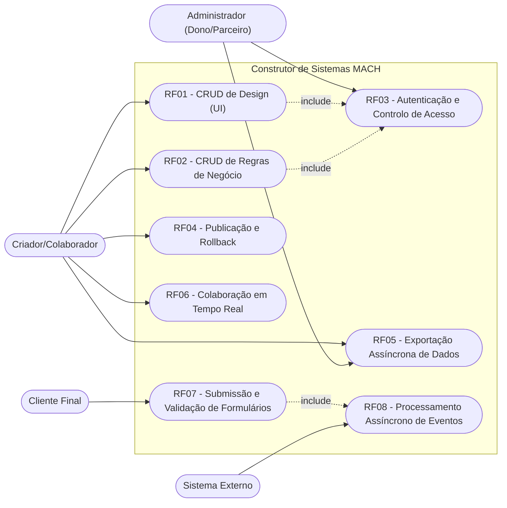
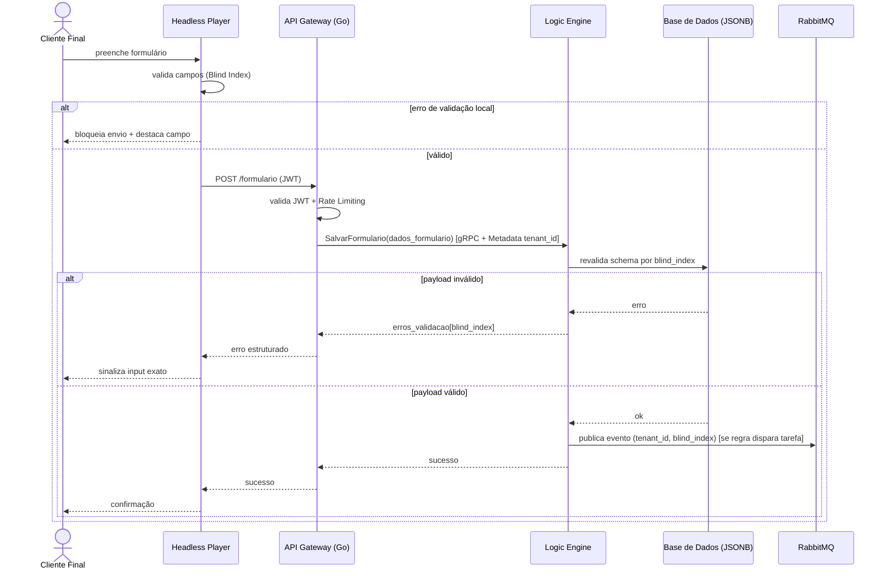
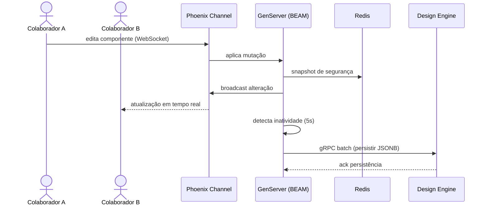
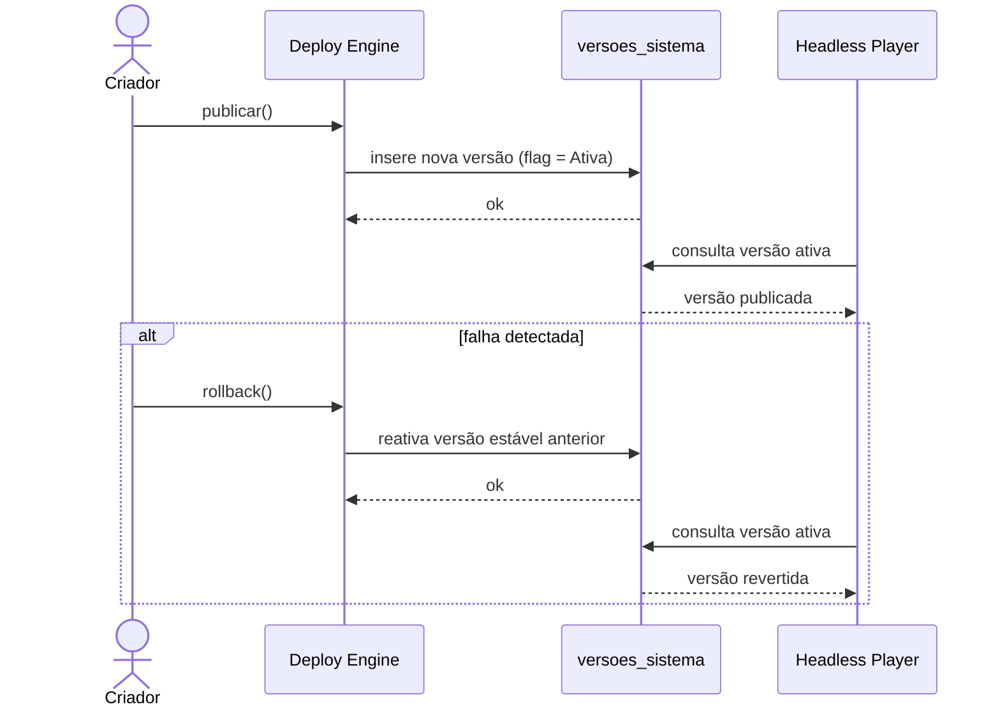
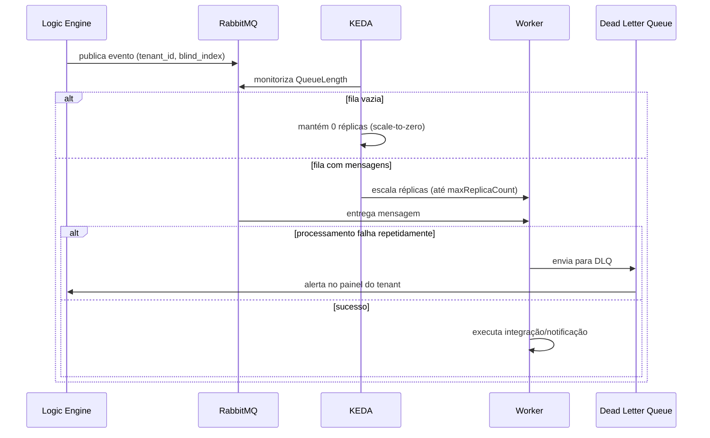
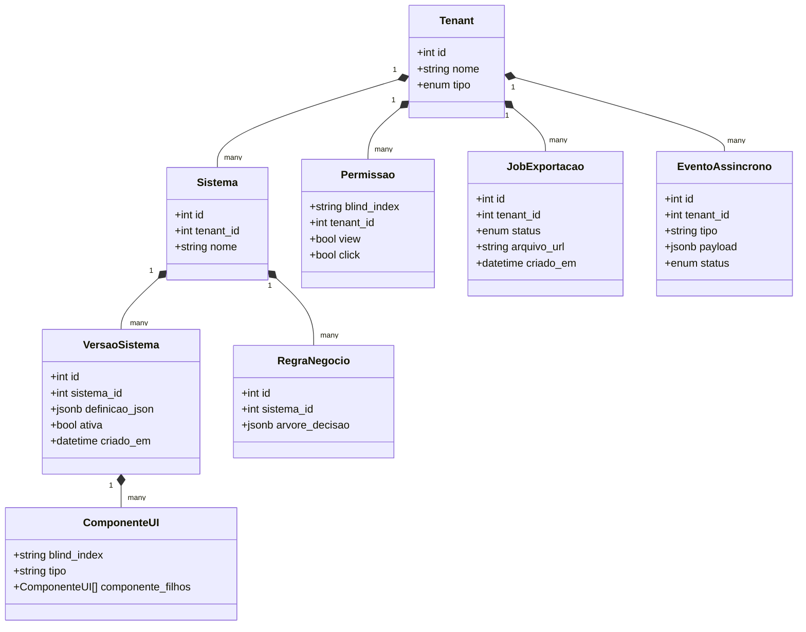

# Documento de Requisitos e Análise — Construtor de Sistemas MACH V4

## 1. Visão Geral
Plataforma Low-Code/No-Code multi-tenant baseada nos pilares **MACH** (Microservices, API-first, Cloud-native SaaS, Headless). Permite que utilizadores construam aplicações digitais via interface visual, com colaboração em tempo real, publicação instantânea (abordagem interpretada), regras de negócio dinâmicas, controlo de acessos por componente (IAM) e exportação assíncrona de dados. A arquitetura é composta por 5 microsserviços (Design Engine, Logic Engine, IAM Service, Deploy Engine, Export Engine), um Gateway híbrido (Go + Elixir/Phoenix), mensageria assíncrona via RabbitMQ/KEDA e observabilidade via OpenTelemetry/Jaeger.

## 2. Regras de Negócio (RN)

| ID | Nome | Descrição |
| :--- | :--- | :--- |
| RN01 | Isolamento Multi-tenant | Toda query à base de dados partilhada aplica filtro obrigatório `WHERE tenant_id = :id`, extraído do contexto gRPC/JWT, impedindo vazamento de dados entre clientes. |
| RN02 | Anonimização por Blind Index | Campos dinâmicos criados pelos utilizadores nunca são referenciados por nome real; são sempre mapeados por um hash criptográfico (Blind Index) para tipo, obrigatoriedade e limites de validação. |
| RN03 | Avaliação de Permissões no Servidor | Condições de acesso (view/click) de cada componente são sempre calculadas no IAM Service; o front-end apenas recebe o mapa booleano final indexado por Blind Index — nunca a lógica da regra. |
| RN04 | Publicação por Flag Ativa | Publicar uma versão cria uma nova linha em `versoes_sistema`; apenas uma versão pode estar com a flag `Ativa` por sistema, e o Headless Player sempre consome a versão ativa. |
| RN05 | Rollback Instantâneo | Reverter uma publicação é feito apenas alternando a flag `Ativa` para a versão estável anterior, sem recompilação ou downtime. |
| RN06 | Persistência por Debounce (Write-Behind) | Mutações de edição colaborativa só são persistidas na base relacional após 5 segundos de inatividade de rede detectados pelo GenServer; antes disso residem apenas em memória BEAM e Redis. |
| RN07 | Bloqueio Otimista por Componente | Um componente sob edição ativa por um colaborador é temporariamente bloqueado (via Blind Index) para os demais colaboradores concorrentes. |
| RN08 | Validação Dupla Obrigatória | Todo payload de formulário deve ser validado no front-end (bloqueio imediato) **e** revalidado no Logic Engine contra o schema salvo, rejeitando submissões que contornem o cliente. |
| RN09 | Isolamento de Fila por Tenant (Fair Queuing) | Nenhum tenant pode monopolizar os workers assíncronos; falhas contínuas de integração de um tenant são desviadas para DLQ sem afetar outros tenants. |
| RN10 | Escalonamento por Fila, não por CPU | O autoscaling de workers assíncronos reage exclusivamente ao tamanho da fila (QueueLength) no RabbitMQ, podendo escalar a zero réplicas. |

## 3. Requisitos Funcionais (RF)

| ID | Nome | Descrição | Prioridade |
| :--- | :--- | :--- | :--- |
| RF01 | CRUD de Design (UI) | Criar, ler, atualizar e remover definições de interface em árvore recursiva (padrão Composite) via Design Engine. | Alta |
| RF02 | CRUD de Regras de Negócio | Criar e gerir regras de negócio como árvores de decisão via Logic Engine. | Alta |
| RF03 | Autenticação e Controlo de Acesso | Validar JWT no Gateway, propagar identidade via gRPC Metadata e avaliar permissões por componente no IAM Service. | Alta |
| RF04 | Publicação e Rollback de Sistema | Publicar uma nova versão do sistema (flag ativa) e reverter instantaneamente para versão anterior em caso de falha. | Alta |
| RF05 | Exportação Assíncrona de Dados | Gerar um Job de exportação completa (UI, regras, dados operacionais) entregue via link seguro temporário (Presigned URL). | Média |
| RF06 | Colaboração em Tempo Real | Permitir múltiplos utilizadores editando o mesmo sistema simultaneamente, com sincronização via WebSockets (Phoenix Channels) e presença (cursores). | Alta |
| RF07 | Submissão e Validação de Formulários | Submeter dados operacionais dinâmicos com validação distribuída (cliente + servidor) via Blind Index. | Alta |
| RF08 | Processamento Assíncrono de Eventos | Disparar tarefas em segundo plano (webhooks, notificações) desacopladas do fluxo síncrono, via RabbitMQ/KEDA. | Média |

## 4. Requisitos Não Funcionais (RNF)

| ID | Nome | Descrição | Categoria |
| :--- | :--- | :--- | :--- |
| RNF01 | Comunicação Interna de Baixa Latência | Toda comunicação entre microsserviços deve ocorrer via gRPC/Protocol Buffers sobre HTTP/2. | Performance |
| RNF02 | Propagação Segura de Identidade | Contexto de tenant/identidade deve trafegar como Metadata binário do gRPC, nunca em payload de negócio. | Segurança |
| RNF03 | Escalabilidade Elástica (Scale-to-Zero) | Workers assíncronos devem escalar de 0 a N réplicas (ex: até 50) conforme profundidade de fila, sem custo ocioso. | Escalabilidade |
| RNF04 | Rastreabilidade Distribuída Ponta a Ponta | Toda requisição deve ser rastreável via Trace ID (W3C Trace Context) através de HTTP, gRPC e AMQP, visível no Jaeger. | Observabilidade |
| RNF05 | Disponibilidade em Publicações | Rollback de versão deve ocorrer em milissegundos, sem indisponibilidade do sistema publicado. | Disponibilidade |
| RNF06 | Resiliência a Falhas de Integração | Falhas de integrações de terceiros não podem impactar outros tenants; devem ser isoladas via DLQ. | Confiabilidade |
| RNF07 | Fluidez de Renderização | O Headless Player deve aplicar mudanças de UI em lotes de 16ms (60Hz), evitando jank visual. | Performance/UX |
| RNF08 | Privacidade por Design | Nenhum nome real de coluna/tabela/campo de negócio pode ser exposto em logs, traces ou payloads de erro — apenas Blind Index. | Segurança/LGPD |

## 5. Diagramas UML (Mermaid)

### 5.1 Diagrama de Caso de Uso

### 5.2 Diagrama de Sequência — RF07: Submissão e Validação de Formulários

### 5.3 Diagrama de Sequência — RF06: Colaboração em Tempo Real

### 5.4 Diagrama de Sequência — RF04: Publicação e Rollback

### 5.5 Diagrama de Sequência — RF08: Processamento Assíncrono de Eventos (KEDA)

### 5.6 Diagrama de Classes

## 6. Mapeamento para Plane (Cards)

| Título do Card | Descrição Sugerida (HTML/Plane) | Prioridade |
| :--- | :--- | :--- |
| Design Engine: CRUD de definições de UI | `<h3>Tarefas</h3><ul><li>Criar contrato gRPC para CRUD de componentes</li><li>Modelar árvore recursiva (Composite) com componente_filhos</li><li>Persistir definição em coluna JSONB</li></ul>` | high |
| Design Engine: estrutura de Blind Index para componentes | `<h3>Tarefas</h3><ul><li>Gerar hash criptográfico por componente</li><li>Mapear tipo, obrigatoriedade e limites por blind_index</li></ul>` | high |
| Logic Engine: CRUD de regras de negócio | `<h3>Tarefas</h3><ul><li>Criar contrato gRPC para árvore de decisão</li><li>Persistir regras vinculadas ao sistema</li></ul>` | high |
| Logic Engine: revalidação de payload por schema | `<h3>Tarefas</h3><ul><li>Implementar validação server-side contra schema salvo</li><li>Retornar mapa de erros indexado por blind_index</li></ul>` | high |
| IAM Service: autenticação JWT no Gateway | `<h3>Tarefas</h3><ul><li>Validar JWT no cabeçalho Authorization</li><li>Aplicar Rate Limiting no API Gateway (Go)</li></ul>` | high |
| IAM Service: propagação de identidade via gRPC Metadata | `<h3>Tarefas</h3><ul><li>Extrair JWT no Gateway</li><li>Injetar tenant_id/identidade como Metadata binário gRPC</li></ul>` | high |
| IAM Service: avaliação de permissões no servidor | `<h3>Tarefas</h3><ul><li>Avaliar condições dinâmicas no back-end</li><li>Retornar mapa booleano indexado por blind_index</li></ul>` | high |
| Deploy Engine: versionamento por flag ativa | `<h3>Tarefas</h3><ul><li>Criar tabela versoes_sistema</li><li>Implementar alternância de flag Ativa na publicação</li></ul>` | high |
| Deploy Engine: rollback instantâneo | `<h3>Tarefas</h3><ul><li>Implementar reversão de flag para versão estável</li><li>Garantir operação sem downtime</li></ul>` | high |
| Export Engine: criação de Job assíncrono | `<h3>Tarefas</h3><ul><li>Criar endpoint de solicitação de exportação</li><li>Retornar resposta imediata ao front-end</li></ul>` | medium |
| Export Engine: streaming gRPC de dados | `<h3>Tarefas</h3><ul><li>Implementar Server Streaming para coleta em chunks</li><li>Evitar sobrecarga de memória RAM</li></ul>` | medium |
| Export Engine: armazenamento e entrega segura | `<h3>Tarefas</h3><ul><li>Compactar e armazenar arquivo em Cloud Storage</li><li>Gerar Presigned URL com expiração curta</li></ul>` | medium |
| API Gateway (Go): tradução HTTP para gRPC | `<h3>Tarefas</h3><ul><li>Implementar proxy REST -> gRPC</li><li>Configurar HTTP/2 para chamadas internas</li></ul>` | high |
| Motor de Colaboração Elixir: Phoenix Channels | `<h3>Tarefas</h3><ul><li>Configurar WebSockets via Phoenix Channels</li><li>Criar GenServer isolado por tela em edição</li></ul>` | high |
| Motor de Colaboração Elixir: write-behind com debounce | `<h3>Tarefas</h3><ul><li>Implementar snapshot em Redis</li><li>Persistir via gRPC batch após 5s de inatividade</li></ul>` | high |
| Motor de Colaboração Elixir: presença e bloqueio otimista | `<h3>Tarefas</h3><ul><li>Implementar Phoenix Presence via CRDT</li><li>Bloquear temporariamente componente em edição por blind_index</li></ul>` | medium |
| Mensageria: setup RabbitMQ + KEDA ScaledObject | `<h3>Tarefas</h3><ul><li>Configurar exchanges e filas dedicadas</li><li>Criar ScaledObject monitorando QueueLength</li></ul>` | medium |
| Mensageria: isolamento de tenant e DLQ | `<h3>Tarefas</h3><ul><li>Implementar Fair Queuing por tenant</li><li>Configurar Dead Letter Queue com alerta ao tenant</li></ul>` | medium |
| Observabilidade: instrumentação OpenTelemetry | `<h3>Tarefas</h3><ul><li>Instrumentar Gateway, gRPC e AMQP com Trace Context W3C</li><li>Integrar exportação de traces ao Jaeger</li></ul>` | medium |
| Observabilidade: tags multi-tenant seguras | `<h3>Tarefas</h3><ul><li>Adicionar platform.tenant_id aos spans</li><li>Adicionar platform.component.blind_index aos spans</li></ul>` | low |
| Headless Player: contrato .proto de submissão | `<h3>Tarefas</h3><ul><li>Implementar SalvarFormularioRequest/Response</li><li>Mapear dados_formulario como map blind_index -> valor</li></ul>` | high |
| Headless Player: batching de renderização (16ms) | `<h3>Tarefas</h3><ul><li>Acumular mutações em janelas de 16ms</li><li>Executar diffing único por lote no DOM Virtual</li></ul>` | medium |
