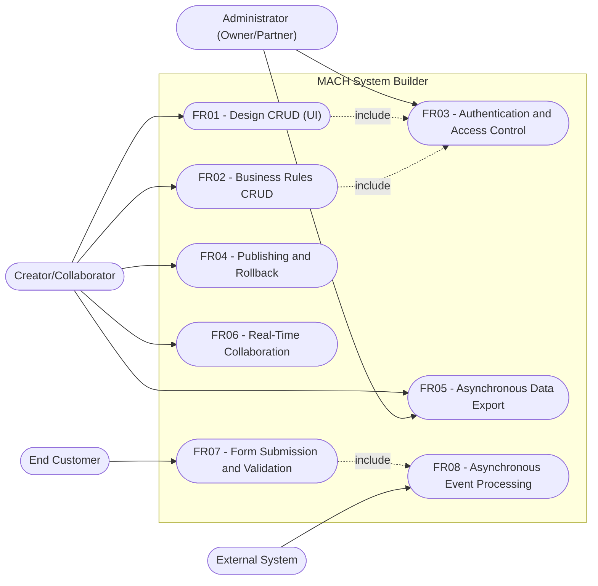
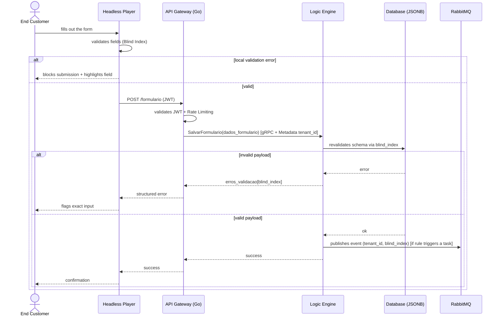
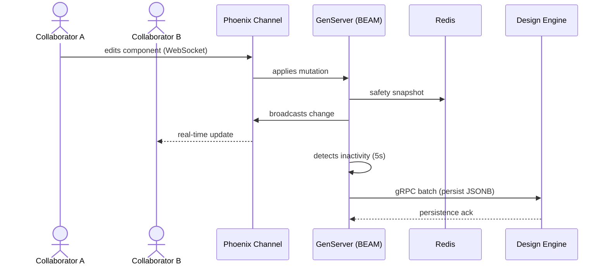
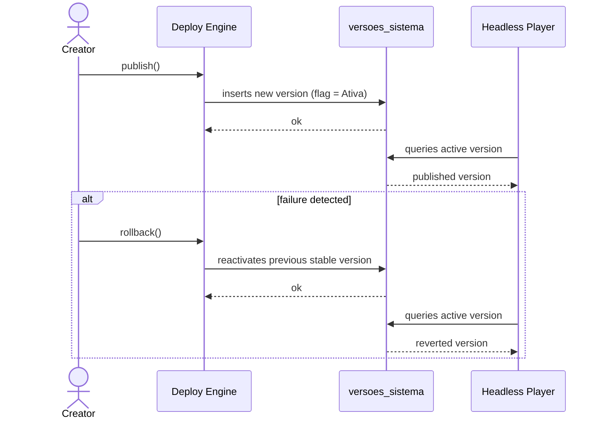
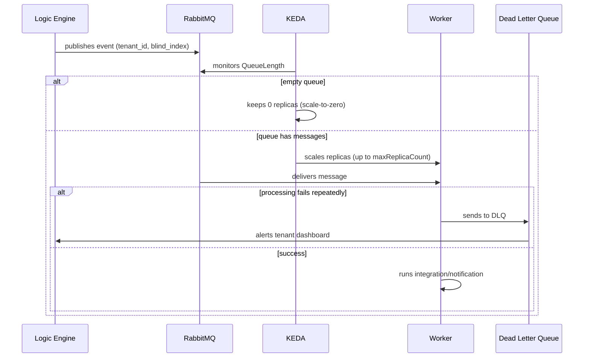
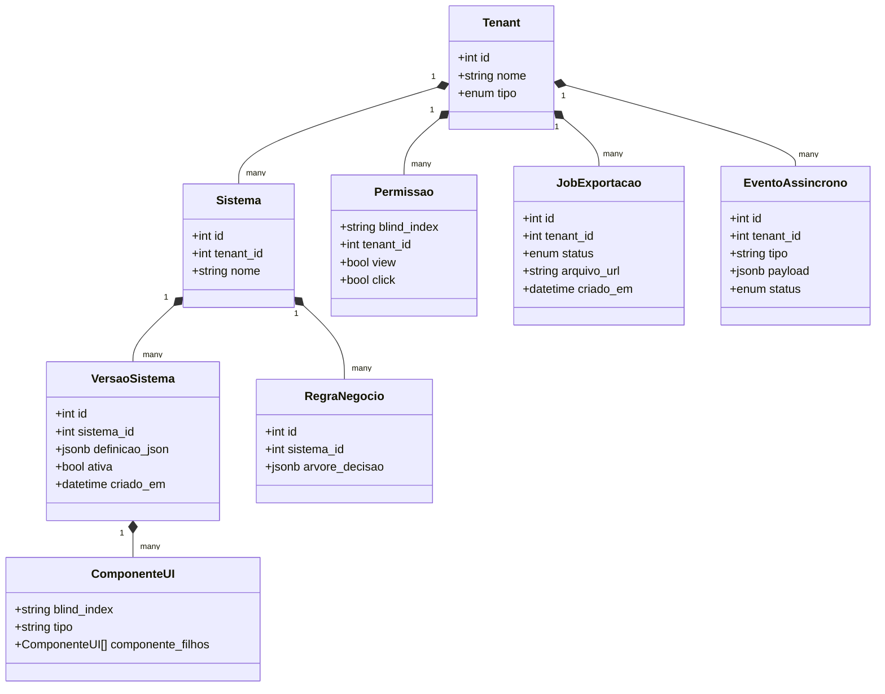

# Requirements and Analysis Document — MACH V4 System Builder

## 1. Overview
Multi-tenant Low-Code/No-Code platform based on the **MACH** pillars (Microservices, API-first, Cloud-native SaaS, Headless). Allows users to build digital applications via a visual interface, with real-time collaboration, instant publishing (interpreted approach), dynamic business rules, per-component access control (IAM), and asynchronous data export. The architecture is composed of 5 microservices (Design Engine, Logic Engine, IAM Service, Deploy Engine, Export Engine), a hybrid Gateway (Go + Elixir/Phoenix), asynchronous messaging via RabbitMQ/KEDA, and observability via OpenTelemetry/Jaeger.

## 2. Business Rules (RN)

| ID | Name | Description |
| :--- | :--- | :--- |
| BR01 | Multi-tenant Isolation | Every query to the shared database applies a mandatory `WHERE tenant_id = :id` filter, extracted from the gRPC/JWT context, preventing data leakage between customers. |
| BR02 | Anonymization via Blind Index | Dynamic fields created by users are never referenced by their real name; they are always mapped through a cryptographic hash (Blind Index) for type, requiredness, and validation limits. |
| BR03 | Server-Side Permission Evaluation | Access conditions (view/click) for each component are always computed in the IAM Service; the front-end only receives the final boolean map indexed by Blind Index — never the rule logic. |
| BR04 | Publishing via Active Flag | Publishing a version creates a new row in `versoes_sistema`; only one version can have the `Ativa` flag per system, and the Headless Player always consumes the active version. |
| BR05 | Instant Rollback | Reverting a publication is done simply by switching the `Ativa` flag to the previous stable version, without recompilation or downtime. |
| BR06 | Debounce-based Persistence (Write-Behind) | Collaborative edit mutations are only persisted to the relational database after 5 seconds of network inactivity detected by the GenServer; before that, they live only in BEAM memory and Redis. |
| BR07 | Optimistic Per-Component Locking | A component under active edit by one collaborator is temporarily locked (via Blind Index) for other concurrent collaborators. |
| BR08 | Mandatory Double Validation | Every form payload must be validated on the front-end (immediate blocking) **and** revalidated in the Logic Engine against the saved schema, rejecting submissions that bypass the client. |
| BR09 | Per-Tenant Queue Isolation (Fair Queuing) | No tenant can monopolize the asynchronous workers; a tenant's repeated integration failures are diverted to a DLQ without affecting other tenants. |
| BR10 | Queue-based Scaling, not CPU-based | Autoscaling of asynchronous workers reacts exclusively to queue size (QueueLength) in RabbitMQ, and can scale down to zero replicas. |

## 3. Functional Requirements (RF)

| ID | Name | Description | Priority |
| :--- | :--- | :--- | :--- |
| FR01 | Design CRUD (UI) | Create, read, update, and delete interface definitions in a recursive tree (Composite pattern) via the Design Engine. | High |
| FR02 | Business Rules CRUD | Create and manage business rules as decision trees via the Logic Engine. | High |
| FR03 | Authentication and Access Control | Validate JWT at the Gateway, propagate identity via gRPC Metadata, and evaluate per-component permissions in the IAM Service. | High |
| FR04 | System Publishing and Rollback | Publish a new system version (active flag) and instantly revert to the previous version on failure. | High |
| FR05 | Asynchronous Data Export | Generate a complete export Job (UI, rules, operational data) delivered via a temporary secure link (Presigned URL). | Medium |
| FR06 | Real-Time Collaboration | Allow multiple users to edit the same system simultaneously, with synchronization via WebSockets (Phoenix Channels) and presence (cursors). | High |
| FR07 | Form Submission and Validation | Submit dynamic operational data with distributed validation (client + server) via Blind Index. | High |
| FR08 | Asynchronous Event Processing | Trigger background tasks (webhooks, notifications) decoupled from the synchronous flow, via RabbitMQ/KEDA. | Medium |

## 4. Non-Functional Requirements (RNF)

| ID | Name | Description | Category |
| :--- | :--- | :--- | :--- |
| NFR01 | Low-Latency Internal Communication | All communication between microservices must occur via gRPC/Protocol Buffers over HTTP/2. | Performance |
| NFR02 | Secure Identity Propagation | Tenant/identity context must travel as binary gRPC Metadata, never in the business payload. | Security |
| NFR03 | Elastic Scalability (Scale-to-Zero) | Asynchronous workers must scale from 0 to N replicas (e.g., up to 50) according to queue depth, with no idle cost. | Scalability |
| NFR04 | End-to-End Distributed Traceability | Every request must be traceable via Trace ID (W3C Trace Context) across HTTP, gRPC, and AMQP, visible in Jaeger. | Observability |
| NFR05 | Publication Availability | Version rollback must occur within milliseconds, with no downtime for the published system. | Availability |
| NFR06 | Resilience to Integration Failures | Third-party integration failures must not impact other tenants; they must be isolated via DLQ. | Reliability |
| NFR07 | Rendering Fluidity | The Headless Player must apply UI changes in 16ms (60Hz) batches, avoiding visual jank. | Performance/UX |
| NFR08 | Privacy by Design | No real column/table/business-field name may be exposed in logs, traces, or error payloads — only Blind Index. | Security/LGPD |

## 5. UML Diagrams (Mermaid)

### 5.1 Use Case Diagram

### 5.2 Sequence Diagram — FR07: Form Submission and Validation

### 5.3 Sequence Diagram — FR06: Real-Time Collaboration

### 5.4 Sequence Diagram — FR04: Publishing and Rollback

### 5.5 Sequence Diagram — FR08: Asynchronous Event Processing (KEDA)

### 5.6 Class Diagram

## 6. Mapping to Plane (Cards)

| Card Title | Suggested Description (HTML/Plane) | Priority |
| :--- | :--- | :--- |
| Design Engine: UI definition CRUD | `<h3>Tasks</h3><ul><li>Create gRPC contract for component CRUD</li><li>Model recursive tree (Composite) with componente_filhos</li><li>Persist definition in a JSONB column</li></ul>` | high |
| Design Engine: Blind Index structure for components | `<h3>Tasks</h3><ul><li>Generate a cryptographic hash per component</li><li>Map type, requiredness, and limits by blind_index</li></ul>` | high |
| Logic Engine: business rules CRUD | `<h3>Tasks</h3><ul><li>Create gRPC contract for the decision tree</li><li>Persist rules linked to the system</li></ul>` | high |
| Logic Engine: schema-based payload revalidation | `<h3>Tasks</h3><ul><li>Implement server-side validation against the saved schema</li><li>Return an error map indexed by blind_index</li></ul>` | high |
| IAM Service: JWT authentication at the Gateway | `<h3>Tasks</h3><ul><li>Validate JWT in the Authorization header</li><li>Apply Rate Limiting in the API Gateway (Go)</li></ul>` | high |
| IAM Service: identity propagation via gRPC Metadata | `<h3>Tasks</h3><ul><li>Extract JWT at the Gateway</li><li>Inject tenant_id/identity as binary gRPC Metadata</li></ul>` | high |
| IAM Service: server-side permission evaluation | `<h3>Tasks</h3><ul><li>Evaluate dynamic conditions on the back-end</li><li>Return a boolean map indexed by blind_index</li></ul>` | high |
| Deploy Engine: active-flag versioning | `<h3>Tasks</h3><ul><li>Create the versoes_sistema table</li><li>Implement toggling of the Ativa flag on publish</li></ul>` | high |
| Deploy Engine: instant rollback | `<h3>Tasks</h3><ul><li>Implement flag reversion to the stable version</li><li>Ensure the operation has no downtime</li></ul>` | high |
| Export Engine: asynchronous Job creation | `<h3>Tasks</h3><ul><li>Create the export request endpoint</li><li>Return an immediate response to the front-end</li></ul>` | medium |
| Export Engine: gRPC data streaming | `<h3>Tasks</h3><ul><li>Implement Server Streaming for chunked collection</li><li>Avoid RAM memory overload</li></ul>` | medium |
| Export Engine: secure storage and delivery | `<h3>Tasks</h3><ul><li>Compress and store the file in Cloud Storage</li><li>Generate a Presigned URL with a short expiration</li></ul>` | medium |
| API Gateway (Go): HTTP-to-gRPC translation | `<h3>Tasks</h3><ul><li>Implement REST -> gRPC proxy</li><li>Configure HTTP/2 for internal calls</li></ul>` | high |
| Elixir Collaboration Engine: Phoenix Channels | `<h3>Tasks</h3><ul><li>Configure WebSockets via Phoenix Channels</li><li>Create an isolated GenServer per screen being edited</li></ul>` | high |
| Elixir Collaboration Engine: debounced write-behind | `<h3>Tasks</h3><ul><li>Implement snapshot in Redis</li><li>Persist via gRPC batch after 5s of inactivity</li></ul>` | high |
| Elixir Collaboration Engine: presence and optimistic locking | `<h3>Tasks</h3><ul><li>Implement Phoenix Presence via CRDT</li><li>Temporarily lock the component being edited by blind_index</li></ul>` | medium |
| Messaging: RabbitMQ + KEDA ScaledObject setup | `<h3>Tasks</h3><ul><li>Configure dedicated exchanges and queues</li><li>Create a ScaledObject monitoring QueueLength</li></ul>` | medium |
| Messaging: tenant isolation and DLQ | `<h3>Tasks</h3><ul><li>Implement per-tenant Fair Queuing</li><li>Configure a Dead Letter Queue with tenant alerting</li></ul>` | medium |
| Observability: OpenTelemetry instrumentation | `<h3>Tasks</h3><ul><li>Instrument Gateway, gRPC, and AMQP with W3C Trace Context</li><li>Integrate trace export to Jaeger</li></ul>` | medium |
| Observability: secure multi-tenant tags | `<h3>Tasks</h3><ul><li>Add platform.tenant_id to spans</li><li>Add platform.component.blind_index to spans</li></ul>` | low |
| Headless Player: submission .proto contract | `<h3>Tasks</h3><ul><li>Implement SalvarFormularioRequest/Response</li><li>Map dados_formulario as a map blind_index -> value</li></ul>` | high |
| Headless Player: rendering batching (16ms) | `<h3>Tasks</h3><ul><li>Accumulate mutations in 16ms windows</li><li>Run a single diff per batch on the Virtual DOM</li></ul>` | medium |
