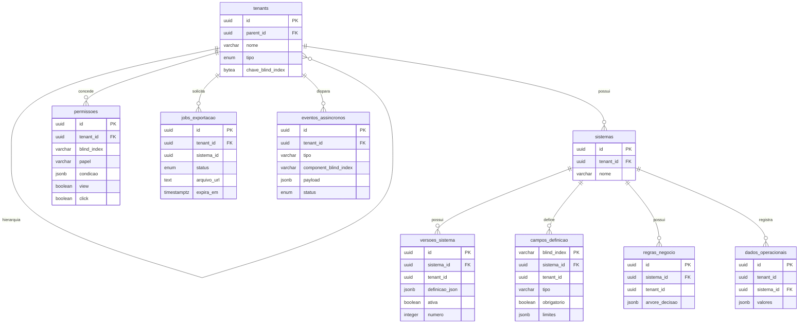

# Modelo de Dados: Construtor de Sistemas MACH V4

Base de dados partilhada (Shared Database Multi-tenancy) em PostgreSQL 16. Isolamento lógico por `tenant_id` em todas as tabelas (RN01), campos dinâmicos em colunas `JSONB`, e definições de campos indexadas por Blind Index (RN02).

---

## 1. Entidades

### `tenants`

| Campo | Tipo | Nulável | Padrão | Descrição |
|-------|------|---------|--------|-----------|
| id | uuid | não | `gen_random_uuid()` | PK |
| parent_id | uuid | sim | null | FK para `tenants.id` — hierarquia Dono → Parceiro → Cliente Final |
| nome | varchar(255) | não | — | Nome do tenant |
| tipo | tenant_tipo (enum) | não | — | `dono` \| `parceiro` \| `cliente` |
| chave_blind_index | bytea | não | — | Chave HMAC por tenant para geração de Blind Index (RN02) |
| criado_em | timestamptz | não | `now()` | — |

### `sistemas`

| Campo | Tipo | Nulável | Padrão | Descrição |
|-------|------|---------|--------|-----------|
| id | uuid | não | `gen_random_uuid()` | PK |
| tenant_id | uuid | não | — | FK `tenants.id` (RN01) |
| nome | varchar(255) | não | — | Nome do sistema criado pelo utilizador |
| criado_em | timestamptz | não | `now()` | — |

### `versoes_sistema` (RN04, RN05)

| Campo | Tipo | Nulável | Padrão | Descrição |
|-------|------|---------|--------|-----------|
| id | uuid | não | `gen_random_uuid()` | PK |
| sistema_id | uuid | não | — | FK `sistemas.id` |
| tenant_id | uuid | não | — | Redundante para filtro direto (RN01) |
| definicao_json | jsonb | não | — | Árvore recursiva completa (Composite, `componente_filhos`) |
| ativa | boolean | não | `false` | Flag de publicação — única ativa por sistema |
| numero | integer | não | — | Sequencial por sistema (para rollback dirigido) |
| criado_em | timestamptz | não | `now()` | — |

**Constraint**: índice único parcial `UNIQUE (sistema_id) WHERE ativa = true` — garante RN04 no nível do banco.

### `campos_definicao` (RN02)

| Campo | Tipo | Nulável | Padrão | Descrição |
|-------|------|---------|--------|-----------|
| blind_index | varchar(64) | não | — | PK composta com `sistema_id`; hash HMAC-SHA256 do componente |
| sistema_id | uuid | não | — | FK `sistemas.id` |
| tenant_id | uuid | não | — | Filtro obrigatório (RN01) |
| tipo | varchar(32) | não | — | `string` \| `number` \| `date` \| `bool` \| ... |
| obrigatorio | boolean | não | `false` | — |
| limites | jsonb | sim | null | Ex.: `{"min": 0, "max_length": 120}` |

### `regras_negocio` (RF02)

| Campo | Tipo | Nulável | Padrão | Descrição |
|-------|------|---------|--------|-----------|
| id | uuid | não | `gen_random_uuid()` | PK |
| sistema_id | uuid | não | — | FK `sistemas.id` |
| tenant_id | uuid | não | — | RN01 |
| arvore_decisao | jsonb | não | — | Nós lógicos (árvore de decisão) |
| criado_em | timestamptz | não | `now()` | — |

### `permissoes` (RN03)

| Campo | Tipo | Nulável | Padrão | Descrição |
|-------|------|---------|--------|-----------|
| id | uuid | não | `gen_random_uuid()` | PK |
| tenant_id | uuid | não | — | RN01 |
| blind_index | varchar(64) | não | — | Componente alvo |
| papel | varchar(64) | não | — | Papel/perfil a que a permissão se aplica |
| condicao | jsonb | sim | null | Condição dinâmica avaliada pelo IAM Service |
| view | boolean | não | `false` | — |
| click | boolean | não | `false` | — |

### `dados_operacionais` (RF07)

| Campo | Tipo | Nulável | Padrão | Descrição |
|-------|------|---------|--------|-----------|
| id | uuid | não | `gen_random_uuid()` | PK |
| tenant_id | uuid | não | — | RN01 |
| sistema_id | uuid | não | — | FK `sistemas.id` |
| valores | jsonb | não | — | Mapa `blind_index → valor` submetido pelo formulário |
| criado_em | timestamptz | não | `now()` | — |

### `jobs_exportacao` (RF05)

| Campo | Tipo | Nulável | Padrão | Descrição |
|-------|------|---------|--------|-----------|
| id | uuid | não | `gen_random_uuid()` | PK |
| tenant_id | uuid | não | — | RN01 |
| sistema_id | uuid | não | — | FK `sistemas.id` |
| status | job_status (enum) | não | `'criado'` | `criado` \| `coletando` \| `pronto` \| `erro` \| `expirado` |
| arquivo_url | text | sim | null | Presigned URL gerada ao concluir |
| expira_em | timestamptz | sim | null | Expiração da URL |
| criado_em | timestamptz | não | `now()` | — |

### `eventos_assincronos` (RF08 — outbox/auditoria)

| Campo | Tipo | Nulável | Padrão | Descrição |
|-------|------|---------|--------|-----------|
| id | uuid | não | `gen_random_uuid()` | PK |
| tenant_id | uuid | não | — | RN01, RN09 |
| tipo | varchar(64) | não | — | `webhook.disparo` \| `notificacao.envio` \| ... |
| component_blind_index | varchar(64) | sim | null | Componente originador (RNF08) |
| payload | jsonb | não | — | Corpo do evento |
| status | evento_status (enum) | não | `'pendente'` | `pendente` \| `publicado` \| `processado` \| `dlq` |
| criado_em | timestamptz | não | `now()` | — |

---

## 2. Relacionamentos

| Entidade A | Cardinalidade | Entidade B | Chave Estrangeira |
|------------|--------------|------------|-------------------|
| tenants | 1:N | tenants | `tenants.parent_id` (hierarquia) |
| tenants | 1:N | sistemas | `sistemas.tenant_id` |
| sistemas | 1:N | versoes_sistema | `versoes_sistema.sistema_id` |
| sistemas | 1:N | campos_definicao | `campos_definicao.sistema_id` |
| sistemas | 1:N | regras_negocio | `regras_negocio.sistema_id` |
| tenants | 1:N | permissoes | `permissoes.tenant_id` |
| sistemas | 1:N | dados_operacionais | `dados_operacionais.sistema_id` |
| tenants | 1:N | jobs_exportacao | `jobs_exportacao.tenant_id` |
| tenants | 1:N | eventos_assincronos | `eventos_assincronos.tenant_id` |

---

## 3. Diagrama ER

---

## 4. Migrações Necessárias

| Arquivo de Migração | Operação | Tabela |
|--------------------|----------|--------|
| `0001_create_tenants_table` | CREATE + enum `tenant_tipo` | `tenants` |
| `0002_create_sistemas_table` | CREATE | `sistemas` |
| `0003_create_versoes_sistema_table` | CREATE + índice único parcial `(sistema_id) WHERE ativa` | `versoes_sistema` |
| `0004_create_campos_definicao_table` | CREATE (PK composta `blind_index, sistema_id`) | `campos_definicao` |
| `0005_create_regras_negocio_table` | CREATE | `regras_negocio` |
| `0006_create_permissoes_table` | CREATE | `permissoes` |
| `0007_create_dados_operacionais_table` | CREATE + índice GIN em `valores` | `dados_operacionais` |
| `0008_create_jobs_exportacao_table` | CREATE + enum `job_status` | `jobs_exportacao` |
| `0009_create_eventos_assincronos_table` | CREATE + enum `evento_status` | `eventos_assincronos` |
| `0010_enable_row_level_security` | ALTER — RLS por `tenant_id` em todas as tabelas (defesa em profundidade, RN01) | todas |

**Observações**:
- Todas as tabelas têm índice composto iniciando por `tenant_id` (padrão de acesso dominante — RN01).
- `dados_operacionais.valores` recebe índice GIN para consultas por chave de blind_index dentro do JSONB.
- RLS (migração 0010) é reforço à camada `pkg/database` (`TenantScopedQuerier`), não substituto.
