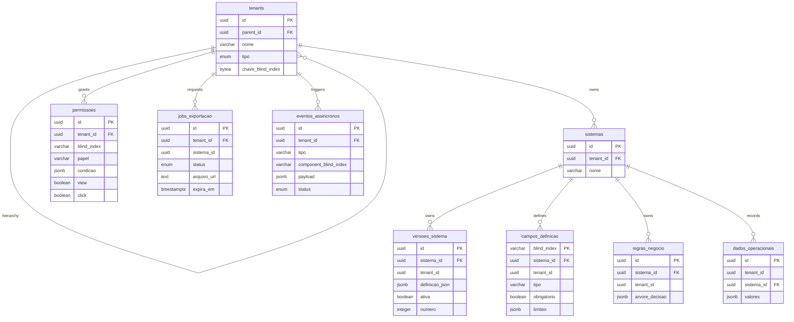

# Data Model: MACH V4 System Builder

Shared database (Shared Database Multi-tenancy) on PostgreSQL 16. Logical isolation by `tenant_id` on all tables (BR01), dynamic fields in `JSONB` columns, and field definitions indexed by Blind Index (BR02).

---

## 1. Entities

### `tenants`

| Field | Type | Nullable | Default | Description |
|-------|------|---------|--------|-----------|
| id | uuid | no | `gen_random_uuid()` | PK |
| parent_id | uuid | yes | null | FK to `tenants.id` — Owner → Partner → End Customer hierarchy |
| nome | varchar(255) | no | — | Tenant name |
| tipo | tenant_tipo (enum) | no | — | `dono` \| `parceiro` \| `cliente` |
| chave_blind_index | bytea | no | — | Per-tenant HMAC key for Blind Index generation (BR02) |
| criado_em | timestamptz | no | `now()` | — |

### `sistemas`

| Field | Type | Nullable | Default | Description |
|-------|------|---------|--------|-----------|
| id | uuid | no | `gen_random_uuid()` | PK |
| tenant_id | uuid | no | — | FK `tenants.id` (BR01) |
| nome | varchar(255) | no | — | Name of the system created by the user |
| criado_em | timestamptz | no | `now()` | — |

### `versoes_sistema` (BR04, BR05)

| Field | Type | Nullable | Default | Description |
|-------|------|---------|--------|-----------|
| id | uuid | no | `gen_random_uuid()` | PK |
| sistema_id | uuid | no | — | FK `sistemas.id` |
| tenant_id | uuid | no | — | Redundant for direct filtering (BR01) |
| definicao_json | jsonb | no | — | Full recursive tree (Composite, `componente_filhos`) |
| ativa | boolean | no | `false` | Publication flag — only one active per system |
| numero | integer | no | — | Sequential per system (for targeted rollback) |
| criado_em | timestamptz | no | `now()` | — |

**Constraint**: partial unique index `UNIQUE (sistema_id) WHERE ativa = true` — enforces BR04 at the database level.

### `campos_definicao` (BR02)

| Field | Type | Nullable | Default | Description |
|-------|------|---------|--------|-----------|
| blind_index | varchar(64) | no | — | Composite PK with `sistema_id`; HMAC-SHA256 hash of the component |
| sistema_id | uuid | no | — | FK `sistemas.id` |
| tenant_id | uuid | no | — | Mandatory filter (BR01) |
| tipo | varchar(32) | no | — | `string` \| `number` \| `date` \| `bool` \| ... |
| obrigatorio | boolean | no | `false` | — |
| limites | jsonb | yes | null | E.g.: `{"min": 0, "max_length": 120}` |

### `regras_negocio` (FR02)

| Field | Type | Nullable | Default | Description |
|-------|------|---------|--------|-----------|
| id | uuid | no | `gen_random_uuid()` | PK |
| sistema_id | uuid | no | — | FK `sistemas.id` |
| tenant_id | uuid | no | — | BR01 |
| arvore_decisao | jsonb | no | — | Logic nodes (decision tree) |
| criado_em | timestamptz | no | `now()` | — |

### `permissoes` (BR03)

| Field | Type | Nullable | Default | Description |
|-------|------|---------|--------|-----------|
| id | uuid | no | `gen_random_uuid()` | PK |
| tenant_id | uuid | no | — | BR01 |
| blind_index | varchar(64) | no | — | Target component |
| papel | varchar(64) | no | — | Role/profile the permission applies to |
| condicao | jsonb | yes | null | Dynamic condition evaluated by the IAM Service |
| view | boolean | no | `false` | — |
| click | boolean | no | `false` | — |

### `dados_operacionais` (FR07)

| Field | Type | Nullable | Default | Description |
|-------|------|---------|--------|-----------|
| id | uuid | no | `gen_random_uuid()` | PK |
| tenant_id | uuid | no | — | BR01 |
| sistema_id | uuid | no | — | FK `sistemas.id` |
| valores | jsonb | no | — | `blind_index → value` map submitted by the form |
| criado_em | timestamptz | no | `now()` | — |

### `jobs_exportacao` (FR05)

| Field | Type | Nullable | Default | Description |
|-------|------|---------|--------|-----------|
| id | uuid | no | `gen_random_uuid()` | PK |
| tenant_id | uuid | no | — | BR01 |
| sistema_id | uuid | no | — | FK `sistemas.id` |
| status | job_status (enum) | no | `'criado'` | `criado` \| `coletando` \| `pronto` \| `erro` \| `expirado` |
| arquivo_url | text | yes | null | Presigned URL generated upon completion |
| expira_em | timestamptz | yes | null | URL expiration |
| criado_em | timestamptz | no | `now()` | — |

### `eventos_assincronos` (FR08 — outbox/audit)

| Field | Type | Nullable | Default | Description |
|-------|------|---------|--------|-----------|
| id | uuid | no | `gen_random_uuid()` | PK |
| tenant_id | uuid | no | — | BR01, BR09 |
| tipo | varchar(64) | no | — | `webhook.disparo` \| `notificacao.envio` \| ... |
| component_blind_index | varchar(64) | yes | null | Originating component (NFR08) |
| payload | jsonb | no | — | Event body |
| status | evento_status (enum) | no | `'pendente'` | `pendente` \| `publicado` \| `processado` \| `dlq` |
| criado_em | timestamptz | no | `now()` | — |

---

## 2. Relationships

| Entity A | Cardinality | Entity B | Foreign Key |
|------------|--------------|------------|-------------------|
| tenants | 1:N | tenants | `tenants.parent_id` (hierarchy) |
| tenants | 1:N | sistemas | `sistemas.tenant_id` |
| sistemas | 1:N | versoes_sistema | `versoes_sistema.sistema_id` |
| sistemas | 1:N | campos_definicao | `campos_definicao.sistema_id` |
| sistemas | 1:N | regras_negocio | `regras_negocio.sistema_id` |
| tenants | 1:N | permissoes | `permissoes.tenant_id` |
| sistemas | 1:N | dados_operacionais | `dados_operacionais.sistema_id` |
| tenants | 1:N | jobs_exportacao | `jobs_exportacao.tenant_id` |
| tenants | 1:N | eventos_assincronos | `eventos_assincronos.tenant_id` |

---

## 3. ER Diagram

---

## 4. Required Migrations

| Migration File | Operation | Table |
|--------------------|----------|--------|
| `0001_create_tenants_table` | CREATE + enum `tenant_tipo` | `tenants` |
| `0002_create_sistemas_table` | CREATE | `sistemas` |
| `0003_create_versoes_sistema_table` | CREATE + partial unique index `(sistema_id) WHERE ativa` | `versoes_sistema` |
| `0004_create_campos_definicao_table` | CREATE (composite PK `blind_index, sistema_id`) | `campos_definicao` |
| `0005_create_regras_negocio_table` | CREATE | `regras_negocio` |
| `0006_create_permissoes_table` | CREATE | `permissoes` |
| `0007_create_dados_operacionais_table` | CREATE + GIN index on `valores` | `dados_operacionais` |
| `0008_create_jobs_exportacao_table` | CREATE + enum `job_status` | `jobs_exportacao` |
| `0009_create_eventos_assincronos_table` | CREATE + enum `evento_status` | `eventos_assincronos` |
| `0010_enable_row_level_security` | ALTER — RLS by `tenant_id` on all tables (defense in depth, BR01) | all |

**Notes**:
- All tables have a composite index starting with `tenant_id` (dominant access pattern — BR01).
- `dados_operacionais.valores` gets a GIN index for queries by blind_index key within the JSONB.
- RLS (migration 0010) reinforces the `pkg/database` layer (`TenantScopedQuerier`), not a replacement for it.
