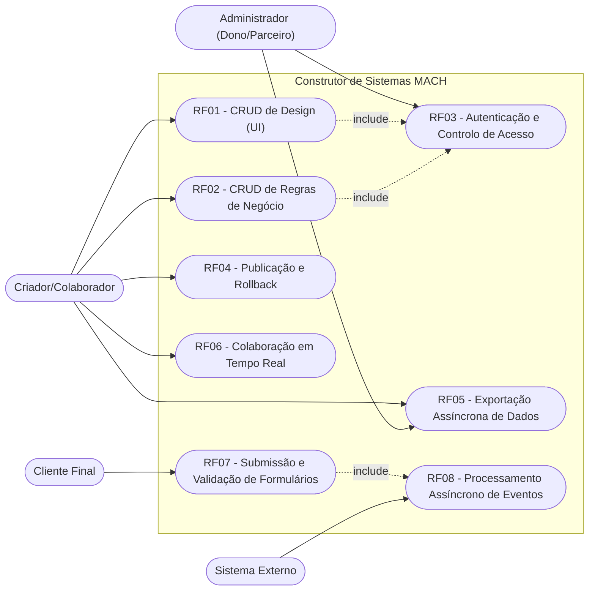
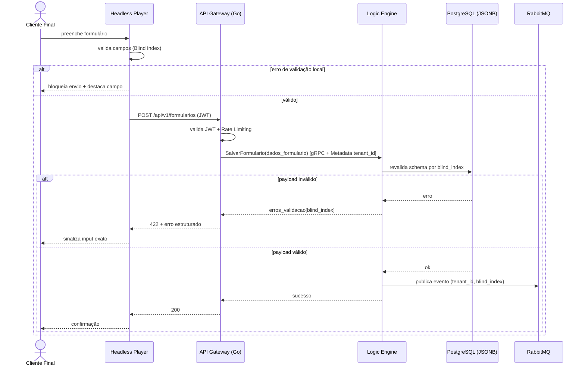
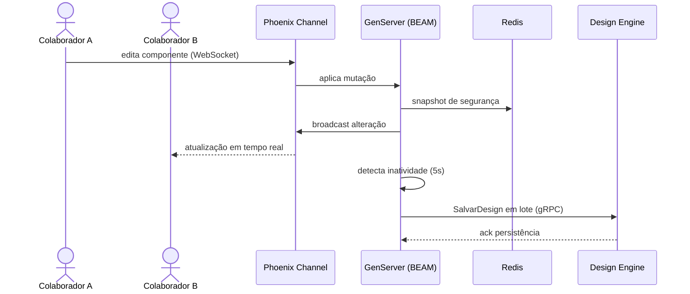
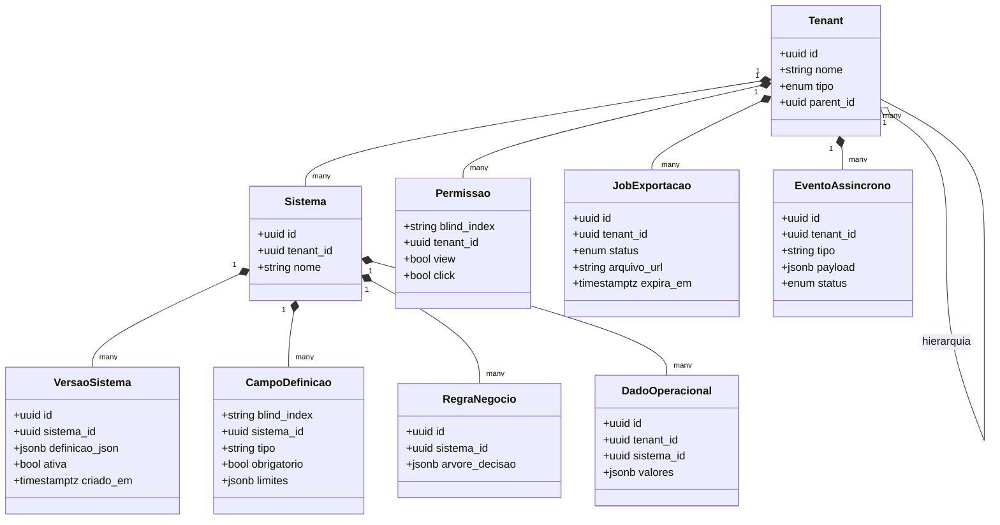

# Especificação: Construtor de Sistemas MACH V4 — Fundação da Plataforma

Plataforma Low-Code/No-Code multi-tenant baseada nos pilares **MACH** (Microservices, API-first, Cloud-native SaaS, Headless). Esta especificação cobre a implementação fundacional da plataforma a partir do documento de análise `doc/ANALISE_REQUISITOS.md`: os 5 microsserviços core (Design Engine, Logic Engine, IAM Service, Deploy Engine, Export Engine), o Gateway híbrido (Go + Elixir/Phoenix), a mensageria assíncrona (RabbitMQ/KEDA), a observabilidade (OpenTelemetry/Jaeger) e o Headless Player.

---

## 1. Objetivo

Entregar a fundação executável da plataforma: um monorepo poliglota com os contratos gRPC versionados, os 5 microsserviços operacionais atrás do Gateway Go, colaboração em tempo real via Elixir/Phoenix, pipeline assíncrono com scale-to-zero e rastreabilidade distribuída de ponta a ponta. Ao final, um utilizador autenticado deve conseguir criar um sistema visual, publicá-lo, submeter dados via Headless Player e exportar seus dados — tudo com isolamento multi-tenant garantido.

---

## 2. Requisitos Funcionais

| ID   | Descrição | Ator | Prioridade |
|------|-----------|------|------------|
| RF01 | CRUD de definições de interface em árvore recursiva (padrão Composite) via Design Engine. | Criador/Colaborador | Alta |
| RF02 | CRUD de regras de negócio como árvores de decisão via Logic Engine. | Criador/Colaborador | Alta |
| RF03 | Validar JWT no Gateway, propagar identidade via gRPC Metadata e avaliar permissões por componente no IAM Service. | Administrador | Alta |
| RF04 | Publicar nova versão do sistema (flag ativa) e reverter instantaneamente para versão anterior. | Criador | Alta |
| RF05 | Gerar Job de exportação completa (UI, regras, dados operacionais) entregue via Presigned URL. | Criador/Administrador | Média |
| RF06 | Edição simultânea multiusuário com sincronização via WebSockets (Phoenix Channels) e presença (cursores). | Criador/Colaborador | Alta |
| RF07 | Submeter dados operacionais dinâmicos com validação distribuída (cliente + servidor) via Blind Index. | Cliente Final | Alta |
| RF08 | Disparar tarefas em segundo plano (webhooks, notificações) desacopladas do fluxo síncrono, via RabbitMQ/KEDA. | Sistema Externo | Média |

---

## 3. Requisitos Não-Funcionais

| ID    | Categoria       | Descrição |
|-------|-----------------|-----------|
| RNF01 | Performance     | Toda comunicação entre microsserviços via gRPC/Protocol Buffers sobre HTTP/2. |
| RNF02 | Segurança       | Contexto de tenant/identidade trafega como Metadata binário do gRPC, nunca em payload de negócio. |
| RNF03 | Escalabilidade  | Workers assíncronos escalam de 0 a N réplicas (ex.: até 50) conforme profundidade de fila, sem custo ocioso. |
| RNF04 | Observabilidade | Toda requisição rastreável via Trace ID (W3C Trace Context) através de HTTP, gRPC e AMQP, visível no Jaeger. |
| RNF05 | Disponibilidade | Rollback de versão em milissegundos, sem indisponibilidade do sistema publicado. |
| RNF06 | Confiabilidade  | Falhas de integrações de terceiros isoladas via DLQ, sem impactar outros tenants. |
| RNF07 | Performance/UX  | Headless Player aplica mudanças de UI em lotes de 16ms (60Hz), evitando jank visual. |
| RNF08 | Segurança/LGPD  | Nenhum nome real de coluna/tabela/campo exposto em logs, traces ou payloads de erro — apenas Blind Index. |

---

## 4. Regras de Negócio

| ID   | Regra |
|------|-------|
| RN01 | **Isolamento Multi-tenant**: toda query à base partilhada aplica filtro obrigatório `WHERE tenant_id = :id`, extraído do contexto gRPC/JWT. |
| RN02 | **Anonimização por Blind Index**: campos dinâmicos nunca são referenciados por nome real; sempre por hash criptográfico mapeando tipo, obrigatoriedade e limites. |
| RN03 | **Avaliação de Permissões no Servidor**: condições view/click calculadas no IAM Service; front-end recebe apenas o mapa booleano final indexado por Blind Index. |
| RN04 | **Publicação por Flag Ativa**: publicar cria nova linha em `versoes_sistema`; apenas uma versão ativa por sistema; Headless Player consome sempre a versão ativa. |
| RN05 | **Rollback Instantâneo**: reverter = alternar flag `ativa` para a versão estável anterior, sem recompilação ou downtime. |
| RN06 | **Persistência por Debounce (Write-Behind)**: mutações colaborativas persistidas na base relacional apenas após 5s de inatividade detectados pelo GenServer; antes disso, apenas memória BEAM + Redis. |
| RN07 | **Bloqueio Otimista por Componente**: componente sob edição ativa é temporariamente bloqueado (via Blind Index) para os demais colaboradores. |
| RN08 | **Validação Dupla Obrigatória**: payload validado no front-end **e** revalidado no Logic Engine contra o schema salvo. |
| RN09 | **Fair Queuing por Tenant**: nenhum tenant monopoliza workers; falhas contínuas desviadas para DLQ sem afetar outros tenants. |
| RN10 | **Escalonamento por Fila**: autoscaling reage exclusivamente ao `QueueLength` no RabbitMQ, podendo escalar a zero. |

---

## 5. Cenários de Uso

### Cenário 1: Submissão de formulário válido (RF07, RN01, RN02, RN08)
* **Dado que** um Cliente Final acede a um sistema publicado com um formulário dinâmico
* **Quando** preenche todos os campos corretamente e submete
* **Então** o Headless Player valida localmente pelo mapa de Blind Index, o Gateway valida o JWT e traduz para gRPC, o Logic Engine revalida contra o schema salvo e persiste na coluna JSONB com `tenant_id`
* **E** se alguma regra de negócio disparar tarefa assíncrona, um evento é publicado no RabbitMQ sem bloquear a resposta

### Cenário 2: Submissão maliciosa contornando o cliente (RF07, RN08, RNF08)
* **Dado que** um atacante envia payload direto à API com campos inválidos
* **Quando** o Logic Engine revalida o payload contra o schema
* **Então** a submissão é rejeitada com mapa de erros indexado por `blind_index`
* **E** nenhum nome real de coluna ou tabela aparece na resposta de erro

### Cenário 3: Colaboração simultânea com debounce (RF06, RN06, RN07)
* **Dado que** dois colaboradores editam o mesmo ecrã simultaneamente
* **Quando** o Colaborador A move um componente
* **Então** a mutação é aplicada no GenServer, replicada em snapshot no Redis e propagada via broadcast ao Colaborador B em tempo real
* **E** após 5 segundos de silêncio de rede, o GenServer consolida a árvore e dispara uma única chamada gRPC batch ao Design Engine

### Cenário 4: Publicação e rollback (RF04, RN04, RN05, RNF05)
* **Dado que** um Criador publicou a versão N do seu sistema
* **Quando** detecta uma falha e aciona rollback
* **Então** o Deploy Engine reativa a flag da versão N-1 em milissegundos
* **E** o Headless Player passa a consumir a versão N-1 sem downtime

### Cenário 5: Pico de webhooks com scale-to-zero (RF08, RN09, RN10, RNF03)
* **Dado que** as filas de eventos estão vazias e os workers escalados a 0 réplicas
* **Quando** um tenant dispara 10.000 webhooks
* **Então** o KEDA detecta o `QueueLength` e escala workers até o `maxReplicaCount`
* **E** falhas contínuas de entrega são desviadas para a DLQ com alerta apenas ao tenant afetado

### Cenário 6: Exportação de grande volume (RF05, RNF01)
* **Dado que** um Criador solicita exportação completa do seu sistema
* **Quando** o Gateway cria o Job no Export Engine e liberta o front-end
* **Então** a coleta ocorre via gRPC Server Streaming em chunks, o pacote é armazenado em Cloud Storage
* **E** o utilizador recebe um Presigned URL de expiração curta para download direto

---

## 6. Critérios de Aceitação

1. Requisição sem JWT válido é rejeitada no Gateway com HTTP 401; requisição com JWT de outro tenant nunca retorna dados alheios (testável via teste de integração multi-tenant).
2. `SalvarFormulario` com campo inválido retorna `erros_validacao` contendo apenas `blind_index` como chaves — nenhuma resposta da API contém nomes reais de colunas/tabelas.
3. Publicar versão insere linha em `versoes_sistema` e desativa a anterior atomicamente (transação única); rollback restaura a anterior em < 100ms medidos no teste.
4. Edição colaborativa: mutação enviada pelo cliente A chega ao cliente B via WebSocket; ausência de mutações por 5s gera exatamente 1 chamada gRPC `SalvarDesign` em lote.
5. Com fila vazia por mais que o cooldown configurado, `kubectl get pods` mostra 0 workers; ao publicar N mensagens, réplicas sobem até o limite do `ScaledObject`.
6. Um `traceparent` gerado no Gateway é visível no Jaeger atravessando Gateway → gRPC → RabbitMQ → Worker como spans do mesmo trace.
7. Exportação devolve HTTP 202 imediato com `job_id`; ao completar, `GET /jobs/{id}` retorna Presigned URL que expira no tempo configurado.
8. Todos os serviços sobem via `docker compose up` e os testes de integração passam no CI.

---

## 7. Diagramas UML

### 7.1. Diagrama de Casos de Uso

### 7.2. Diagrama de Sequência — Cenário 1/2 (RF07)

### 7.3. Diagrama de Sequência — Cenário 3 (RF06)

### 7.4. Diagrama de Classes (entidades persistidas)

---

## 8. Fora de Escopo

- **Abordagem Compilada** (geração de imagens Docker/Serverless por tenant): roadmap futuro descrito em `doc/CONTRACTS_PERFORMANCE.md §6`; a arquitetura apenas não pode impedi-la.
- **Editor visual (builder UI)**: esta spec cobre o back-end, os contratos e o Headless Player (renderizador); o painel de construção drag-and-drop é demanda própria.
- **Billing/cobrança por tenant** e gestão comercial de planos.
- **Marketplace de componentes/templates** de terceiros.
- **Instâncias single-tenant dedicadas** (modelo enterprise).
- **Aplicativos móveis nativos** — o Headless Player é web (SPA).
