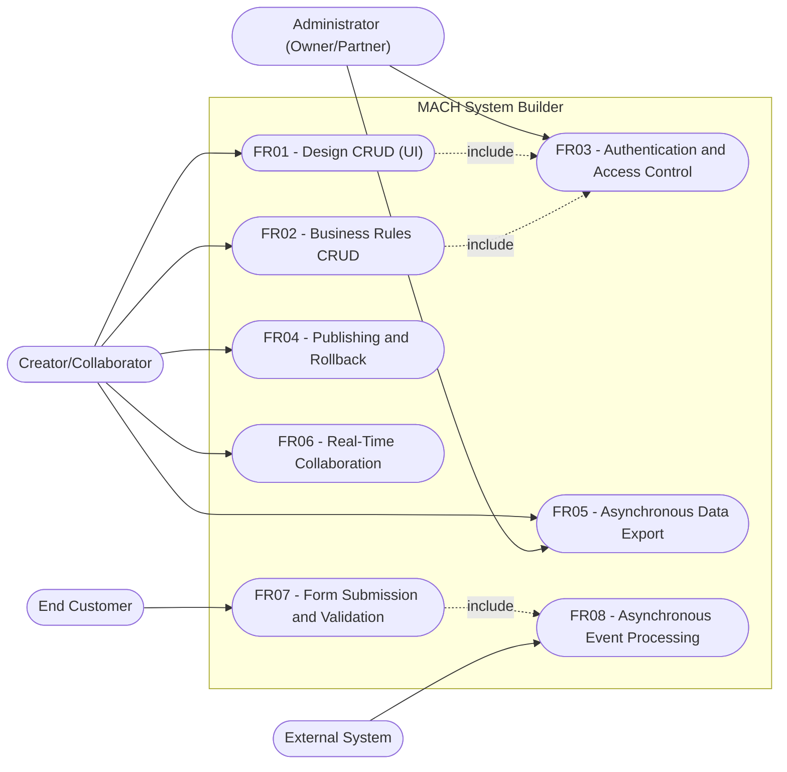
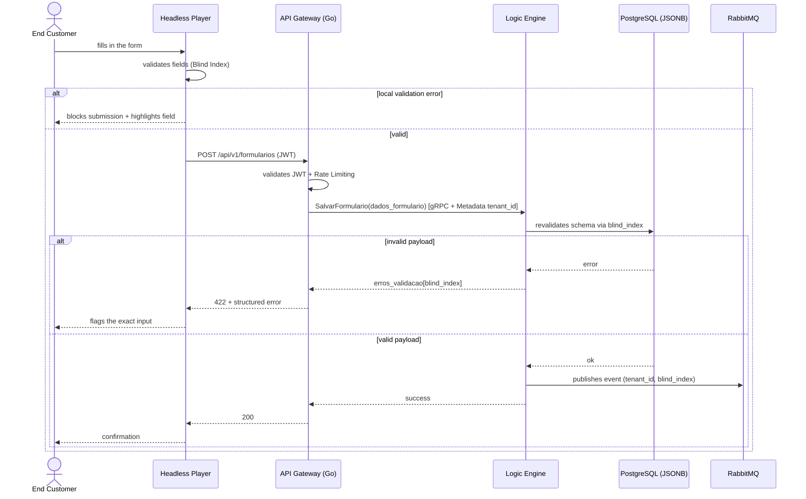
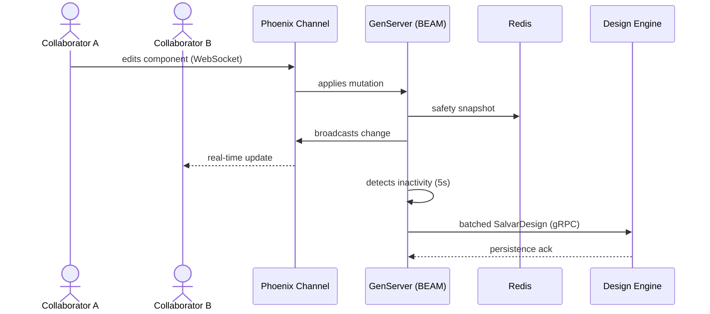
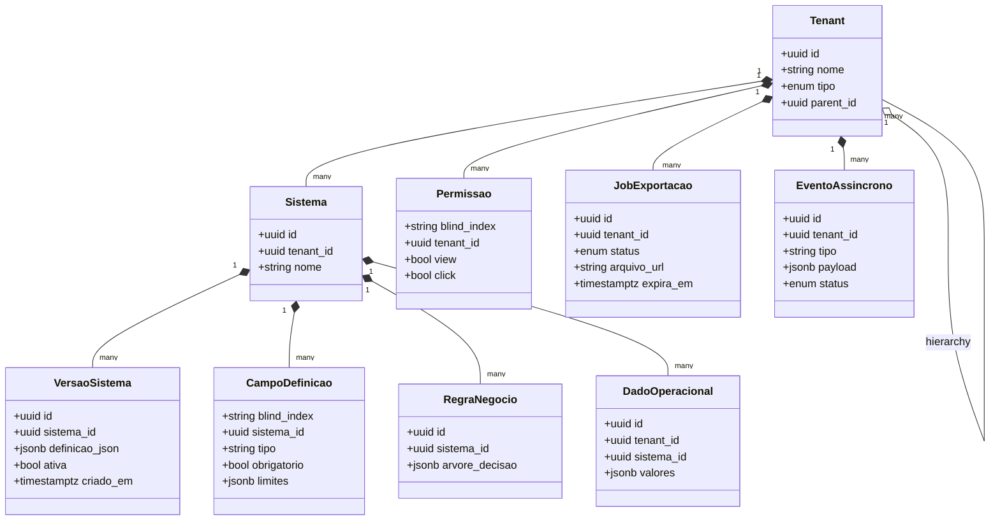

# Specification: MACH V4 System Builder — Platform Foundation

Multi-tenant Low-Code/No-Code platform based on the **MACH** pillars (Microservices, API-first, Cloud-native SaaS, Headless). This specification covers the foundational implementation of the platform based on the requirements analysis document `doc/ANALISE_REQUISITOS.md`: the 5 core microservices (Design Engine, Logic Engine, IAM Service, Deploy Engine, Export Engine), the hybrid Gateway (Go + Elixir/Phoenix), asynchronous messaging (RabbitMQ/KEDA), observability (OpenTelemetry/Jaeger), and the Headless Player.

---

## 1. Objective

Deliver the executable foundation of the platform: a polyglot monorepo with versioned gRPC contracts, the 5 microservices operating behind the Go Gateway, real-time collaboration via Elixir/Phoenix, an asynchronous pipeline with scale-to-zero, and end-to-end distributed traceability. By the end, an authenticated user must be able to create a visual system, publish it, submit data via the Headless Player, and export their data — all with guaranteed multi-tenant isolation.

---

## 2. Functional Requirements

| ID   | Description | Actor | Priority |
|------|-----------|------|------------|
| FR01 | CRUD of interface definitions in a recursive tree (Composite pattern) via the Design Engine. | Creator/Collaborator | High |
| FR02 | CRUD of business rules as decision trees via the Logic Engine. | Creator/Collaborator | High |
| FR03 | Validate the JWT at the Gateway, propagate identity via gRPC Metadata, and evaluate per-component permissions in the IAM Service. | Administrator | High |
| FR04 | Publish a new system version (active flag) and instantly roll back to the previous version. | Creator | High |
| FR05 | Generate a full export Job (UI, rules, operational data) delivered via a Presigned URL. | Creator/Administrator | Medium |
| FR06 | Simultaneous multi-user editing with synchronization via WebSockets (Phoenix Channels) and presence (cursors). | Creator/Collaborator | High |
| FR07 | Submit dynamic operational data with distributed validation (client + server) via Blind Index. | End Customer | High |
| FR08 | Trigger background tasks (webhooks, notifications) decoupled from the synchronous flow, via RabbitMQ/KEDA. | External System | Medium |

---

## 3. Non-Functional Requirements

| ID    | Category       | Description |
|-------|-----------------|-----------|
| NFR01 | Performance     | All inter-microservice communication via gRPC/Protocol Buffers over HTTP/2. |
| NFR02 | Security        | Tenant/identity context travels as binary gRPC Metadata, never in the business payload. |
| NFR03 | Scalability     | Asynchronous workers scale from 0 to N replicas (e.g., up to 50) based on queue depth, with no idle cost. |
| NFR04 | Observability   | Every request is traceable via Trace ID (W3C Trace Context) across HTTP, gRPC, and AMQP, visible in Jaeger. |
| NFR05 | Availability    | Version rollback in milliseconds, with no downtime for the published system. |
| NFR06 | Reliability     | Third-party integration failures isolated via DLQ, without impacting other tenants. |
| NFR07 | Performance/UX  | The Headless Player applies UI changes in 16ms batches (60Hz), avoiding visual jank. |
| NFR08 | Security/LGPD   | No real column/table/field name is ever exposed in logs, traces, or error payloads — only the Blind Index. |

---

## 4. Business Rules

| ID   | Rule |
|------|-------|
| BR01 | **Multi-tenant Isolation**: every query against the shared database applies a mandatory `WHERE tenant_id = :id` filter, extracted from the gRPC/JWT context. |
| BR02 | **Anonymization via Blind Index**: dynamic fields are never referenced by their real name; always by a cryptographic hash mapping type, required-ness, and limits. |
| BR03 | **Server-Side Permission Evaluation**: view/click conditions are computed in the IAM Service; the front-end receives only the final boolean map indexed by Blind Index. |
| BR04 | **Publishing via Active Flag**: publishing creates a new row in `versoes_sistema`; only one active version per system; the Headless Player always consumes the active version. |
| BR05 | **Instant Rollback**: rolling back = toggling the `ativa` flag to the previous stable version, with no recompilation or downtime. |
| BR06 | **Debounced Persistence (Write-Behind)**: collaborative mutations are persisted to the relational database only after 5s of inactivity detected by the GenServer; before that, they live only in BEAM memory + Redis. |
| BR07 | **Optimistic Per-Component Locking**: a component under active edition is temporarily locked (via Blind Index) for other collaborators. |
| BR08 | **Mandatory Double Validation**: payload validated on the front-end **and** revalidated in the Logic Engine against the saved schema. |
| BR09 | **Fair Queuing per Tenant**: no tenant monopolizes workers; persistent failures are diverted to the DLQ without affecting other tenants. |
| BR10 | **Queue-Based Scaling**: autoscaling reacts exclusively to `QueueLength` in RabbitMQ, and can scale to zero. |

---

## 5. Usage Scenarios

### Scenario 1: Valid Form Submission (FR07, BR01, BR02, BR08)
* **Given** an End Customer accesses a published system with a dynamic form
* **When** they fill in all fields correctly and submit
* **Then** the Headless Player validates locally via the Blind Index map, the Gateway validates the JWT and translates it to gRPC, the Logic Engine revalidates against the saved schema and persists it in the JSONB column with `tenant_id`
* **And** if any business rule triggers an asynchronous task, an event is published to RabbitMQ without blocking the response

### Scenario 2: Malicious Submission Bypassing the Client (FR07, BR08, NFR08)
* **Given** an attacker sends a payload directly to the API with invalid fields
* **When** the Logic Engine revalidates the payload against the schema
* **Then** the submission is rejected with an error map indexed by `blind_index`
* **And** no real column or table name appears in the error response

### Scenario 3: Simultaneous Collaboration with Debounce (FR06, BR06, BR07)
* **Given** two collaborators edit the same screen simultaneously
* **When** Collaborator A moves a component
* **Then** the mutation is applied in the GenServer, replicated as a snapshot in Redis, and broadcast to Collaborator B in real time
* **And** after 5 seconds of network silence, the GenServer consolidates the tree and fires a single batched gRPC call to the Design Engine

### Scenario 4: Publishing and Rollback (FR04, BR04, BR05, NFR05)
* **Given** a Creator has published version N of their system
* **When** they detect a failure and trigger a rollback
* **Then** the Deploy Engine reactivates the version N-1 flag in milliseconds
* **And** the Headless Player starts consuming version N-1 with no downtime

### Scenario 5: Webhook Spike with Scale-to-Zero (FR08, BR09, BR10, NFR03)
* **Given** the event queues are empty and workers are scaled to 0 replicas
* **When** a tenant fires 10,000 webhooks
* **Then** KEDA detects the `QueueLength` and scales workers up to the `maxReplicaCount`
* **And** persistent delivery failures are diverted to the DLQ with an alert only to the affected tenant

### Scenario 6: Large-Volume Export (FR05, NFR01)
* **Given** a Creator requests a full export of their system
* **When** the Gateway creates the Job in the Export Engine and frees up the front-end
* **Then** collection happens via gRPC Server Streaming in chunks, and the package is stored in Cloud Storage
* **And** the user receives a short-lived Presigned URL for direct download

---

## 6. Acceptance Criteria

1. A request without a valid JWT is rejected at the Gateway with HTTP 401; a request with another tenant's JWT never returns someone else's data (testable via a multi-tenant integration test).
2. `SalvarFormulario` with an invalid field returns `erros_validacao` containing only `blind_index` values as keys — no API response contains real column/table names.
3. Publishing a version inserts a row into `versoes_sistema` and atomically deactivates the previous one (single transaction); rollback restores the previous version in < 100ms as measured in the test.
4. Collaborative editing: a mutation sent by client A reaches client B via WebSocket; no mutations for 5s generates exactly 1 batched gRPC `SalvarDesign` call.
5. With the queue empty for longer than the configured cooldown, `kubectl get pods` shows 0 workers; when N messages are published, replicas scale up to the `ScaledObject` limit.
6. A `traceparent` generated at the Gateway is visible in Jaeger spanning Gateway → gRPC → RabbitMQ → Worker as spans of the same trace.
7. Export returns an immediate HTTP 202 with `job_id`; upon completion, `GET /jobs/{id}` returns a Presigned URL that expires at the configured time.
8. All services start via `docker compose up` and integration tests pass in CI.

---

## 7. UML Diagrams

### 7.1. Use Case Diagram

### 7.2. Sequence Diagram — Scenario 1/2 (FR07)

### 7.3. Sequence Diagram — Scenario 3 (FR06)

### 7.4. Class Diagram (persisted entities)

---

## 8. Out of Scope

- **Compiled Approach** (generating per-tenant Docker/Serverless images): future roadmap described in `doc/CONTRACTS_PERFORMANCE.md §6`; the architecture must simply not preclude it.
- **Visual editor (builder UI)**: this spec covers the back-end, the contracts, and the Headless Player (renderer); the drag-and-drop builder panel is a separate deliverable.
- **Per-tenant billing** and commercial plan management.
- **Third-party component/template marketplace**.
- **Dedicated single-tenant instances** (enterprise model).
- **Native mobile apps** — the Headless Player is web-based (SPA).
