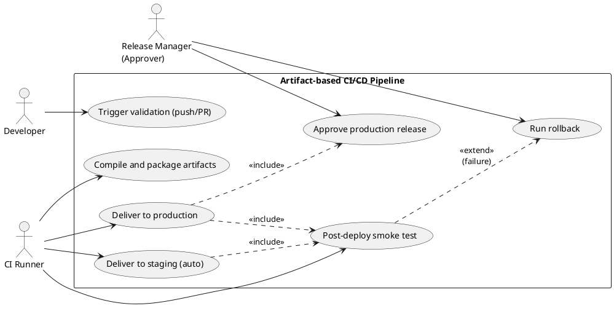
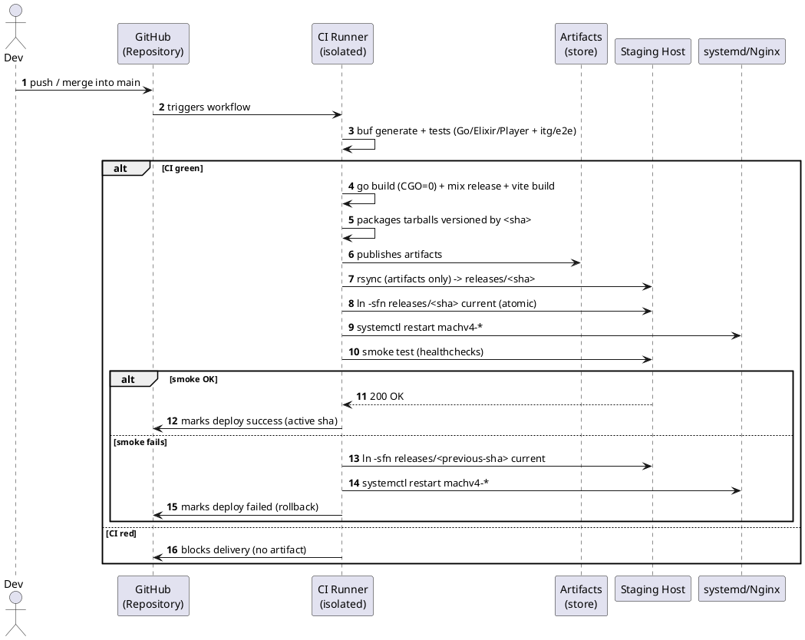
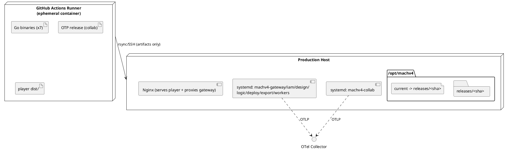

# Specification: CI/CD Pipeline for Compiled Artifact Delivery

This effort defines the Continuous Integration and Delivery pipeline for the MACH V4 polyglot monorepo under a strict **artifact delivery** model: the CI server (runner) compiles each deployable unit in an isolated environment, and only the **final, ready-to-run artifacts** (static Go binaries, Elixir/OTP release, and minified static player bundle) are transferred to the production server. No source code, development dependencies, `node_modules`/`deps`, or Git history reaches the production environment. The flow is rigidly split into three stages: `[Git Repository] → [CI Runner (compiles)] → [Production Server (receives artifacts only)]`.

---

## 1. Objective

Automate the validation, compilation, and delivery of MACH V4 so that every commit to `main` is validated and delivered to *staging* automatically, and every semantic tag (`vX.Y.Z`) is promoted to production via a manual pipeline trigger — transferring **only** the compiled artifacts, with atomic activation (symlink swap) and fast rollback without recompilation. The production environment never hosts source code, build tools, or build secrets.

---

## 2. Functional Requirements

| ID   | Description | Actor | Priority |
|------|-----------|------|------------|
| FR01 | On every push/PR, the isolated runner generates the `.proto` stubs, installs development dependencies, and runs lint + the test suite (Go, Elixir, Player) as well as the integration/E2E suites (formalizes Phase 11). | CI Runner | High |
| FR02 | Compile the release artifacts: 7 static Go binaries (`gateway`, `iam`, `design`, `logic`, `deploy`, `export`, `workers`), the Elixir release of `collab` (`mix release`), and the static `player` bundle (`vite build`). | CI Runner | High |
| FR03 | Package each artifact as a tarball versioned by the short git sha, containing **exclusively** executable content — no source, tests, `.git`, `node_modules`, or `deps`. | CI Runner | High |
| FR04 | Publish the tarballs as pipeline artifacts (retained for N days) for traceability and reuse during delivery. | CI Runner | Medium |
| FR05 | On integration into `main`, deliver the artifacts to the **staging** host automatically. | CD System | High |
| FR06 | Publishing a `vX.Y.Z` semver tag compiles and publishes the release artifacts; delivery to the **production** host happens via a **manual trigger** of the pipeline (the trigger is the human gate). | Approver | High |
| FR07 | Transfer the artifacts to the host via rsync over SSH into a versioned release directory (`releases/<sha>`), sending only the delta. | CD System | High |
| FR08 | Activate the release via **atomic symlink swap** (`current → releases/<sha>`) and restart the `systemd` units; serve the player through Nginx from the new docroot. | CD System | High |
| FR09 | Perform **rollback** by repointing the `current` symlink to the previous release and restarting the services — without a new build. | Approver | High |
| FR10 | Block delivery when CI validation fails (gate: no green CI, no artifact, and no deploy). | CD System | High |
| FR11 | Run a post-activation smoke test (healthcheck for each service); on failure, trigger automatic rollback. | CD System | High |

---

## 3. Non-Functional Requirements

| ID    | Category | Description |
|-------|-----------|-----------|
| NFR01 | Security | Production never receives source code, `.git`, development dependencies, or build secrets. Connection exclusively via SSH with key auth; secrets stored in the CI vault (GitHub Secrets/Environments); binaries run as a **non-root** user. |
| NFR02 | Performance | Pipeline uses caching (Go modules, `mix deps`, npm, `buf`) and job parallelism; delivery transfers only the delta via rsync. |
| NFR03 | Reliability | Atomic activation (symlink swap); idempotent deploy; rollback completed in < 2 min. |
| NFR04 | Traceability | Each release is named by the git sha; the pipeline records which sha is active in each environment. |
| NFR05 | Reproducibility | Deterministic build inside the runner container: the same commit produces the same artifact. |
| NFR06 | Observability | The pipeline reports status per stage; the binaries (already instrumented with OTel — Phase 9) point to the target environment's Collector. |

---

## 4. Business Rules

| ID   | Rule |
|------|-------|
| BR01 | Only compiled content is sent to production (binaries, OTP release, `dist/`). Transferring source, tests, `.git`, `node_modules`, or `deps` is forbidden. |
| BR02 | A production artifact is only generated from a `vX.Y.Z` semver tag; *staging* is generated from `main`. |
| BR03 | Production deploy requires deliberate human action: it is triggered by a manual pipeline dispatch (`workflow_dispatch`), never automatically on tag creation. |
| BR04 | The release name is the short git sha (immutable); the `current` alias moves atomically between releases. |
| BR05 | The `.proto` stubs (`gen/`) are generated on the runner before the build; they are never versioned nor sent to production. |
| BR06 | The Go binaries are compiled with `CGO_ENABLED=0` (static, independent of the host's libc). |
| BR07 | Rollback points `current` to the previous release and restarts the services; it **does not** recompile. |
| BR08 | A failed post-deploy smoke test triggers automatic rollback to the previous release. |

---

## 5. Usage Scenarios

### Scenario 1: Automatic integration and delivery to staging
* **Given** a PR was approved and merged into the `main` branch
* **When** the CI pipeline completes validation successfully
* **Then** the runner compiles and packages the artifacts versioned by the git sha
* **And** the CD stage transfers only the artifacts to the staging host, activates the new release via symlink swap, and restarts the services
* **And** the smoke test confirms the services are healthy

### Scenario 2: Production release via manual trigger
* **Given** a `v1.4.0` tag was published on `main` and its artifacts compiled/published
* **When** the Release Manager manually triggers the pipeline pointing at the tag (`workflow_dispatch`, `--ref v1.4.0`)
* **Then** the pipeline validates, recompiles the tag's artifacts, and delivers them to the production host
* **And** activates the release and records the active git sha in production

### Scenario 3: Automatic rollback on smoke test failure
* **Given** a new release was activated in an environment
* **When** the post-activation smoke test fails for any service
* **Then** the pipeline repoints `current` to the previous release and restarts the services
* **And** marks the deploy as failed, preserving the environment on the previous stable version

### Scenario 4: Manual rollback
* **Given** an active release exhibits a defect detected after deploy
* **When** the operator triggers a manual rollback for an environment
* **Then** `current` is repointed to the previous release and the services restarted, without a new build

---

## 6. Acceptance Criteria

1. After a deploy, the target host contains **only** binaries/release/`dist/` in the release directory — inspection finds no `.go`, `.ex`, `.git`, `node_modules`, or `deps`.
2. A merge into `main` results, without intervention, in an updated staging environment with healthy services.
3. A `vX.Y.Z` tag only reaches production via a deliberate manual pipeline trigger (never automatically).
4. Release activation is atomic: at no point does `current` point to a partially transferred directory.
5. A rollback (manual or automatic) restores the previous release in < 2 min without recompiling.
6. No artifact is delivered when any CI step fails.
7. The delivered Go binaries run on a host without the Go toolchain installed (static, `CGO_ENABLED=0`).

---

## 7. UML Diagrams

### 7.1. Use Case Diagram

### 7.2. Sequence Diagram (main flow — Scenario 1)

### 7.3. Deployment Diagram (components)

---

## 8. Out of Scope

- Provisioning the host infrastructure (OS, user creation, Nginx/systemd installation, firewall) — assumed pre-existing (Ansible/Terraform are left for another effort).
- Database migrations in production as part of the deploy — handled as a **dependency/prerequisite** (see `plan.md`), not automated here.
- Advanced release strategies (blue-green, canary, progressive traffic).
- Worker autoscaling via KEDA/Kubernetes — the existing manifest (`infra/k8s/keda/scaledobject-workers.yaml`) is an **alternative** substrate to this effort's model (see `research.md`, Alternatives section).
- Publishing the player bundle to a CDN/object storage (S3) — recorded as an alternative; the adopted standard is Nginx on the host.
