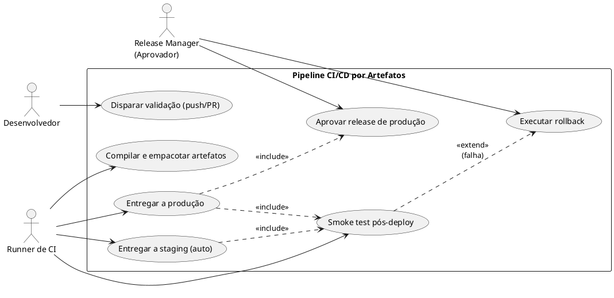
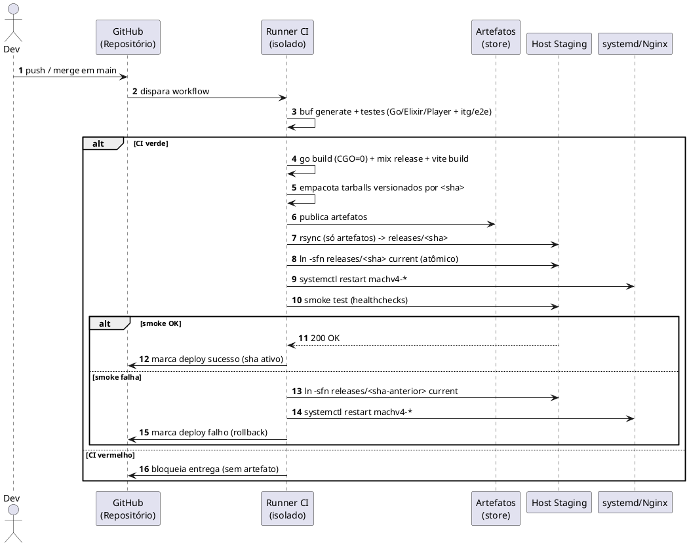
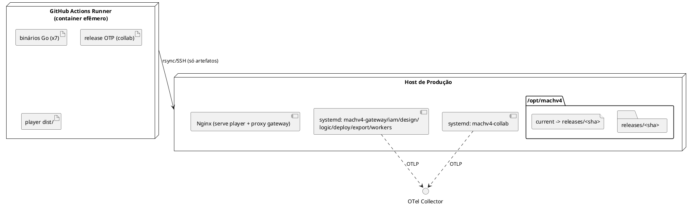

# Especificação: Pipeline CI/CD por Entrega de Artefatos Compilados

Esta demanda define o pipeline de Integração e Entrega Contínuas do monorepo poliglota MACH V4 sob um modelo estrito de **entrega por artefatos**: o servidor de CI (runner) compila cada unidade implantável em ambiente isolado e apenas os **artefatos finais, prontos para execução** (binários Go estáticos, release Elixir/OTP e bundle estático minificado do player) são transferidos ao servidor de produção. Nenhum código-fonte, dependência de desenvolvimento, `node_modules`/`deps` ou histórico Git chega ao ambiente produtivo. O fluxo é rigidamente separado em três estágios: `[Repositório Git] → [Runner de CI (compila)] → [Servidor de Produção (só recebe artefatos)]`.

---

## 1. Objetivo

Automatizar a validação, compilação e entrega do MACH V4 de modo que cada commit em `main` seja validado e entregue a *staging* automaticamente, e cada tag semântica (`vX.Y.Z`) seja entregue a produção mediante aprovação manual — transferindo **somente** os artefatos compilados, com ativação atômica (troca de symlink) e rollback rápido sem recompilação. O ambiente de produção nunca hospeda fonte, ferramentas de build ou segredos de compilação.

---

## 2. Requisitos Funcionais

| ID   | Descrição | Ator | Prioridade |
|------|-----------|------|------------|
| RF01 | Em cada push/PR, o runner isolado gera os stubs `.proto`, instala dependências de desenvolvimento e executa lint + suíte de testes (Go, Elixir, Player) e as suítes de integração/E2E (formaliza a Fase 11). | Runner CI | Alta |
| RF02 | Compilar os artefatos de release: 7 binários Go estáticos (`gateway`, `iam`, `design`, `logic`, `deploy`, `export`, `workers`), o release Elixir do `collab` (`mix release`) e o bundle estático do `player` (`vite build`). | Runner CI | Alta |
| RF03 | Empacotar cada artefato como tarball versionado pelo git sha curto, contendo **exclusivamente** conteúdo executável — sem fonte, testes, `.git`, `node_modules` ou `deps`. | Runner CI | Alta |
| RF04 | Publicar os tarballs como artefatos do pipeline (retidos por N dias) para rastreabilidade e reuso na entrega. | Runner CI | Média |
| RF05 | Ao integrar `main`, entregar os artefatos ao host de **staging** automaticamente. | Sistema CD | Alta |
| RF06 | Ao publicar uma tag semver `vX.Y.Z`, entregar ao host de **produção** após **aprovação manual**. | Aprovador | Alta |
| RF07 | Transferir os artefatos ao host via rsync sobre SSH para um diretório de release versionado (`releases/<sha>`), enviando apenas o delta. | Sistema CD | Alta |
| RF08 | Ativar o release por **troca atômica de symlink** (`current → releases/<sha>`) e reiniciar as unidades `systemd`; servir o player pelo Nginx a partir do novo docroot. | Sistema CD | Alta |
| RF09 | Executar **rollback** repontando o symlink `current` ao release anterior e reiniciando os serviços — sem novo build. | Aprovador | Alta |
| RF10 | Bloquear a entrega quando a validação de CI falhar (gate: sem CI verde, sem artefato e sem deploy). | Sistema CD | Alta |
| RF11 | Executar smoke test pós-ativação (healthcheck de cada serviço); em falha, disparar rollback automático. | Sistema CD | Alta |

---

## 3. Requisitos Não-Funcionais

| ID    | Categoria | Descrição |
|-------|-----------|-----------|
| RNF01 | Segurança | Produção nunca recebe código-fonte, `.git`, dependências de desenvolvimento nem segredos de build. Conexão exclusiva via SSH com chave; segredos guardados no cofre do CI (GitHub Secrets/Environments); binários executam como usuário **non-root**. |
| RNF02 | Desempenho | Pipeline usa cache (módulos Go, `mix deps`, npm, `buf`) e paralelismo entre jobs; a entrega transfere apenas o delta via rsync. |
| RNF03 | Confiabilidade | Ativação atômica (symlink swap); deploy idempotente; rollback concluído em < 2 min. |
| RNF04 | Rastreabilidade | Cada release é nomeado pelo git sha; o pipeline registra qual sha está ativo em cada ambiente. |
| RNF05 | Reprodutibilidade | Build determinístico no container do runner: o mesmo commit produz o mesmo artefato. |
| RNF06 | Observabilidade | O pipeline reporta status por estágio; os binários (já instrumentados com OTel — Fase 9) apontam ao Collector do ambiente de destino. |

---

## 4. Regras de Negócio

| ID   | Regra |
|------|-------|
| RN01 | Somente conteúdo compilado é enviado a produção (binários, release OTP, `dist/`). É proibido transferir fonte, testes, `.git`, `node_modules` ou `deps`. |
| RN02 | Artefato de produção só é gerado a partir de uma tag semver `vX.Y.Z`; *staging* é gerado a partir de `main`. |
| RN03 | O deploy de produção exige aprovação manual (proteção de *environment*). |
| RN04 | O nome do release é o git sha curto (imutável); o alias `current` move-se atomicamente entre releases. |
| RN05 | Os stubs `.proto` (`gen/`) são gerados no runner antes do build; nunca são versionados nem enviados a produção. |
| RN06 | Os binários Go são compilados com `CGO_ENABLED=0` (estáticos, independentes da libc do host). |
| RN07 | O rollback aponta `current` ao release anterior e reinicia os serviços; **não** recompila. |
| RN08 | Falha no smoke test pós-deploy dispara rollback automático para o release anterior. |

---

## 5. Cenários de Uso

### Cenário 1: Integração e entrega automática em staging
* **Dado que** um PR foi aprovado e integrado à branch `main`
* **Quando** o pipeline de CI conclui a validação com sucesso
* **Então** o runner compila e empacota os artefatos versionados pelo git sha
* **E** o estágio de CD transfere apenas os artefatos ao host de staging, ativa o novo release por troca de symlink e reinicia os serviços
* **E** o smoke test confirma os serviços saudáveis

### Cenário 2: Release de produção com aprovação
* **Dado que** uma tag `v1.4.0` foi publicada em `main`
* **Quando** o pipeline gera os artefatos e alcança o estágio de deploy de produção
* **Então** o pipeline pausa aguardando aprovação manual do Release Manager
* **E** após a aprovação, entrega os artefatos ao host de produção e ativa o release
* **E** registra o git sha ativo em produção

### Cenário 3: Rollback automático por falha de smoke test
* **Dado que** um novo release foi ativado em um ambiente
* **Quando** o smoke test pós-ativação falha em qualquer serviço
* **Então** o pipeline repointa `current` ao release anterior e reinicia os serviços
* **E** marca o deploy como falho, preservando o ambiente na versão anterior estável

### Cenário 4: Rollback manual
* **Dado que** um release ativo apresenta defeito detectado após o deploy
* **Quando** o operador dispara o rollback manual para um ambiente
* **Então** o `current` é repontado ao release anterior e os serviços reiniciados, sem novo build

---

## 6. Critérios de Aceitação

1. Após um deploy, o host de destino contém **apenas** binários/release/`dist/` no diretório do release — inspeção não encontra `.go`, `.ex`, `.git`, `node_modules` ou `deps`.
2. Um merge em `main` resulta, sem intervenção, em staging atualizado e serviços saudáveis.
3. Uma tag `vX.Y.Z` só chega a produção após aprovação manual registrada.
4. A ativação de um release é atômica: em nenhum instante o `current` aponta para um diretório parcialmente transferido.
5. Um rollback (manual ou automático) restaura o release anterior em < 2 min sem recompilar.
6. Nenhum artefato é entregue quando qualquer etapa de CI falha.
7. Os binários Go entregues executam em um host sem toolchain Go instalado (estáticos, `CGO_ENABLED=0`).

---

## 7. Diagramas UML

### 7.1. Diagrama de Casos de Uso

### 7.2. Diagrama de Sequência (fluxo principal — Cenário 1)

### 7.3. Diagrama de Implantação (componentes)

---

## 8. Fora de Escopo

- Provisionamento da infraestrutura do host (SO, criação de usuário, instalação do Nginx/systemd, firewall) — assumido pré-existente (Ansible/Terraform ficam para outra demanda).
- Migrações de banco em produção como parte do deploy — tratadas como **dependência/pré-requisito** (ver `plan.md`), não automatizadas aqui.
- Estratégias avançadas de release (blue-green, canary, tráfego progressivo).
- Autoscaling de workers via KEDA/Kubernetes — o manifesto existente (`infra/k8s/keda/scaledobject-workers.yaml`) é um substrato **alternativo** ao modelo desta demanda (ver `research.md`, seção Alternativas).
- Publicação do bundle do player em CDN/object storage (S3) — registrada como alternativa; o padrão adotado é Nginx no host.
