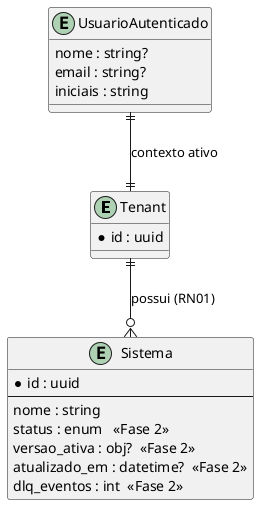

# Modelo de Dados: Dashboard — Integração de Dados e Funcionalidade

Esta demanda é predominantemente de front-end e **não cria tabelas** no backend. O
"modelo" aqui descreve os tipos de domínio consumidos pelo Player (em
`player/src/api/types.ts`) e os tipos novos de estado de UI/tema/identidade. Também
documenta a **extensão de contrato** necessária no `Sistema` para viabilizar RF07/RF09
(Fase 2), a ser fornecida pelo Gateway.

---

## 1. Entidades (tipos de domínio no Player)

### `Sistema` (existente — `api/types.ts`)

| Campo | Tipo | Nulável | Padrão | Descrição |
|-------|------|---------|--------|-----------|
| id    | string (uuid) | não | — | Identificador do sistema |
| nome  | string | não | — | Nome exibido |

### `Sistema` — extensão proposta (Fase 2, fornecida pelo Gateway)

| Campo | Tipo | Nulável | Padrão | Descrição |
|-------|------|---------|--------|-----------|
| status | `"publicado" \| "rascunho" \| "falha"` | sim | `"rascunho"` | Estado derivado da versão ativa (RN04) e da saúde de integração (RN09) |
| versao_ativa | `{ numero: number; rotulo: string } \| null` | sim | `null` | Ex.: `{ numero: 7, rotulo: "v7 · ativa" }`; `null` = sem versão ativa |
| atualizado_em | string (ISO 8601) | sim | — | Timestamp da última edição (ex.: "editado há 3 min") |
| dlq_eventos | number | sim | `0` | Contagem de eventos na DLQ do tenant para o sistema (RN09) |

> Enquanto o Gateway não retornar esses campos, o Player os trata como opcionais e
> degrada graciosamente (sem status/versão no card).

### `UsuarioAutenticado` (novo — derivado do JWT, apenas exibição — RF03)

| Campo | Tipo | Nulável | Padrão | Descrição |
|-------|------|---------|--------|-----------|
| nome | string | sim | — | Claim `name` do JWT |
| email | string | sim | — | Claim `email` do JWT |
| iniciais | string | não | `"?"` | Derivadas do nome/e-mail para o avatar |

### `PreferenciaTema` (novo — persistido em `localStorage` — RF05/RNF04)

| Campo | Tipo | Nulável | Padrão | Descrição |
|-------|------|---------|--------|-----------|
| tema | `"claro" \| "escuro"` | não | `"escuro"` | Chave `mach_theme` no `localStorage` |

### `EstadoDados<T>` (novo — máquina de estados de UI — RF06)

| Variante | Campos | Descrição |
|----------|--------|-----------|
| `carregando` | — | Renderiza skeleton (`aria-busy`) |
| `pronto` | `dados: T` | Renderiza conteúdo |
| `vazio` | — | Renderiza empty state |
| `erro` | `mensagem: string` | Renderiza alerta + botão repetir |

### `Metricas` (novo — Overview — RF01)

| Campo | Tipo | Nulável | Padrão | Descrição |
|-------|------|---------|--------|-----------|
| sistemas_total | number | não | `0` | Total de sistemas do tenant |
| sistemas_ativos | number | sim | — | Sistemas publicados (requer status — Fase 2) |
| sistemas_rascunho | number | sim | — | Sistemas sem versão ativa (Fase 2) |

---

## 2. Relacionamentos

| Entidade A | Cardinalidade | Entidade B | Chave |
|------------|--------------|------------|-------|
| Tenant | 1:N | Sistema | derivado do JWT (RN01) |
| Sistema | 1:1 | VersaoAtiva | `versao_ativa` (RN04) |
| Sistema | 1:N | ColaboradorPresente | tópico Phoenix `sistema:{id}` (RF08) |
| UsuarioAutenticado | 1:1 | JWT | claims do token (RF03) |

---

## 3. Diagrama ER

---

## 4. Migrações Necessárias

Nenhuma migração de banco no escopo desta demanda (front-end).

| Alteração | Operação | Local |
|-----------|----------|-------|
| Extensão do payload de `Sistema` (status, versao_ativa, atualizado_em, dlq_eventos) | Alteração de contrato/serializer no Gateway | Backend — **Fase 2**, fora desta demanda de front-end |
| Chave `mach_theme` | `localStorage` (cliente) | Player |
