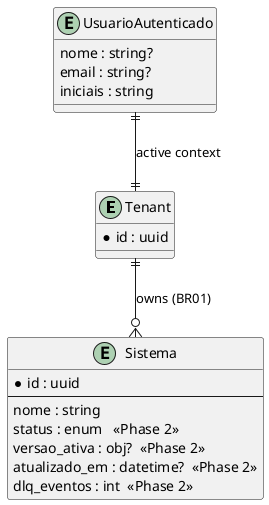

# Data Model: Dashboard — Data Integration and Functionality

This effort is predominantly front-end and **does not create tables** on the backend. The
"model" here describes the domain types consumed by the Player (in
`player/src/api/types.ts`) and the new UI state/theme/identity types. It also
documents the **contract extension** needed on `Sistema` to enable FR07/FR09
(Phase 2), to be provided by the Gateway.

---

## 1. Entities (domain types in the Player)

### `Sistema` (existing — `api/types.ts`)

| Field | Type | Nullable | Default | Description |
|-------|------|---------|--------|-----------|
| id    | string (uuid) | no | — | System identifier |
| nome  | string | no | — | Displayed name |

### `Sistema` — proposed extension (Phase 2, provided by the Gateway)

| Field | Type | Nullable | Default | Description |
|-------|------|---------|--------|-----------|
| status | `"publicado" \| "rascunho" \| "falha"` | yes | `"rascunho"` | State derived from the active version (BR04) and integration health (BR09) |
| versao_ativa | `{ numero: number; rotulo: string } \| null` | yes | `null` | E.g., `{ numero: 7, rotulo: "v7 · active" }`; `null` = no active version |
| atualizado_em | string (ISO 8601) | yes | — | Timestamp of the last edit (e.g., "edited 3 min ago") |
| dlq_eventos | number | yes | `0` | Count of events in the tenant's DLQ for the system (BR09) |

> Until the Gateway returns these fields, the Player treats them as optional and
> degrades gracefully (no status/version on the card).

### `UsuarioAutenticado` (new — derived from the JWT, display only — FR03)

| Field | Type | Nullable | Default | Description |
|-------|------|---------|--------|-----------|
| nome | string | yes | — | `name` claim from the JWT |
| email | string | yes | — | `email` claim from the JWT |
| iniciais | string | no | `"?"` | Derived from the name/email for the avatar |

### `PreferenciaTema` (new — persisted in `localStorage` — FR05/NFR04)

| Field | Type | Nullable | Default | Description |
|-------|------|---------|--------|-----------|
| tema | `"claro" \| "escuro"` | no | `"escuro"` | `mach_theme` key in `localStorage` |

### `EstadoDados<T>` (new — UI state machine — FR06)

| Variant | Fields | Description |
|----------|--------|-----------|
| `carregando` | — | Renders a skeleton (`aria-busy`) |
| `pronto` | `dados: T` | Renders the content |
| `vazio` | — | Renders the empty state |
| `erro` | `mensagem: string` | Renders an alert + retry button |

### `Metricas` (new — Overview — FR01)

| Field | Type | Nullable | Default | Description |
|-------|------|---------|--------|-----------|
| sistemas_total | number | no | `0` | Total systems in the tenant |
| sistemas_ativos | number | yes | — | Published systems (requires status — Phase 2) |
| sistemas_rascunho | number | yes | — | Systems with no active version (Phase 2) |

---

## 2. Relationships

| Entity A | Cardinality | Entity B | Key |
|------------|--------------|------------|-------|
| Tenant | 1:N | Sistema | derived from the JWT (BR01) |
| Sistema | 1:1 | VersaoAtiva | `versao_ativa` (BR04) |
| Sistema | 1:N | ColaboradorPresente | Phoenix topic `sistema:{id}` (FR08) |
| UsuarioAutenticado | 1:1 | JWT | token claims (FR03) |

---

## 3. ER Diagram

---

## 4. Required Migrations

No database migration is in scope for this effort (front-end).

| Change | Operation | Location |
|-----------|----------|-------|
| `Sistema` payload extension (status, versao_ativa, atualizado_em, dlq_eventos) | Contract/serializer change on the Gateway | Backend — **Phase 2**, outside this front-end effort |
| `mach_theme` key | `localStorage` (client) | Player |
