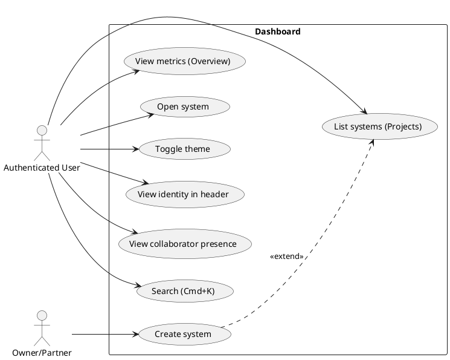
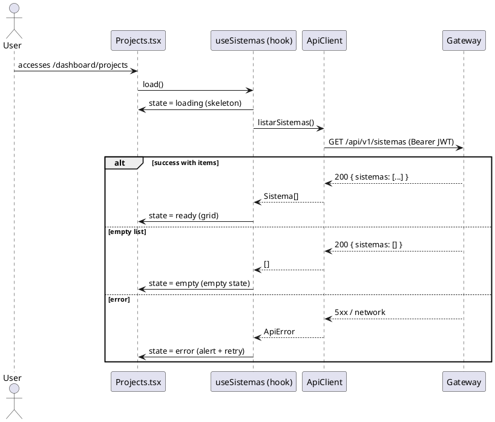
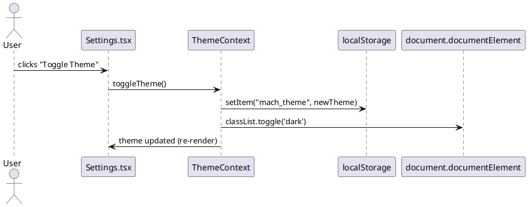

# Specification: Dashboard — Data Integration and Functionality

The Player Dashboard (the `Overview`, `Projects`, and `Settings` screens, under `/dashboard`)
was delivered only at the visual layer: it adopts the Material Design 3 aesthetic (hero card,
metric cards, FAB, sidebar), but every screen is a **static mockup** with hardcoded data
and inert buttons. None of them consumes the endpoints already exposed by the
`ApiClient` (`listarSistemas`, `criarSistema`, `versaoAtiva`, `criarExportacao`).
This effort turns the mocked dashboard into a functional panel wired to real data,
with UI states (loading/empty/error), a persistent theme, and working actions,
reusing the logic already validated in `SeletorSistemas.tsx`.

---

## 1. Objective

Replace the Dashboard's static data and actions with real integration against the Gateway,
making the three screens operational: metrics and system listing sourced from the API,
user identity derived from the JWT, functional navigation/creation actions, a persistent
light/dark theme, and consistent loading, empty, and error states. Advanced features from
the planned wireframe (tenant selector, command palette, real-time presence, DLQ alerts)
are specified as Phase 2.

---

## 2. Functional Requirements

| ID   | Description | Actor | Priority |
|------|-----------|------|------------|
| FR01 | The `Overview` screen must display real platform metrics (e.g., active systems, drafts, total), fetched from the API, replacing the fixed "12/4/8" values. | Authenticated user | High |
| FR02 | The `Projects` screen must list the tenant's real systems via `client.listarSistemas()`, reusing `SeletorSistemas`'s logic, instead of the fixed "ERP Financeiro" card. | Authenticated user | High |
| FR03 | The header (`DashboardLayout`) must display the user's real name and initials/avatar, derived from the JWT claims, replacing "Welcome, User" and the "U" avatar. | Authenticated user | High |
| FR04 | **All** interactive controls on the dashboard must perform a real action — no button may be left without a handler or use `alert()`. The complete set is catalogued in the Control Inventory (section 2.1); "Get Started" is just one of the items. | Authenticated user | High |
| FR05 | The `Settings` screen must toggle between light and dark theme, with the choice persisted across sessions and applied without a flash of the wrong theme. | Authenticated user | High |
| FR06 | Every dashboard screen that loads data must present loading (skeleton), empty, and error (with a retry action) states. | Authenticated user | High |
| FR07 | The system cards in `Projects` must display status (Published/Draft/Failed) and the active version (e.g., `v7 · active`) of each system. | Authenticated user | Medium |
| FR08 | The dashboard must display the presence of online collaborators per system, in real time, via a Phoenix channel (`collab/phoenixSocket.ts`). | Authenticated user | Low |
| FR09 | The dashboard must flag systems with integration failures and the tenant's DLQ event count. | Authenticated user | Low |
| FR10 | The dashboard must provide a command palette (Cmd/Ctrl+K) for system search and quick actions. | Authenticated user | Low |
| FR11 | The top bar must display a hierarchical tenant selector (Owner › Partner), reflecting the active multi-tenant context. | Authenticated user | Low |
| FR12 | The `Projects` screen must provide status filters (All/Published/Drafts) and a grid/list view toggle. | Authenticated user | Low |
| FR13 | The top bar must display a tenant notification/alert indicator. | Authenticated user | Low |
| FR14 | The user's avatar in the header must open a menu (profile, settings, sign out), replacing the current inert clickable `
`. | Authenticated user | Medium |

---

## 2.1. Interactive Control Inventory (detail for FR04)

Complete catalogue of **every** clickable button/control on the dashboard screens,
its current behavior, and the target action. No item may remain without a handler or with
an `alert()` by the end of implementation (FR04).

| # | Control | Screen / Location | Current behavior | Target action | FR |
|---|----------|--------------|---------------------|-----------|----|
| C1 | "Get Started" button | `Overview.tsx` (hero card) | `<button>` **with no `onClick`** | Starts the system-creation flow (`criarSistema` / navigation to creation) | FR04 |
| C2 | "Create" FAB | `Overview.tsx` | `onClick={() => alert('Create new project')}` | Starts the system-creation flow (same action as C1) | FR04 |
| C3 | "Create new project" card | `Projects.tsx` | `
` **with no handler** | Starts the system-creation flow | FR04 |
| C4 | "Open project →" | `Projects.tsx` (system card) | `
` **with no handler** | Opens the selected system (`abrirSistema(id)` → reloads with `?sistema=`) | FR04 |
| C5 | "Edit Profile" button | `Settings.tsx` | `<button>` **with no handler** | Navigates to the profile-edit route/placeholder | FR04 |
| C6 | "Toggle Theme" button | `Settings.tsx` | `<button>` **with no handler** | Toggles light/dark via `ThemeContext` (FR05) | FR04, FR05 |
| C7 | User avatar | `DashboardLayout.tsx` (header) | `
` **with no handler** | Opens the user menu (profile / settings / sign out) | FR14 |
| C8 | "Sign Out" button | `DashboardLayout.tsx` (header) | **Functional** (`encerrarSessao()` + reload) | Preserve behavior; align visuals with the theme | — |
| C9 | `SidebarTrigger` | `DashboardLayout.tsx` | **Functional** (sidebar toggle) | Preserve | NFR02 |
| C10 | Home / Projects / Settings nav | `DashboardLayout.tsx` (sidebar) | **Functional** (`Link` + `isActive`) | Preserve; ensure active state per route | NFR02 |

> Items C1–C7 are the work covered by FR04/FR14. C8–C10 already work and only need to be
> preserved (and, in C8's case, have its style aligned to the theme tokens — FR05).

---

## 3. Non-Functional Requirements

| ID    | Category | Description |
|-------|-----------|-----------|
| NFR01 | Visual consistency | The whole interface must preserve the already-adopted Material Design 3 aesthetic (`rounded-3xl`/`rounded-full`, tonal colors, soft elevations) and the `m3/` components. |
| NFR02 | Responsiveness | The layout must remain responsive; the sidebar must adapt/hide on mobile screens (current `SidebarProvider` behavior preserved). |
| NFR03 | Accessibility / Feedback | Loading states must use `aria-busy`; errors must use `role="alert"`; interactive actions must keep `hover`/`focus`/`active:scale-95` states. |
| NFR04 | Theme persistence | The theme preference must persist in `localStorage` and be applied before the first paint, avoiding a flash of the wrong theme (FOUC). |
| NFR05 | Reuse / DRY | The dashboard's system listing/creation must not duplicate `SeletorSistemas`; the shared logic must be extracted into a shared hook/module. |
| NFR06 | Security | Identity travels only in the `Authorization: Bearer` header; the tenant is derived from the token by the Gateway and never sent in the body (BR01). JWT claims are read only for display, never trusted for authorization. |

---

## 4. Business Rules

| ID   | Rule |
|------|-------|
| BR01 | Multi-tenant: the active tenant is derived from the JWT by the Gateway; the Player never sends it in the request body. (Inherited from 001.) |
| BR03 | Component visibility follows the permission map keyed by `blind_index`; the dashboard must not display actions the user lacks permission for (e.g., creating a system requires owner/partner — 403 handled in the UI). |
| BR04 | The status/version displayed per system derives from the consolidated active version (`versao-ativa`); a system with no active version is "Draft". |
| BR09 | Failure alerts shown on the dashboard correspond to events diverted to the tenant's DLQ. |
| BR10 | An end-customer user (without owner/partner role) does not see system-creation actions; the UI hides or disables those CTAs instead of exposing an error. |

---

## 5. Usage Scenarios

### Scenario 1: Listing real systems in Projects
* **Given** the user is authenticated and has systems in the tenant
* **When** they access `/dashboard/projects`
* **Then** the dashboard displays a skeleton while loading
* **And** replaces it with the grid of real systems returned by `listarSistemas()`
* **And** each card shows the name and (FR07) the system's status/version

### Scenario 2: Tenant with no systems (empty state)
* **Given** the authenticated user has no systems
* **When** they access `/dashboard/projects`
* **Then** the dashboard displays an empty state with a CTA to create the first system

### Scenario 3: Data load failure
* **Given** the API call fails (network/Gateway error)
* **When** the dashboard attempts to load the data
* **Then** it displays an error message with `role="alert"` and a "Try again" button
* **And** clicking retry redoes the request

### Scenario 4: Creating a new system via the FAB
* **Given** the user has creation permission (owner/partner)
* **When** they click the "Create" FAB (or "Get Started" / "Create new project" card)
* **Then** the system-creation flow starts
* **And** on completion, the Player reopens with the new system already active

### Scenario 5: Persistent theme toggle
* **Given** the user is on `/dashboard/settings`
* **When** they trigger "Toggle Theme"
* **Then** the interface switches between light and dark immediately
* **And** on reloading the page, the chosen theme is kept with no flash

### Scenario 6b: Avatar menu (FR14)
* **Given** the user is authenticated on the dashboard
* **When** they click the header avatar (C7)
* **Then** a menu opens with options (profile, settings, sign out)
* **And** "Sign Out" reuses the same existing `encerrarSessao()` (C8)

### Scenario 6: User identity in the header
* **Given** the user is authenticated with a valid JWT
* **When** `DashboardLayout` renders
* **Then** the header displays the real name and initials/avatar derived from the token claims

---

## 6. Acceptance Criteria

1. No metric, system card, user name, or avatar on the dashboard is hardcoded; all come from the API or the JWT claims.
2. `Projects` renders the systems returned by `listarSistemas()` and reuses the logic shared with `SeletorSistemas` (no duplication of the call/states).
3. Every control in the Inventory (section 2.1, C1–C7) performs a real action; there is no remaining `alert()`, clickable `
` without a handler, or `<button>` without `onClick` on the dashboard. C8–C10 remain functional.
4. There is a light/dark theme toggle persisted in `localStorage`, applied before the first paint.
5. Every screen with data presents the three states: loading (`aria-busy`), empty, and error (`role="alert"` + retry).
6. The header displays the user's name/initials derived from the JWT.
7. The test suite (`vitest run`) passes, including new behavior tests (active navigation, actions, and data states via mocked `fetch`).
8. `tsc --noEmit` and the build (`vite build`) complete without errors.

---

## 7. UML Diagrams

### 7.1. Use Case Diagram

### 7.2. Sequence Diagram — Listing systems in Projects (FR02/FR06)

### 7.3. Sequence Diagram — Theme toggle (FR05/NFR04)

---

## 8. Out of Scope

- Creating new backend endpoints/services for aggregated metrics and for
  enriching `Sistema` (status, version, collaborators, DLQ). This spec assumes
  those fields will be provided by the Gateway; until they exist, the screens
  derive them from the current endpoints and degrade gracefully (see
  `research.md` and `contracts/api.md`).
- User profile editing (the "Edit Profile" button may open a placeholder/route,
  but the edit form itself is not part of this effort).
- Implementing the real-time presence backend (the Phoenix channel already exists; provisioning
  per-system topics on the collaboration server is a prerequisite).
