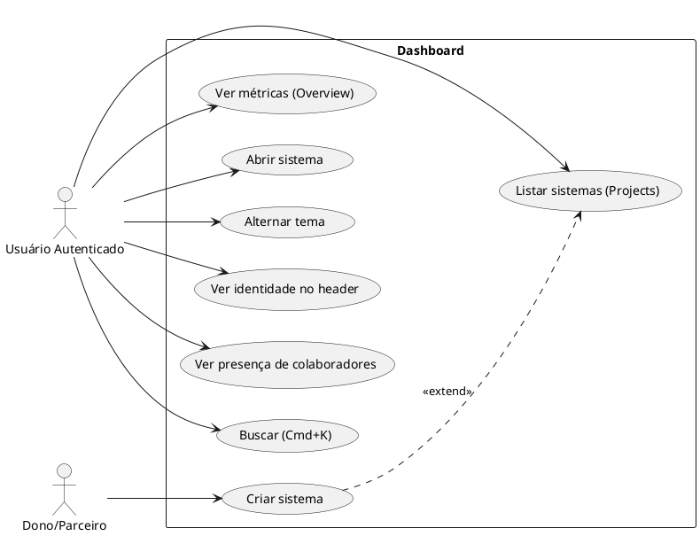
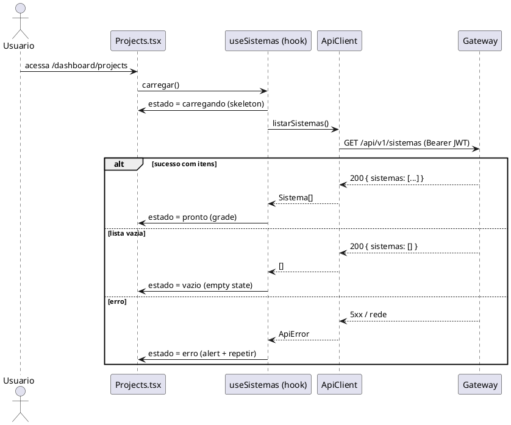
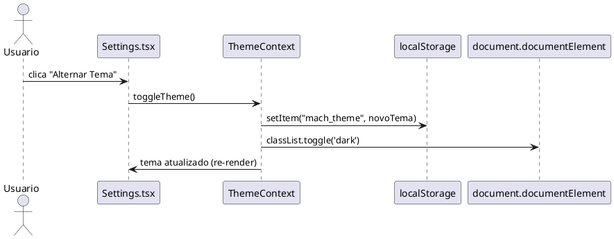

# Especificação: Dashboard — Integração de Dados e Funcionalidade

O Dashboard do Player (telas `Overview`, `Projects` e `Settings`, sob `/dashboard`)
foi entregue apenas na camada visual: adota a estética Material Design 3 (hero card,
metric cards, FAB, sidebar), mas todas as telas são **mockups estáticos** com dados
hardcoded e botões inertes. Nenhuma delas consome os endpoints já expostos pelo
`ApiClient` (`listarSistemas`, `criarSistema`, `versaoAtiva`, `criarExportacao`).
Esta demanda transforma o dashboard mockado em um painel funcional, ligado a dados
reais, com estados de UI (loading/empty/erro), tema persistente e ações operantes,
reaproveitando a lógica já validada em `SeletorSistemas.tsx`.

---

## 1. Objetivo

Substituir os dados e ações estáticos do Dashboard por integração real com o Gateway,
tornando as três telas operacionais: métricas e listagem de sistemas vindas da API,
identidade do usuário derivada do JWT, ações de navegação/criação funcionais, tema
claro/escuro persistente e estados de carregamento, vazio e erro consistentes. Recursos
avançados do wireframe planejado (seletor de tenant, command palette, presença em tempo
real, alertas de DLQ) são especificados como Fase 2.

---

## 2. Requisitos Funcionais

| ID   | Descrição | Ator | Prioridade |
|------|-----------|------|------------|
| RF01 | A tela `Overview` deve exibir métricas reais da plataforma (ex.: sistemas ativos, rascunhos, total), buscadas na API, substituindo os valores fixos "12/4/8". | Usuário autenticado | Alta |
| RF02 | A tela `Projects` deve listar os sistemas reais do tenant via `client.listarSistemas()`, reutilizando a lógica de `SeletorSistemas`, em vez do card fixo "ERP Financeiro". | Usuário autenticado | Alta |
| RF03 | O cabeçalho (`DashboardLayout`) deve exibir nome e iniciais/avatar reais do usuário, derivados dos claims do JWT, substituindo "Welcome, User" e o avatar "U". | Usuário autenticado | Alta |
| RF04 | **Todos** os controles interativos do dashboard devem executar uma ação real — nenhum botão pode ficar sem handler ou usar `alert()`. O conjunto completo está catalogado no Inventário de Controles (seção 2.1); "Get Started" é apenas um dos itens. | Usuário autenticado | Alta |
| RF05 | A tela `Settings` deve alternar entre tema claro e escuro, com a escolha persistida entre sessões e aplicada sem flash de tema incorreto. | Usuário autenticado | Alta |
| RF06 | Todas as telas do dashboard que carregam dados devem apresentar estados de carregamento (skeleton), vazio (empty state) e erro (com ação de repetir). | Usuário autenticado | Alta |
| RF07 | Os cards de sistema em `Projects` devem exibir status (Publicado/Rascunho/Falha) e a versão ativa (ex.: `v7 · ativa`) de cada sistema. | Usuário autenticado | Média |
| RF08 | O dashboard deve exibir a presença de colaboradores online por sistema, em tempo real, via canal Phoenix (`collab/phoenixSocket.ts`). | Usuário autenticado | Baixa |
| RF09 | O dashboard deve sinalizar sistemas com falha de integração e a contagem de eventos na DLQ do tenant. | Usuário autenticado | Baixa |
| RF10 | O dashboard deve prover uma command palette (Cmd/Ctrl+K) para busca de sistemas e ações rápidas. | Usuário autenticado | Baixa |
| RF11 | A top bar deve exibir um seletor de tenant hierárquico (Dono › Parceiro), refletindo o contexto multi-tenant ativo. | Usuário autenticado | Baixa |
| RF12 | A tela `Projects` deve prover filtros por status (Todos/Publicados/Rascunhos) e alternância de visualização grade/lista. | Usuário autenticado | Baixa |
| RF13 | A top bar deve exibir um indicador de notificações/alertas do tenant. | Usuário autenticado | Baixa |
| RF14 | O avatar do usuário no cabeçalho deve abrir um menu (perfil, configurações, sair), substituindo o `
` clicável inerte atual. | Usuário autenticado | Média |

---

## 2.1. Inventário de Controles Interativos (detalha RF04)

Catálogo completo de **todos** os botões/controles clicáveis das telas do dashboard,
seu comportamento atual e a ação-alvo. Nenhum item pode permanecer sem handler ou com
`alert()` ao fim da implementação (RF04).

| # | Controle | Tela / Local | Comportamento atual | Ação-alvo | RF |
|---|----------|--------------|---------------------|-----------|----|
| C1 | Botão "Get Started" | `Overview.tsx` (hero card) | `<button>` **sem `onClick`** | Inicia o fluxo de criação de sistema (`criarSistema` / navegação para criação) | RF04 |
| C2 | FAB "Create" | `Overview.tsx` | `onClick={() => alert('Create new project')}` | Inicia o fluxo de criação de sistema (mesma ação de C1) | RF04 |
| C3 | Card "Criar novo projeto" | `Projects.tsx` | `
` **sem handler** | Inicia o fluxo de criação de sistema | RF04 |
| C4 | "Abrir projeto →" | `Projects.tsx` (card de sistema) | `
` **sem handler** | Abre o sistema selecionado (`abrirSistema(id)` → recarrega com `?sistema=`) | RF04 |
| C5 | Botão "Editar Perfil" | `Settings.tsx` | `<button>` **sem handler** | Navega para a rota/placeholder de edição de perfil | RF04 |
| C6 | Botão "Alternar Tema" | `Settings.tsx` | `<button>` **sem handler** | Alterna claro/escuro via `ThemeContext` (RF05) | RF04, RF05 |
| C7 | Avatar do usuário | `DashboardLayout.tsx` (header) | `
` **sem handler** | Abre menu do usuário (perfil / configurações / sair) | RF14 |
| C8 | Botão "Sair" | `DashboardLayout.tsx` (header) | **Funcional** (`encerrarSessao()` + reload) | Preservar comportamento; alinhar visual ao tema | — |
| C9 | `SidebarTrigger` | `DashboardLayout.tsx` | **Funcional** (toggle da sidebar) | Preservar | RNF02 |
| C10 | Nav Home / Projects / Settings | `DashboardLayout.tsx` (sidebar) | **Funcional** (`Link` + `isActive`) | Preservar; garantir estado ativo por rota | RNF02 |

> Itens C1–C7 são o trabalho de RF04/RF14. C8–C10 já funcionam e apenas devem ser
> preservados (e, no caso de C8, ter o estilo ajustado aos tokens de tema — RF05).

---

## 3. Requisitos Não-Funcionais

| ID    | Categoria | Descrição |
|-------|-----------|-----------|
| RNF01 | Consistência visual | Toda a interface deve preservar a estética Material Design 3 já adotada (`rounded-3xl`/`rounded-full`, cores tonais, elevações suaves) e os componentes `m3/`. |
| RNF02 | Responsividade | O layout deve permanecer responsivo; a sidebar deve se adaptar/ocultar em telas móveis (comportamento atual do `SidebarProvider` preservado). |
| RNF03 | Acessibilidade / Feedback | Estados de carregamento devem usar `aria-busy`; erros devem usar `role="alert"`; ações interativas devem manter estados `hover`/`focus`/`active:scale-95`. |
| RNF04 | Persistência de tema | A preferência de tema deve persistir em `localStorage` e ser aplicada antes da primeira pintura, evitando flash de tema incorreto (FOUC). |
| RNF05 | Reuso / DRY | A listagem/criação de sistemas do dashboard não deve duplicar `SeletorSistemas`; a lógica comum deve ser extraída para um hook/módulo compartilhado. |
| RNF06 | Segurança | A identidade viaja apenas no header `Authorization: Bearer`; o tenant é derivado do token pelo Gateway e nunca enviado no corpo (RN01). Claims do JWT lidos apenas para exibição, sem confiar neles para autorização. |

---

## 4. Regras de Negócio

| ID   | Regra |
|------|-------|
| RN01 | Multi-tenant: o tenant ativo é derivado do JWT pelo Gateway; o Player nunca o envia no corpo das requisições. (Herdada de 001.) |
| RN03 | A visibilidade de componentes segue o mapa de permissões por `blind_index`; o dashboard não deve exibir ações para as quais o usuário não tem permissão (ex.: criar sistema exige dono/parceiro — 403 tratado na UI). |
| RN04 | O status/versão exibido por sistema deriva da versão ativa consolidada (`versao-ativa`); um sistema sem versão ativa é "Rascunho". |
| RN09 | Alertas de falha exibidos no dashboard correspondem a eventos desviados para a DLQ do tenant. |
| RN10 | Um usuário cliente-final (sem papel dono/parceiro) não vê as ações de criação de sistema; a UI oculta ou desabilita esses CTAs em vez de expor um erro. |

---

## 5. Cenários de Uso

### Cenário 1: Listagem de sistemas reais em Projects
* **Dado que** o usuário está autenticado e possui sistemas no tenant
* **Quando** ele acessa `/dashboard/projects`
* **Então** o dashboard exibe um skeleton durante o carregamento
* **E** substitui-o pela grade de sistemas reais retornados por `listarSistemas()`
* **E** cada card mostra o nome e (RF07) o status/versão do sistema

### Cenário 2: Tenant sem sistemas (empty state)
* **Dado que** o usuário autenticado não possui nenhum sistema
* **Quando** ele acessa `/dashboard/projects`
* **Então** o dashboard exibe um empty state com CTA para criar o primeiro sistema

### Cenário 3: Falha ao carregar dados
* **Dado que** a chamada à API falha (rede/erro do Gateway)
* **Quando** o dashboard tenta carregar os dados
* **Então** exibe uma mensagem de erro com `role="alert"` e um botão "Tentar novamente"
* **E** ao clicar em repetir, refaz a requisição

### Cenário 4: Criar novo sistema pelo FAB
* **Dado que** o usuário tem permissão de criação (dono/parceiro)
* **Quando** ele clica no FAB "Create" (ou "Get Started" / card "Criar novo projeto")
* **Então** o fluxo de criação de sistema é iniciado
* **E** ao concluir, o Player é reaberto já com o novo sistema ativo

### Cenário 5: Alternância de tema persistente
* **Dado que** o usuário está em `/dashboard/settings`
* **Quando** ele aciona "Alternar Tema"
* **Então** a interface troca entre claro e escuro imediatamente
* **E** ao recarregar a página, o tema escolhido é mantido sem flash

### Cenário 6b: Menu do avatar (RF14)
* **Dado que** o usuário está autenticado no dashboard
* **Quando** ele clica no avatar no cabeçalho (C7)
* **Então** abre-se um menu com opções (perfil, configurações, sair)
* **E** "Sair" reutiliza o mesmo `encerrarSessao()` já existente (C8)

### Cenário 6: Identidade do usuário no cabeçalho
* **Dado que** o usuário está autenticado com um JWT válido
* **Quando** o `DashboardLayout` é renderizado
* **Então** o cabeçalho exibe o nome real e as iniciais/avatar do usuário derivados dos claims do token

---

## 6. Critérios de Aceitação

1. Nenhuma métrica, card de sistema, nome de usuário ou avatar no dashboard é hardcoded; todos vêm da API ou dos claims do JWT.
2. `Projects` renderiza os sistemas retornados por `listarSistemas()` e reutiliza a lógica compartilhada com `SeletorSistemas` (sem duplicação da chamada/estados).
3. Todo controle do Inventário (seção 2.1, C1–C7) executa uma ação real; não há `alert()`, `
` clicável sem handler nem `<button>` sem `onClick` remanescente no dashboard. C8–C10 permanecem funcionais.
4. Existe alternância de tema claro/escuro persistida em `localStorage`, aplicada antes da primeira pintura.
5. Cada tela com dados apresenta os três estados: carregando (`aria-busy`), vazio e erro (`role="alert"` + repetir).
6. O cabeçalho exibe nome/iniciais do usuário derivados do JWT.
7. A suíte de testes (`vitest run`) passa, incluindo novos testes de comportamento (navegação ativa, ações e estados de dados via `fetch` mockado).
8. `tsc --noEmit` e o build (`vite build`) concluem sem erros.

---

## 7. Diagramas UML

### 7.1. Diagrama de Casos de Uso

### 7.2. Diagrama de Sequência — Listagem de sistemas em Projects (RF02/RF06)

### 7.3. Diagrama de Sequência — Alternância de tema (RF05/RNF04)

---

## 8. Fora de Escopo

- Criação de novos endpoints/serviços de backend para métricas agregadas e para o
  enriquecimento do `Sistema` (status, versão, colaboradores, DLQ). Esta spec assume
  que tais campos serão fornecidos pelo Gateway; enquanto não existirem, as telas
  usam derivação a partir dos endpoints atuais e degradam graciosamente (ver
  `research.md` e `contracts/api.md`).
- Edição de perfil do usuário (o botão "Editar Perfil" pode abrir um placeholder/rota,
  mas o formulário de edição não faz parte desta demanda).
- Implementação do backend de presença em tempo real (canal Phoenix já existe; o
  provisionamento de tópicos por sistema no servidor de colaboração é pré-requisito).
