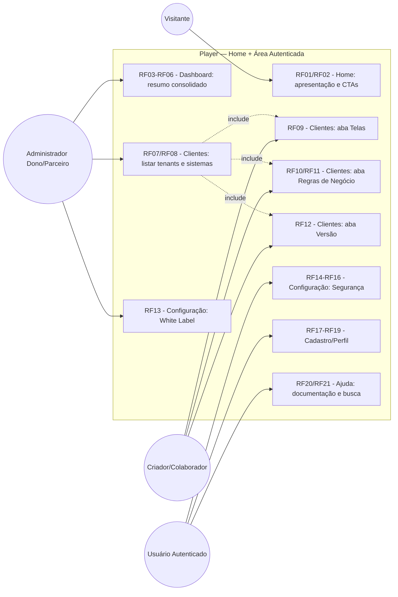
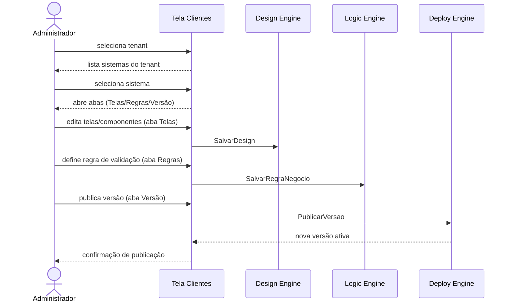
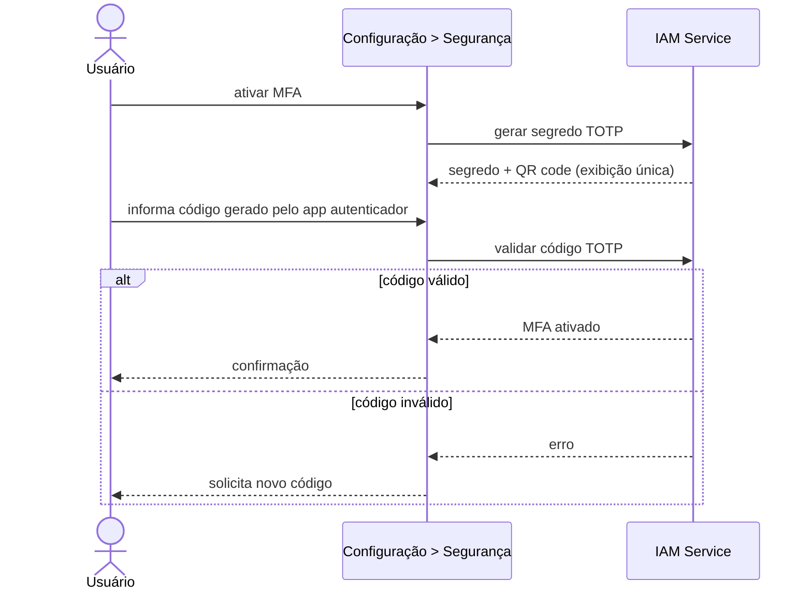
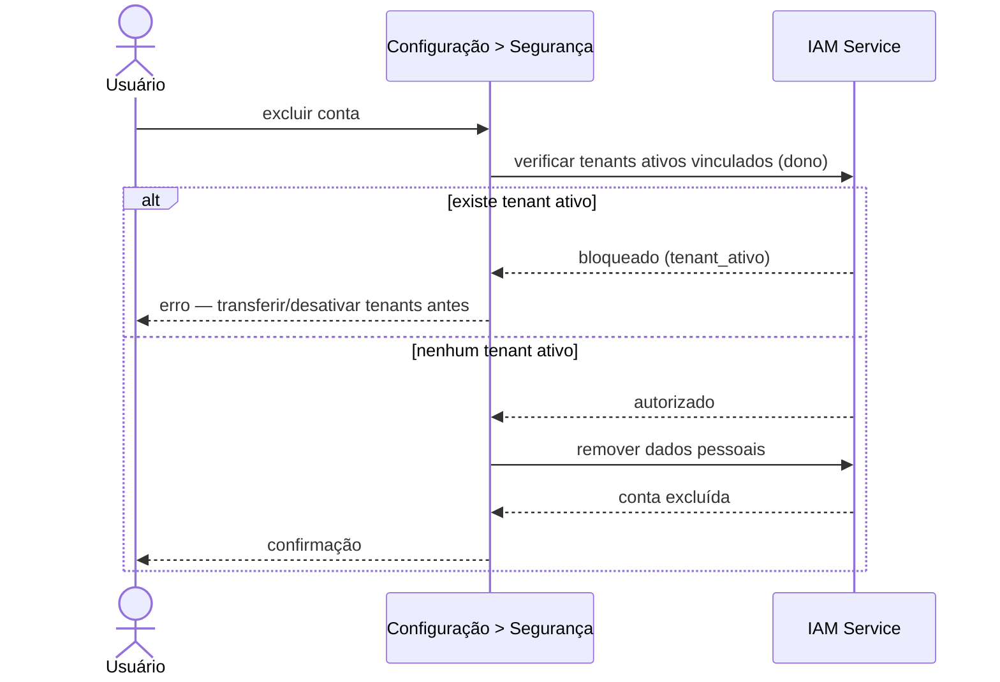
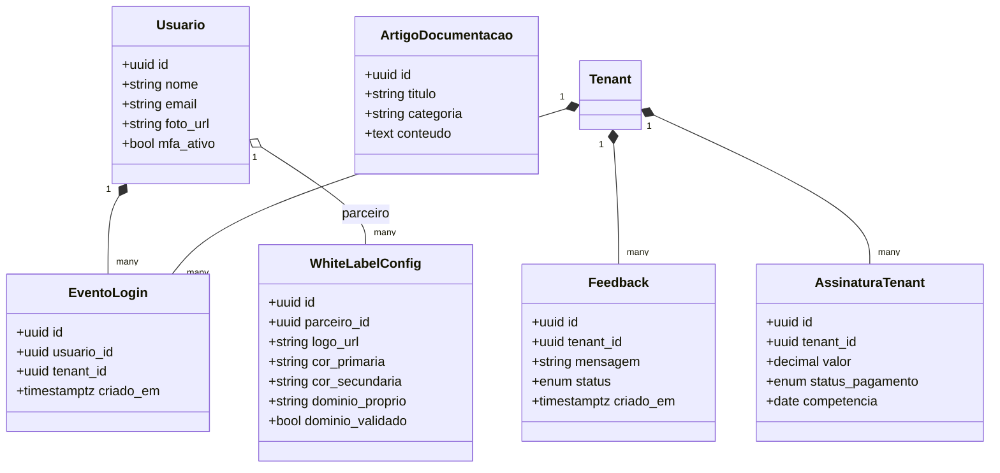

# Especificação: Reestruturação de IA e Regras de Negócio — Home, Dashboard, Clientes, Configuração, Cadastro/Perfil, Ajuda

Esta demanda reestrutura a informação/navegação do Player autenticado, hoje entregue pela
spec `003-dashboard-integracao-dados` como `/dashboard` (abas `Overview`, `Projects`,
`Settings`, `Settings/Perfil`). O novo menu é: **Home** (nova, pública), **Dashboard**
(renomeia `Overview`), **Clientes** (renomeia e expande `Projects`), **Configuração**
(renomeia e expande `Settings`), **Cadastro/Perfil** (promove `Perfil` a item de topo) e
**Ajuda** (nova). Esta spec também passa a cobrir, do ponto de vista de regras de
negócio e IA, dois itens que a spec `001-construtor-sistemas-mach-v4 §8` marcava como
fora de escopo — o editor visual (builder UI, aqui a aba **Telas** de Clientes) e uma
visão de billing/cobrança (aqui o card **Resumo Financeiro** do Dashboard) — sem,
entretanto, especificar a implementação técnica desses dois motores (ver §8).

---

## 1. Objetivo

Definir as regras de negócio e requisitos das seis telas de topo do Player autenticado
(mais a landing pública Home), de modo que um Administrador (Dono/Parceiro) consiga: se
apresentar a visitantes e convertê-los em conta; visualizar um resumo consolidado dos
tenants sob sua gestão; navegar de um tenant até o construtor de um sistema específico
(Telas, Regras de Negócio, Versão); configurar sua marca (White Label) e a segurança da
própria conta; manter seus dados de cadastro; e consultar a documentação da plataforma.

---

## 2. Requisitos Funcionais

| ID | Tela | Descrição | Ator | Prioridade |
|----|------|-----------|------|------------|
| RF01 | Home | Exibir página pública de apresentação do produto/sistema, sem exigir login. | Visitante | Alta |
| RF02 | Home | Oferecer CTAs "Entrar" (login) e "Cadastrar/Testar grátis" (trial). | Visitante | Alta |
| RF03 | Dashboard | Exibir resumo geral consolidado dos tenants vinculados ao usuário autenticado. | Administrador (Dono/Parceiro) | Alta |
| RF04 | Dashboard | Card "Últimos Acessos": listar os 10 logins mais recentes de usuários dos tenants vinculados, sem filtro de período. | Administrador (Dono/Parceiro) | Alta |
| RF05 | Dashboard | Card "Reclamações/Feedback": listar mensagens recebidas dos tenants vinculados, com status pendente/respondido. | Administrador (Dono/Parceiro) | Alta |
| RF06 | Dashboard | Card "Resumo Financeiro": exibir receita de assinatura/cobrança da plataforma pelos tenants vinculados. | Administrador (Dono/Parceiro) | Alta |
| RF07 | Clientes | Listar tenants (clientes/negócios) vinculados ao usuário autenticado. | Administrador (Dono/Parceiro) | Alta |
| RF08 | Clientes | Ao selecionar um tenant, listar os sistemas pertencentes a ele. | Administrador (Dono/Parceiro) | Alta |
| RF09 | Clientes | Ao selecionar um sistema, abrir a aba "Telas": canvas infinito, sidebar esquerda com telas/componentes e painel direito de propriedades do componente selecionado, permitindo criar/atualizar telas e componentes. Editor funcional detalhado em `specs/007-editor-visual-canvas`. | Criador/Colaborador | Alta |
| RF10 | Clientes | Aba "Regras de Negócio": CRUD de regras de validação de estado de um componente (ex.: CPF somente números, 11 caracteres). | Criador/Colaborador | Alta |
| RF11 | Clientes | Aba "Regras de Negócio": suportar regras que validam a combinação de múltiplos componentes. | Criador/Colaborador | Média |
| RF12 | Clientes | Aba "Versão": listar as versões do sistema e permitir publicar uma nova versão ou reverter para uma anterior. | Criador | Alta |
| RF13 | Configuração | Editar White Label (logo, cores, domínio próprio) da marca do parceiro. | Administrador (Dono/Parceiro) | Alta |
| RF14 | Configuração | Seção "Segurança": atualizar senha. | Usuário autenticado | Alta |
| RF15 | Configuração | Seção "Segurança": ativar/desativar MFA via aplicativo autenticador (TOTP). | Usuário autenticado | Alta |
| RF16 | Configuração | Seção "Segurança": excluir a própria conta. | Usuário autenticado | Média |
| RF17 | Cadastro/Perfil | Editar nome e foto de perfil. | Usuário autenticado | Alta |
| RF18 | Cadastro/Perfil | Editar e-mail, com confirmação obrigatória antes de efetivar a troca. | Usuário autenticado | Alta |
| RF19 | Cadastro/Perfil | Exibir atalho para a seção Segurança (Configuração) para troca de senha. | Usuário autenticado | Baixa |
| RF20 | Ajuda | Exibir documentação geral da plataforma como conteúdo estático organizado por categoria. | Usuário autenticado | Média |
| RF21 | Ajuda | Prover busca por palavra-chave na documentação. | Usuário autenticado | Média |

---

## 3. Requisitos Não-Funcionais

| ID | Categoria | Descrição |
|----|-----------|-----------|
| RNF01 | Segurança | MFA segue padrão TOTP (RFC 6238); segredo armazenado cifrado e exibido em claro (QR code) apenas no momento da configuração inicial. |
| RNF02 | Segurança | Troca de e-mail e exclusão de conta exigem reautenticação (confirmação de senha) antes de efetivar, prevenindo abuso de sessão sequestrada. |
| RNF03 | Segurança | White Label com domínio próprio exige validação de propriedade do domínio (ex.: registro DNS) antes de ativação. |
| RNF04 | Consistência Visual | As seis telas seguem a estética Material Design 3 já adotada pelo Player (herdado de RNF01 da spec 003). |
| RNF05 | Acessibilidade | Estados de carregamento/vazio/erro dos cards do Dashboard e da busca de Ajuda usam `aria-busy`/`role="alert"` (herdado de RNF03 da spec 003). |
| RNF06 | Privacidade/LGPD | A exclusão de conta remove permanentemente os dados pessoais (nome, e-mail, foto) do usuário após confirmação. |

---

## 4. Regras de Negócio

| ID | Nome | Regra |
|----|------|-------|
| RN01 | Vínculo Usuário-Tenant | Dashboard e Clientes exibem exclusivamente dados de tenants vinculados ao usuário autenticado como dono/parceiro (extensão do isolamento multi-tenant RN01 da spec 001). |
| RN02 | Top 10 Acessos sem Filtro de Período | O card de últimos acessos sempre mostra os 10 eventos de login mais recentes agregados entre todos os tenants vinculados; o mesmo usuário pode aparecer mais de uma vez. |
| RN03 | Ciclo de Status do Feedback | Toda mensagem de feedback nasce com status "pendente" e só migra para "respondido" mediante ação explícita de resposta. |
| RN04 | Natureza do Resumo Financeiro | O resumo financeiro do Dashboard reflete receita de assinatura/cobrança da plataforma paga pelos tenants, não a receita operacional interna de cada tenant. |
| RN05 | Hierarquia Cliente → Sistema | Um tenant (cliente) pode possuir múltiplos sistemas; a tela Clientes sempre navega Tenant → Sistema → abas (Telas/Regras de Negócio/Versão) — nunca abre as abas diretamente a partir do tenant. |
| RN06 | Escopo das Regras de Negócio do Componente | Uma regra de negócio pode validar o estado de um único componente isoladamente ou a combinação de múltiplos componentes do mesmo sistema. |
| RN07 | Bloqueio de Exclusão de Conta | A exclusão da conta é bloqueada enquanto o usuário for dono de ao menos um tenant ativo; é necessário transferir a titularidade ou desativar o tenant antes de excluir a conta. |
| RN08 | Confirmação de Troca de E-mail | O e-mail da conta só é efetivamente alterado após confirmação via link/código enviado ao novo endereço; até a confirmação, o e-mail atual permanece válido para login. |
| RN09 | Ajuda Independe de Tenant | O conteúdo de documentação da tela Ajuda é global à plataforma — não é filtrado por tenant nem por papel do usuário. |

---

## 5. Cenários de Uso

### Cenário 1: Visitante conhece o produto e inicia cadastro (RF01, RF02)
* **Dado que** um visitante anônimo acessa a Home
* **Quando** ele visualiza a apresentação do produto
* **Então** pode clicar em "Entrar" (vai para login) ou "Cadastrar/Testar grátis" (inicia trial)

### Cenário 2: Dono/Parceiro visualiza o resumo consolidado (RF03–RF06, RN01–RN04)
* **Dado que** um Administrador (Dono/Parceiro) está autenticado e possui tenants vinculados
* **Quando** acessa o Dashboard
* **Então** vê o card de Últimos Acessos (10 logins mais recentes agregados), o card de Reclamações/Feedback (com status) e o card de Resumo Financeiro (assinatura/cobrança) — todos restritos aos tenants vinculados a ele

### Cenário 3: Navegação até o construtor de um sistema (RF07–RF12, RN05)
* **Dado que** o Administrador acessa Clientes
* **Quando** seleciona um tenant e, em seguida, um sistema desse tenant
* **Então** o sistema abre com as abas Telas, Regras de Negócio e Versão
* **E** em Telas ele cria/edita telas e componentes no canvas infinito
* **E** em Regras de Negócio define validações de um ou vários componentes
* **E** em Versão ele publica uma nova versão ou reverte para uma anterior

### Cenário 4: Ativação de MFA (RF15, RNF01)
* **Dado que** o usuário está em Configuração > Segurança
* **Quando** ativa o MFA
* **Então** o sistema exibe um QR code TOTP uma única vez
* **E** o usuário confirma com um código válido do aplicativo autenticador para concluir a ativação

### Cenário 5: Tentativa de exclusão de conta bloqueada (RF16, RN07)
* **Dado que** o usuário possui ao menos um tenant ativo vinculado a ele como dono
* **Quando** ele tenta excluir a própria conta em Configuração > Segurança
* **Então** o sistema bloqueia a exclusão e informa que é necessário transferir/desativar os tenants vinculados antes

### Cenário 6: Troca de e-mail com confirmação (RF18, RN08)
* **Dado que** o usuário altera o e-mail em Cadastro/Perfil
* **Quando** salva a alteração
* **Então** um link/código de confirmação é enviado ao novo e-mail
* **E** o e-mail antigo continua válido para login até a confirmação
* **E** somente após confirmar o novo e-mail passa a ser o e-mail da conta

### Cenário 7: Busca na documentação (RF20, RF21)
* **Dado que** o usuário está na tela Ajuda
* **Quando** digita um termo no campo de busca
* **Então** os artigos de documentação cujo conteúdo/título correspondem ao termo são exibidos

---

## 6. Critérios de Aceitação

1. A Home é acessível sem autenticação e nenhum de seus elementos exige login prévio; os CTAs "Entrar" e "Cadastrar/Testar grátis" navegam para os fluxos correspondentes.
2. Nenhum dado exibido no Dashboard ou em Clientes pertence a um tenant não vinculado ao usuário autenticado (testável via teste de integração multi-tenant, análogo ao critério 1 da spec 001).
3. O card de Últimos Acessos sempre retorna no máximo 10 itens, ordenados do login mais recente para o mais antigo, sem aplicar filtro de janela de tempo.
4. Uma mensagem de feedback criada tem status inicial "pendente"; após uma ação de resposta, o status muda para "respondido" e essa transição é irreversível para "pendente" automaticamente.
5. Em Clientes, não é possível abrir as abas Telas/Regras de Negócio/Versão sem antes selecionar um tenant e, dentro dele, um sistema.
6. Uma regra de negócio pode ser criada referenciando um único `blind_index` de componente ou uma lista de múltiplos `blind_index`.
7. Ativar MFA exige confirmação de um código TOTP válido antes de marcar o fator como ativo na conta; o segredo não é reexibido em claro após essa etapa.
8. Uma tentativa de excluir a conta com tenants ativos vinculados retorna erro de bloqueio (não exclui parcialmente nada); com zero tenants ativos vinculados, a exclusão é concluída e os dados pessoais deixam de existir.
9. Uma alteração de e-mail não reflete no e-mail de login até que o link/código enviado ao novo endereço seja confirmado.
10. A busca em Ajuda retorna somente artigos cujo título ou conteúdo contém o termo pesquisado, e é idêntica para qualquer usuário autenticado (não varia por tenant).

---

## 7. Diagramas UML

### 7.1. Diagrama de Casos de Uso

### 7.2. Diagrama de Sequência — Navegação Clientes até publicação (RF07–RF12, RN05)

### 7.3. Diagrama de Sequência — Ativação de MFA (RF15, RNF01)

### 7.4. Diagrama de Sequência — Exclusão de conta bloqueada por tenant ativo (RF16, RN07)

### 7.5. Diagrama de Classes (novas entidades)

---

## 8. Fora de Escopo

- **Motor de billing/cobrança real** (gateways de pagamento, emissão de fatura): esta spec cobre apenas a exibição do Resumo Financeiro no Dashboard, assumindo que os dados de `AssinaturaTenant` são expostos por um serviço de billing a especificar/implementar à parte (item antes listado como fora de escopo em `001-construtor-sistemas-mach-v4 §8`, que segue fora de escopo aqui).
- **Canal de resposta ao Feedback** (ex.: envio de e-mail de resposta ao tenant): esta spec cobre apenas o registro da mensagem e a mudança de status pendente/respondido.
- **Validação técnica de propriedade de domínio** (fluxo de DNS/TXT record) para o White Label: RNF03 exige a validação, mas o mecanismo de verificação é demanda própria.
- **Autoria/CMS da documentação de Ajuda**: o conteúdo é assumido como estático e gerenciado fora desta demanda (ex.: arquivos versionados publicados por outro processo).
- **Fluxo de transferência de titularidade de tenant**, mencionado em RN07 como pré-condição para exclusão de conta: seu detalhamento não faz parte desta spec.
- **Implementação técnica do canvas/engine de renderização da aba Telas**: esta spec define a navegação e as regras de negócio; a engine em si é coberta por `001-construtor-sistemas-mach-v4` (RF01) e por demanda própria de UI, conforme já indicado em `001 §8`.
- **Migração/remoção do código atual** das rotas `/dashboard/overview`, `/dashboard/projects`, `/dashboard/settings` (spec 003): esta spec define o novo comportamento; o mapeamento de migração de rotas/arquivos é detalhado em `tasks.md`.

---

## 9. Mapeamento para Plane (Cards)

| Título do Card | Descrição (HTML) | Prioridade |
|---|---|---|
| Home: página pública de apresentação | `<h3>Tarefas</h3><ul><li>Criar rota pública /home sem exigir autenticação</li><li>Implementar CTA "Entrar" navegando para login</li><li>Implementar CTA "Cadastrar/Testar grátis" navegando para o fluxo de trial</li></ul>` | high |
| Dashboard: renomear Overview e ajustar navegação | `<h3>Tarefas</h3><ul><li>Renomear rota/menu Overview para Dashboard</li><li>Atualizar item de sidebar e testes de navegação ativa</li></ul>` | medium |
| Dashboard: card Últimos Acessos | `<h3>Tarefas</h3><ul><li>Expor endpoint/consulta dos 10 logins mais recentes agregados por tenants vinculados</li><li>Renderizar card com estados loading/empty/erro</li></ul>` | high |
| Dashboard: card Reclamações/Feedback | `<h3>Tarefas</h3><ul><li>Modelar entidade Feedback com status pendente/respondido</li><li>Expor listagem por tenants vinculados</li><li>Renderizar card com filtro por status</li></ul>` | high |
| Dashboard: card Resumo Financeiro | `<h3>Tarefas</h3><ul><li>Definir contrato de dados de AssinaturaTenant</li><li>Renderizar card de receita de assinatura por tenants vinculados</li></ul>` | high |
| Clientes: renomear Projects e listar tenants | `<h3>Tarefas</h3><ul><li>Renomear rota/menu Projects para Clientes</li><li>Listar tenants vinculados ao usuário autenticado</li><li>Ao selecionar tenant, listar sistemas do tenant</li></ul>` | high |
| Clientes: aba Telas (canvas) | `<h3>Tarefas</h3><ul><li>Implementar canvas infinito com sidebar de telas/componentes</li><li>Implementar painel de propriedades do componente selecionado</li><li>Persistir criação/atualização de telas e componentes</li></ul>` | high |
| Clientes: aba Regras de Negócio | `<h3>Tarefas</h3><ul><li>Implementar CRUD de regra de validação de componente único</li><li>Implementar regra de validação envolvendo múltiplos componentes</li></ul>` | high |
| Clientes: aba Versão | `<h3>Tarefas</h3><ul><li>Listar versões do sistema</li><li>Implementar publicação de nova versão</li><li>Implementar reversão para versão anterior</li></ul>` | high |
| Configuração: renomear Settings e adicionar White Label | `<h3>Tarefas</h3><ul><li>Renomear rota/menu Settings para Configuração</li><li>Implementar edição de logo, cores e domínio próprio</li><li>Implementar validação de domínio antes da ativação</li></ul>` | high |
| Configuração: seção Segurança | `<h3>Tarefas</h3><ul><li>Implementar atualização de senha com reautenticação</li><li>Implementar ativação/desativação de MFA via TOTP</li><li>Implementar exclusão de conta com bloqueio por tenant ativo</li></ul>` | high |
| Cadastro/Perfil: promover a item de topo | `<h3>Tarefas</h3><ul><li>Mover rota Perfil de /dashboard/settings/perfil para item de topo Cadastro/Perfil</li><li>Implementar edição de nome e foto</li><li>Implementar troca de e-mail com confirmação por link/código</li><li>Adicionar atalho para Segurança em Configuração</li></ul>` | high |
| Ajuda: documentação com busca | `<h3>Tarefas</h3><ul><li>Criar rota Ajuda com conteúdo estático organizado por categoria</li><li>Implementar busca por palavra-chave nos artigos</li></ul>` | medium |

