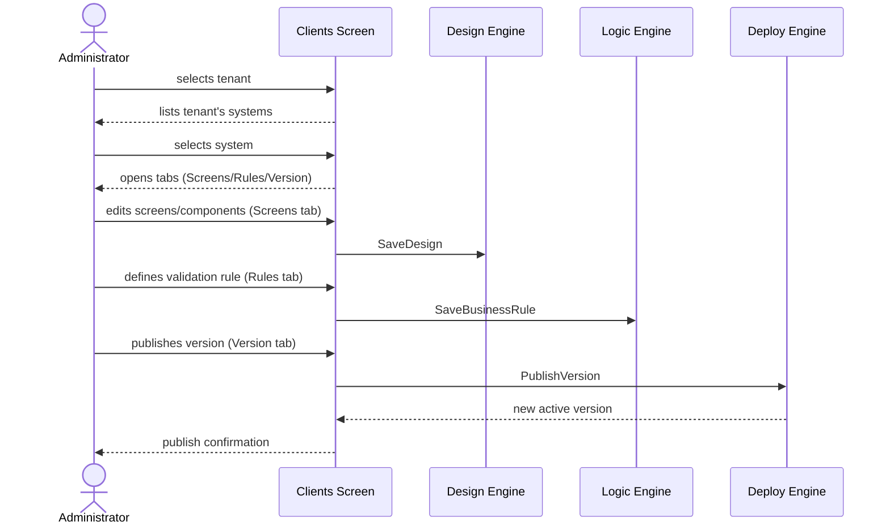
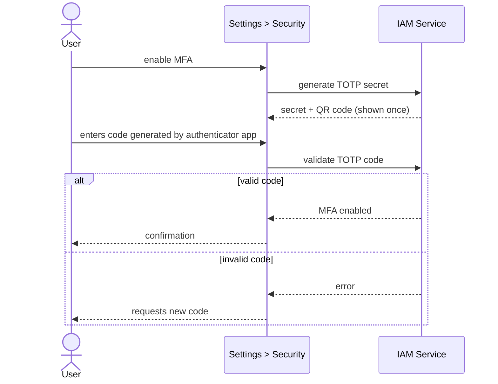
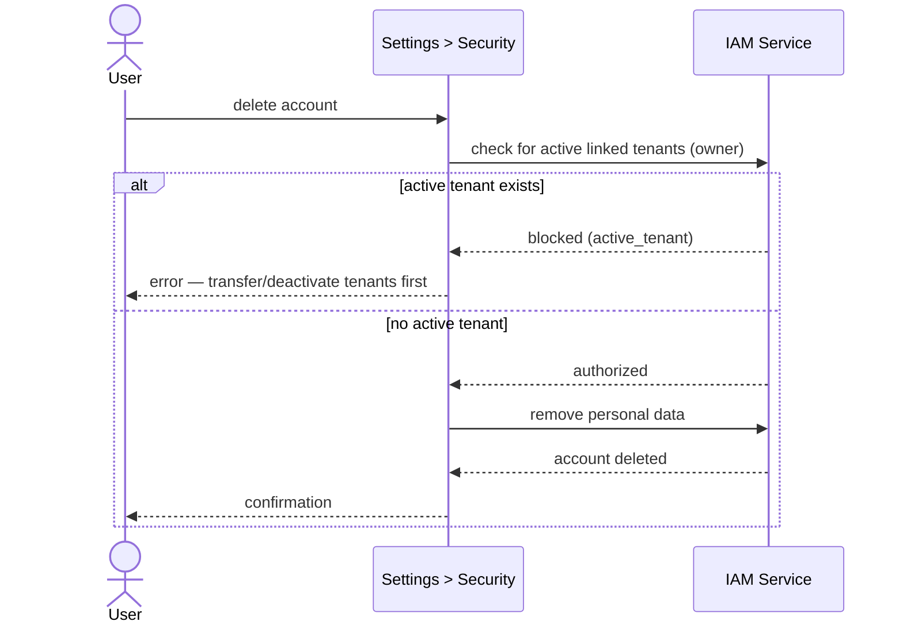
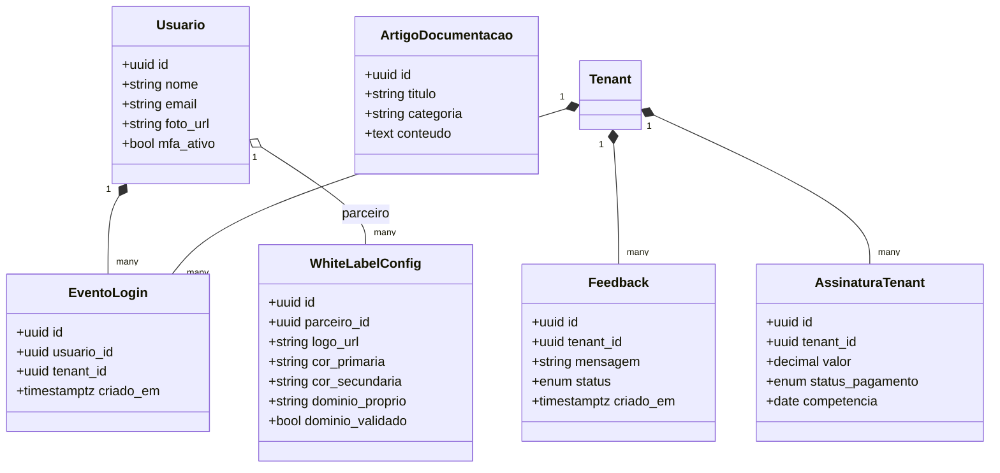

# Specification: AI and Business Rules Restructuring — Home, Dashboard, Clients, Settings, Registration/Profile, Help

This initiative restructures the information/navigation of the authenticated Player, currently delivered by
spec `003-dashboard-integracao-dados` as `/dashboard` (tabs `Overview`, `Projects`,
`Settings`, `Settings/Profile`). The new menu is: **Home** (new, public), **Dashboard**
(renames `Overview`), **Clients** (renames and expands `Projects`), **Settings**
(renames and expands `Settings`), **Registration/Profile** (promotes `Profile` to a top-level item), and
**Help** (new). This spec also now covers, from a business-rules and AI perspective,
two items that spec `001-construtor-sistemas-mach-v4 §8` marked as
out of scope — the visual editor (builder UI, here the **Screens** tab under Clients) and a
billing view (here the **Financial Summary** card on the Dashboard) — without,
however, specifying the technical implementation of those two engines (see §8).

---

## 1. Objective

Define the business rules and requirements for the six top-level screens of the authenticated Player
(plus the public Home landing page), so that an Administrator (Owner/Partner) can: present
the product to visitors and convert them into an account; view a consolidated summary of the
tenants under their management; navigate from a tenant to the builder for a specific system
(Screens, Business Rules, Version); configure their brand (White Label) and their own account
security; maintain their registration data; and consult the platform documentation.

---

## 2. Functional Requirements

| ID | Screen | Description | Actor | Priority |
|----|------|-----------|------|------------|
| FR01 | Home | Display a public product/system presentation page, with no login required. | Visitor | High |
| FR02 | Home | Offer "Sign In" (login) and "Sign Up/Try for Free" (trial) CTAs. | Visitor | High |
| FR03 | Dashboard | Display a consolidated overview of the tenants linked to the authenticated user. | Administrator (Owner/Partner) | High |
| FR04 | Dashboard | "Recent Access" card: list the 10 most recent logins by users of the linked tenants, with no period filter. | Administrator (Owner/Partner) | High |
| FR05 | Dashboard | "Complaints/Feedback" card: list messages received from the linked tenants, with pending/answered status. | Administrator (Owner/Partner) | High |
| FR06 | Dashboard | "Financial Summary" card: display platform subscription/billing revenue from the linked tenants. | Administrator (Owner/Partner) | High |
| FR07 | Clients | List tenants (customers/businesses) linked to the authenticated user. | Administrator (Owner/Partner) | High |
| FR08 | Clients | When a tenant is selected, list the systems belonging to it. | Administrator (Owner/Partner) | High |
| FR09 | Clients | When a system is selected, open the "Screens" tab: infinite canvas, left sidebar with screens/components, and a right-hand properties panel for the selected component, allowing screens and components to be created/updated. Functional editor detailed in `specs/007-editor-visual-canvas`. | Creator/Collaborator | High |
| FR10 | Clients | "Business Rules" tab: CRUD for validation rules on a single component's state (e.g., CPF digits only, 11 characters). | Creator/Collaborator | High |
| FR11 | Clients | "Business Rules" tab: support rules that validate a combination of multiple components. | Creator/Collaborator | Medium |
| FR12 | Clients | "Version" tab: list system versions and allow publishing a new version or rolling back to a previous one. | Creator | High |
| FR13 | Settings | Edit the partner brand's White Label (logo, colors, custom domain). | Administrator (Owner/Partner) | High |
| FR14 | Settings | "Security" section: update password. | Authenticated user | High |
| FR15 | Settings | "Security" section: enable/disable MFA via an authenticator app (TOTP). | Authenticated user | High |
| FR16 | Settings | "Security" section: delete own account. | Authenticated user | Medium |
| FR17 | Registration/Profile | Edit name and profile photo. | Authenticated user | High |
| FR18 | Registration/Profile | Edit email, with mandatory confirmation before the change takes effect. | Authenticated user | High |
| FR19 | Registration/Profile | Display a shortcut to the Security section (Settings) for changing password. | Authenticated user | Low |
| FR20 | Help | Display general platform documentation as static content organized by category. | Authenticated user | Medium |
| FR21 | Help | Provide keyword search across the documentation. | Authenticated user | Medium |

---

## 3. Non-Functional Requirements

| ID | Category | Description |
|----|-----------|-----------|
| NFR01 | Security | MFA follows the TOTP standard (RFC 6238); the secret is stored encrypted and shown in the clear (QR code) only at initial setup. |
| NFR02 | Security | Changing email and deleting the account require reauthentication (password confirmation) before taking effect, preventing abuse via a hijacked session. |
| NFR03 | Security | White Label with a custom domain requires domain-ownership validation (e.g., DNS record) before activation. |
| NFR04 | Visual Consistency | The six screens follow the Material Design 3 aesthetic already adopted by the Player (inherited from NFR01 of spec 003). |
| NFR05 | Accessibility | Loading/empty/error states for the Dashboard cards and the Help search use `aria-busy`/`role="alert"` (inherited from NFR03 of spec 003). |
| NFR06 | Privacy/LGPD | Account deletion permanently removes the user's personal data (name, email, photo) after confirmation. |

---

## 4. Business Rules

| ID | Name | Rule |
|----|------|-------|
| BR01 | User-Tenant Link | Dashboard and Clients display exclusively data from tenants linked to the authenticated user as owner/partner (extension of the multi-tenant isolation BR01 from spec 001). |
| BR02 | Top 10 Access Without Period Filter | The recent-access card always shows the 10 most recent login events aggregated across all linked tenants; the same user may appear more than once. |
| BR03 | Feedback Status Lifecycle | Every feedback message starts with "pending" status and only moves to "answered" through an explicit reply action. |
| BR04 | Nature of the Financial Summary | The Dashboard's financial summary reflects platform subscription/billing revenue paid by the tenants, not each tenant's internal operating revenue. |
| BR05 | Client → System Hierarchy | A tenant (client) may own multiple systems; the Clients screen always navigates Tenant → System → tabs (Screens/Business Rules/Version) — it never opens the tabs directly from the tenant. |
| BR06 | Scope of Component Business Rules | A business rule may validate the state of a single component in isolation or the combination of multiple components within the same system. |
| BR07 | Account Deletion Block | Account deletion is blocked while the user owns at least one active tenant; ownership must be transferred or the tenant deactivated before the account can be deleted. |
| BR08 | Email Change Confirmation | The account email is only actually changed after confirmation via a link/code sent to the new address; until confirmed, the current email remains valid for login. |
| BR09 | Help Is Tenant-Independent | The documentation content on the Help screen is global to the platform — it is not filtered by tenant or by user role. |

---

## 5. Usage Scenarios

### Scenario 1: A visitor learns about the product and starts signing up (FR01, FR02)
* **Given** an anonymous visitor accesses Home
* **When** they view the product presentation
* **Then** they can click "Sign In" (goes to login) or "Sign Up/Try for Free" (starts a trial)

### Scenario 2: An Owner/Partner views the consolidated summary (FR03–FR06, BR01–BR04)
* **Given** an Administrator (Owner/Partner) is authenticated and has linked tenants
* **When** they access the Dashboard
* **Then** they see the Recent Access card (10 most recent aggregated logins), the Complaints/Feedback card (with status), and the Financial Summary card (subscription/billing) — all restricted to the tenants linked to them

### Scenario 3: Navigating to a system's builder (FR07–FR12, BR05)
* **Given** the Administrator accesses Clients
* **When** they select a tenant and then a system belonging to that tenant
* **Then** the system opens with the Screens, Business Rules, and Version tabs
* **And** in Screens they create/edit screens and components on the infinite canvas
* **And** in Business Rules they define validations for one or several components
* **And** in Version they publish a new version or roll back to a previous one

### Scenario 4: Enabling MFA (FR15, NFR01)
* **Given** the user is in Settings > Security
* **When** they enable MFA
* **Then** the system displays a TOTP QR code exactly once
* **And** the user confirms with a valid code from the authenticator app to complete activation

### Scenario 5: Blocked account-deletion attempt (FR16, BR07)
* **Given** the user owns at least one active tenant linked to them
* **When** they try to delete their own account in Settings > Security
* **Then** the system blocks the deletion and states that the linked tenants must be transferred/deactivated first

### Scenario 6: Email change with confirmation (FR18, BR08)
* **Given** the user changes their email in Registration/Profile
* **When** they save the change
* **Then** a confirmation link/code is sent to the new email
* **And** the old email remains valid for login until confirmation
* **And** only after confirming does the new email become the account's email

### Scenario 7: Searching the documentation (FR20, FR21)
* **Given** the user is on the Help screen
* **When** they type a term into the search field
* **Then** documentation articles whose content/title match the term are displayed

---

## 6. Acceptance Criteria

1. Home is accessible without authentication and none of its elements require prior login; the "Sign In" and "Sign Up/Try for Free" CTAs navigate to the corresponding flows.
2. No data displayed on the Dashboard or in Clients belongs to a tenant not linked to the authenticated user (testable via a multi-tenant integration test, analogous to criterion 1 of spec 001).
3. The Recent Access card always returns at most 10 items, ordered from most recent to oldest login, with no time-window filter applied.
4. A feedback message created has an initial status of "pending"; after a reply action, the status changes to "answered", and this transition does not revert automatically to "pending".
5. In Clients, the Screens/Business Rules/Version tabs cannot be opened without first selecting a tenant and, within it, a system.
6. A business rule can be created referencing a single component `blind_index` or a list of multiple `blind_index` values.
7. Enabling MFA requires confirmation of a valid TOTP code before the factor is marked active on the account; the secret is not shown in the clear again after this step.
8. An attempt to delete an account with active linked tenants returns a blocking error (nothing is partially deleted); with zero active linked tenants, the deletion completes and the personal data ceases to exist.
9. An email change does not affect the login email until the link/code sent to the new address is confirmed.
10. Help search returns only articles whose title or content contains the searched term, and behaves identically for any authenticated user (does not vary by tenant).

---

## 7. UML Diagrams

### 7.1. Use Case Diagram

### 7.2. Sequence Diagram — Clients navigation through publishing (FR07–FR12, BR05)

### 7.3. Sequence Diagram — Enabling MFA (FR15, NFR01)

### 7.4. Sequence Diagram — Account deletion blocked by active tenant (FR16, BR07)

### 7.5. Class Diagram (new entities)

---

## 8. Out of Scope

- **Real billing engine** (payment gateways, invoice issuance): this spec covers only the display of the Financial Summary on the Dashboard, assuming that `AssinaturaTenant` data is exposed by a billing service to be specified/implemented separately (item previously listed as out of scope in `001-construtor-sistemas-mach-v4 §8`, which remains out of scope here).
- **Feedback reply channel** (e.g., sending a reply email to the tenant): this spec covers only recording the message and changing its pending/answered status.
- **Technical domain-ownership validation** (DNS/TXT record flow) for White Label: NFR03 requires the validation, but the verification mechanism is its own initiative.
- **Authoring/CMS for the Help documentation**: the content is assumed to be static and managed outside this initiative (e.g., versioned files published by another process).
- **Tenant ownership-transfer flow**, mentioned in BR07 as a precondition for account deletion: its details are not part of this spec.
- **Technical implementation of the canvas/rendering engine for the Screens tab**: this spec defines the navigation and business rules; the engine itself is covered by `001-construtor-sistemas-mach-v4` (FR01) and by a dedicated UI initiative, as already indicated in `001 §8`.
- **Migration/removal of the current code** for the `/dashboard/overview`, `/dashboard/projects`, `/dashboard/settings` routes (spec 003): this spec defines the new behavior; the route/file migration mapping is detailed in `tasks.md`.

---

## 9. Mapping to Plane (Cards)

| Card Title | Description (HTML) | Priority |
|---|---|---|
| Home: public presentation page | `<h3>Tasks</h3><ul><li>Create public /home route with no authentication required</li><li>Implement "Sign In" CTA navigating to login</li><li>Implement "Sign Up/Try for Free" CTA navigating to the trial flow</li></ul>` | high |
| Dashboard: rename Overview and adjust navigation | `<h3>Tasks</h3><ul><li>Rename the Overview route/menu to Dashboard</li><li>Update sidebar item and active-navigation tests</li></ul>` | medium |
| Dashboard: Recent Access card | `<h3>Tasks</h3><ul><li>Expose endpoint/query for the 10 most recent logins aggregated across linked tenants</li><li>Render card with loading/empty/error states</li></ul>` | high |
| Dashboard: Complaints/Feedback card | `<h3>Tasks</h3><ul><li>Model the Feedback entity with pending/answered status</li><li>Expose listing by linked tenants</li><li>Render card with status filter</li></ul>` | high |
| Dashboard: Financial Summary card | `<h3>Tasks</h3><ul><li>Define AssinaturaTenant data contract</li><li>Render subscription revenue card by linked tenants</li></ul>` | high |
| Clients: rename Projects and list tenants | `<h3>Tasks</h3><ul><li>Rename the Projects route/menu to Clients</li><li>List tenants linked to the authenticated user</li><li>When a tenant is selected, list the tenant's systems</li></ul>` | high |
| Clients: Screens tab (canvas) | `<h3>Tasks</h3><ul><li>Implement infinite canvas with screens/components sidebar</li><li>Implement properties panel for the selected component</li><li>Persist creation/update of screens and components</li></ul>` | high |
| Clients: Business Rules tab | `<h3>Tasks</h3><ul><li>Implement CRUD for a single-component validation rule</li><li>Implement a validation rule involving multiple components</li></ul>` | high |
| Clients: Version tab | `<h3>Tasks</h3><ul><li>List system versions</li><li>Implement publishing a new version</li><li>Implement rollback to a previous version</li></ul>` | high |
| Settings: rename Settings and add White Label | `<h3>Tasks</h3><ul><li>Rename the Settings route/menu to Settings</li><li>Implement editing of logo, colors, and custom domain</li><li>Implement domain validation before activation</li></ul>` | high |
| Settings: Security section | `<h3>Tasks</h3><ul><li>Implement password update with reauthentication</li><li>Implement MFA enable/disable via TOTP</li><li>Implement account deletion blocked by an active tenant</li></ul>` | high |
| Registration/Profile: promote to a top-level item | `<h3>Tasks</h3><ul><li>Move the Profile route from /dashboard/settings/perfil to the top-level Registration/Profile item</li><li>Implement editing of name and photo</li><li>Implement email change with link/code confirmation</li><li>Add a shortcut to Security under Settings</li></ul>` | high |
| Help: documentation with search | `<h3>Tasks</h3><ul><li>Create Help route with static content organized by category</li><li>Implement keyword search across articles</li></ul>` | medium |

