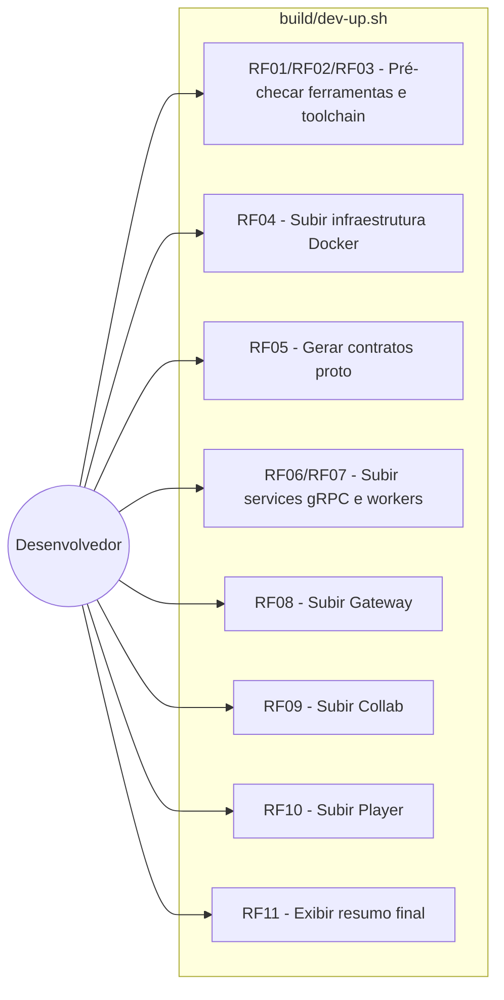
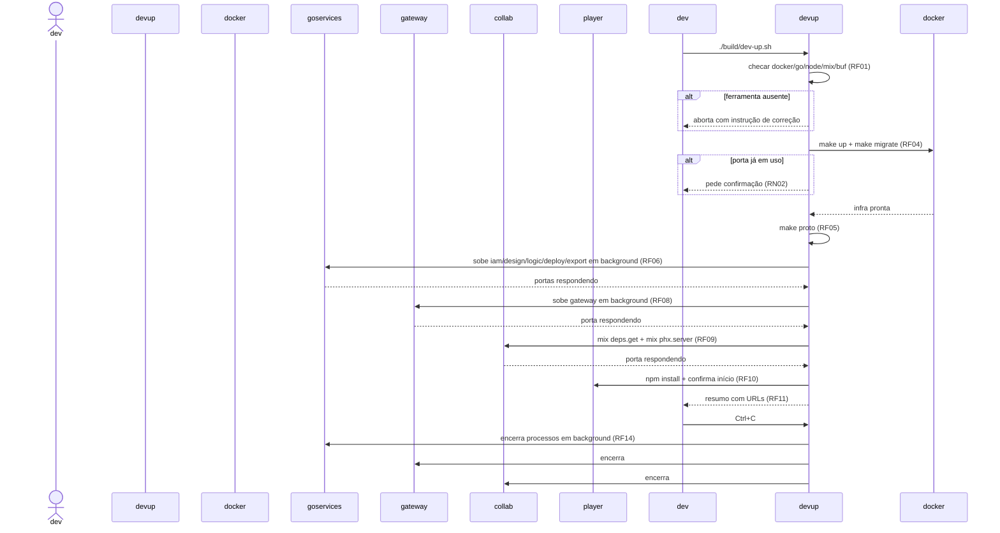

# Documento de Requisitos e Análise — Comando de Inicialização Local

## 1. Visão Geral

Hoje, subir o MACH V4 localmente exige executar manualmente, em ordem e em
terminais separados: `make up`, `make migrate`, `make proto`, 5 serviços gRPC
Go, os workers, o Gateway, o Collab (Elixir/Phoenix) e o Player (Vite) — sem
checagem de pré-requisitos, sem detecção de conflito de porta e com logs
espalhados por processo. Esta demanda especifica um **comando único e guiado**
(`build/dev-up.sh`) que orquestra toda essa sequência, com feedback visual a
cada etapa, confirmação do usuário em pontos de risco (porta ocupada, falha de
uma etapa) e logs centralizados numa única pasta — reduzindo o startup a um
único comando reexecutável.

Implementação de referência: `build/dev-up.sh`. Documentação de uso:
`USAGE.md` (seção "Startup guiado").

---

## 2. Regras de Negócio (RN)

| ID | Nome | Descrição |
| :--- | :--- | :--- |
| RN01 | Ordem de subida respeita dependências | A sequência é fixa e reflete as dependências reais entre camadas: infra (Docker) → contratos proto → serviços gRPC → workers → gateway → collab → player. Uma etapa só inicia depois que a anterior está pronta (porta respondendo). |
| RN02 | Conflito de porta nunca falha silenciosamente | Se uma porta necessária já estiver em uso no host (ex.: MinIO 9000 ocupado por outro projeto), o comando avisa explicitamente e pede confirmação antes de prosseguir — nunca mata o processo que já a ocupa nem ignora o conflito sem aviso. |
| RN03 | Processos em background são efêmeros ao comando | Todo processo que o comando inicia em background (services, workers, gateway, collab) deve ser encerrado automaticamente quando o comando é interrompido (Ctrl+C) ou termina, para não deixar processos órfãos ocupando portas. |
| RN04 | Log único por execução | A saída (stdout/stderr) de cada etapa — síncrona (`make up`, `npm install`) ou em background (services, gateway, collab) — é centralizada em uma única pasta de logs, um arquivo por componente, para facilitar diagnóstico sem caçar terminais. |
| RN05 | Execução não-interativa opcional | O comando deve poder rodar sem nenhum prompt (flag `--yes`, assume "sim" em todas as confirmações) para uso em automações, e sem subir o player (flag `--no-player`) quando ele já roda à parte. |

---

## 3. Requisitos Funcionais (RF)

| ID | Nome | Descrição | Prioridade |
| :--- | :--- | :--- | :--- |
| RF01 | Pré-checagem de ferramentas | Verificar presença de `docker`, `go`, `node`, `npm`, `mix`, `buf` no PATH antes de iniciar qualquer etapa; abortar com instrução de correção específica para a ferramenta faltante. | Alta |
| RF02 | Ajuste automático de PATH | Adicionar automaticamente ao PATH as toolchains locais exigidas pelo repo (Go 1.26 em `$HOME/.local/go`, Elixir 1.17 em `$HOME/.local/elixir1.17`), sem exigir que o usuário configure o shell manualmente. | Alta |
| RF03 | Validação de versão do Go | Detectar a versão do `go` resolvida no PATH e avisar (com opção de prosseguir mesmo assim) se for anterior à mínima exigida pelo repo (1.23+). | Média |
| RF04 | Subida da infraestrutura | Executar `make up` e `make migrate`; antes disso, detectar portas de infra já ocupadas no host e pedir confirmação (RN02). | Alta |
| RF05 | Geração de contratos proto | Executar `make proto` (buf lint + generate) para regenerar `gen/go`, `gen/elixir`, `gen/ts` antes de compilar qualquer serviço. | Alta |
| RF06 | Subida dos serviços gRPC | Subir em background os 5 serviços (`iam`, `design`, `logic`, `deploy`, `export`), aguardando ativamente (com timeout) cada porta responder antes de seguir para a etapa seguinte. | Alta |
| RF07 | Subida dos workers | Subir em background o consumidor de filas RabbitMQ (`workers/cmd`). | Média |
| RF08 | Subida do Gateway | Subir o Gateway HTTP em background, aguardando sua porta responder. | Alta |
| RF09 | Subida do Collab | Instalar dependências (`mix deps.get`) e subir o Collab (Phoenix) em background, aguardando sua porta responder. | Alta |
| RF10 | Preparação e subida do Player | Instalar dependências do Player (`npm install`, se `node_modules` ausente) e, mediante confirmação do usuário, iniciá-lo em foreground (`npm run dev`). | Média |
| RF11 | Resumo final | Ao concluir, exibir um painel com as URLs de todos os serviços no ar (Gateway, Collab, Jaeger, RabbitMQ mgmt, MinIO console, Player) e o caminho da pasta de logs. | Média |
| RF12 | Flags de execução | Suportar `--no-player` (não inicia o player) e `--yes`/`-y` (não interativo, assume "sim" em todas as confirmações). | Média |
| RF13 | Log centralizado | Gravar a saída de cada etapa — em background ou síncrona — em `<pasta-de-logs>/<nome>.log`, além de exibi-la em tela quando síncrona. | Alta |
| RF14 | Encerramento limpo | Ao receber Ctrl+C (ou ao sair por erro), encerrar todos os processos em background que o comando iniciou, na ordem inversa de criação. | Alta |

---

## 4. Requisitos Não Funcionais (RNF)

| ID | Nome | Descrição | Categoria |
| :--- | :--- | :--- | :--- |
| RNF01 | Reexecutabilidade | O comando pode ser rodado múltiplas vezes seguidas sem exigir limpeza manual prévia (infra/migrações já aplicadas não devem quebrar uma nova execução). | Confiabilidade |
| RNF02 | Feedback visual degradável | Indicadores visuais (✓/✗/!, cores) devem funcionar em terminal interativo e degradar para texto plano quando a saída não é um TTY (ex.: redirecionada para arquivo ou CI). | Usabilidade |
| RNF03 | Timeout de espera | A espera ativa por uma porta tem um limite (60s por padrão); ao expirar, o comando reporta falha apontando o log específico daquela etapa, em vez de travar indefinidamente. | Confiabilidade |
| RNF04 | Sem dependências externas novas | O comando usa apenas ferramentas já exigidas pelo projeto (bash, docker, go, node, mix, buf) — nenhuma dependência adicional a instalar só para rodar o startup. | Portabilidade |
| RNF05 | Localização única | O comando e os demais scripts de build/startup/deploy do repositório residem todos em `build/`, evitando dispersão de scripts operacionais pelo repositório. | Manutenibilidade |

---

## 5. Diagramas UML (Mermaid)

### 5.1 Diagrama de Caso de Uso

### 5.2 Diagrama de Sequência

*(Diagrama de Classes omitido — a funcionalidade não introduz nem altera modelos de dados.)*

---

## 6. Mapeamento para Plane (Cards)

| Título do Card | Descrição (HTML) | Prioridade |
| :--- | :--- | :--- |
| Pré-checagem de ferramentas e toolchain no startup local | `<h3>Tarefas</h3><ul><li>Verificar docker/go/node/npm/mix/buf no PATH</li><li>Abortar com instrução de correção quando faltar ferramenta</li><li>Ajustar PATH automaticamente para Go 1.26 e Elixir 1.17 locais</li><li>Validar versão mínima do Go (1.23+) com aviso e opção de prosseguir</li></ul>` | high |
| Subida guiada da infraestrutura Docker | `<h3>Tarefas</h3><ul><li>Detectar portas de infra já ocupadas antes do make up</li><li>Pedir confirmação do usuário em caso de conflito</li><li>Executar make up e make migrate</li><li>Aguardar postgres/rabbitmq/minio responderem antes de seguir</li></ul>` | high |
| Subida orquestrada dos serviços gRPC e workers | `<h3>Tarefas</h3><ul><li>Rodar make proto antes de compilar os serviços</li><li>Subir iam/design/logic/deploy/export em background</li><li>Aguardar ativamente cada porta responder, com timeout</li><li>Subir o worker de RabbitMQ em background</li></ul>` | high |
| Subida do Gateway e do Collab no startup local | `<h3>Tarefas</h3><ul><li>Subir o Gateway HTTP em background e aguardar a porta</li><li>Rodar mix deps.get e subir o Collab (Phoenix) em background</li><li>Aguardar a porta do Collab responder</li></ul>` | high |
| Subida opcional do Player e resumo final | `<h3>Tarefas</h3><ul><li>Instalar dependências do player quando node_modules ausente</li><li>Perguntar ao usuário se deseja iniciar o player agora</li><li>Exibir painel final com as URLs de todos os serviços</li></ul>` | medium |
| Flags de execução e encerramento limpo | `<h3>Tarefas</h3><ul><li>Implementar flag --no-player</li><li>Implementar flag --yes para modo não interativo</li><li>Encerrar todos os processos em background ao sair (Ctrl+C ou erro)</li></ul>` | medium |
| Log centralizado do startup local | `<h3>Tarefas</h3><ul><li>Gravar saída de cada etapa síncrona e em background em pasta única de logs</li><li>Exibir saída em tela simultaneamente para etapas síncronas</li><li>Adicionar a pasta de logs ao gitignore</li></ul>` | medium |
| Reorganização dos scripts de build/deploy em build/ | `<h3>Tarefas</h3><ul><li>Mover scripts/*.sh (build-artifacts, deploy, rollback, smoke-test) para build/</li><li>Atualizar referências em .github/workflows/cd.yml</li><li>Atualizar referências em infra/deploy/README.md e provision-host.sh</li><li>Atualizar referências nos docs da spec 002</li></ul>` | low |

> Status de implementação: todos os itens acima já foram implementados nesta sessão (`build/dev-up.sh`, `USAGE.md`, migração `scripts/` → `build/`). Os cards ficam disponíveis para registro/rastreabilidade retroativa no Plane, se desejado.
