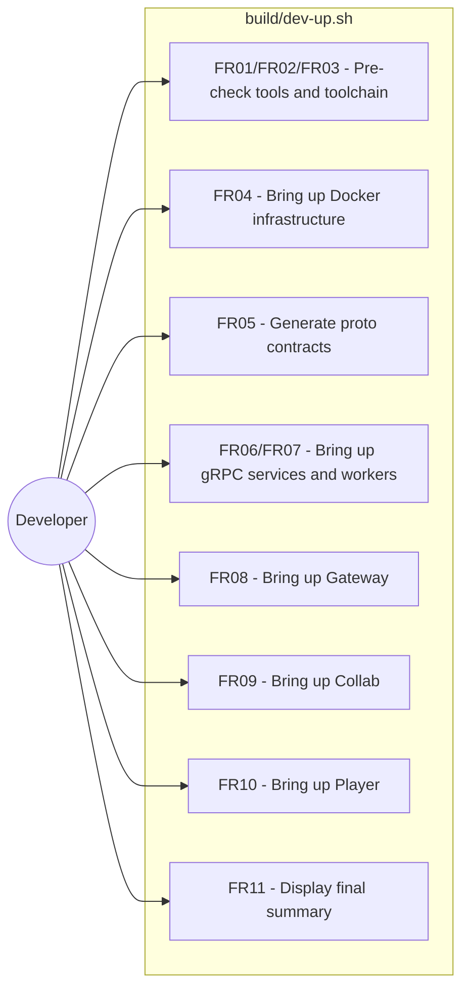
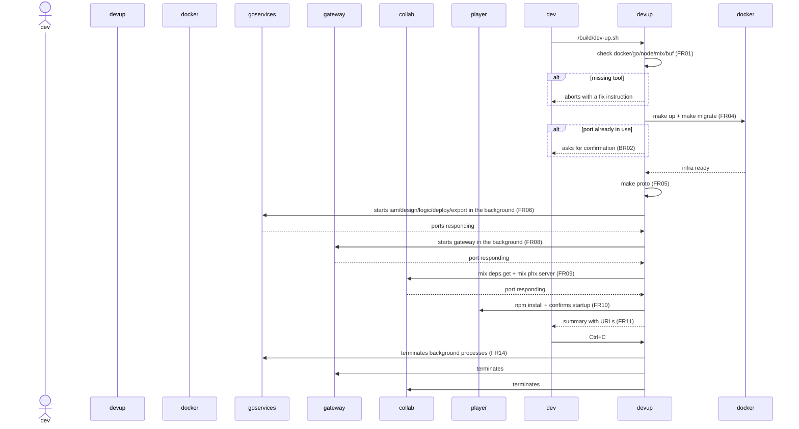

# Requirements and Analysis Document — Local Initialization Command

## 1. Overview

Today, bringing up MACH V4 locally requires manually running, in order and in
separate terminals: `make up`, `make migrate`, `make proto`, the 5 Go gRPC
services, the workers, the Gateway, Collab (Elixir/Phoenix), and the Player
(Vite) — with no prerequisite checks, no port-conflict detection, and logs
scattered across processes. This feature specifies a **single guided command**
(`build/dev-up.sh`) that orchestrates this entire sequence, with visual
feedback at every step, user confirmation at risk points (port in use, a step
failing), and centralized logs in a single folder — reducing startup to a
single, re-runnable command.

Reference implementation: `build/dev-up.sh`. Usage documentation:
`USAGE.md` ("Guided startup" section).

---

## 2. Business Rules (RN)

| ID | Name | Description |
| :--- | :--- | :--- |
| BR01 | Startup order respects dependencies | The sequence is fixed and reflects the real dependencies between layers: infra (Docker) → proto contracts → gRPC services → workers → gateway → collab → player. A step only starts once the previous one is ready (its port responding). |
| BR02 | Port conflicts never fail silently | If a required port is already in use on the host (e.g., MinIO 9000 taken by another project), the command explicitly warns and asks for confirmation before proceeding — it never kills the process already using it, nor silently ignores the conflict. |
| BR03 | Background processes are ephemeral to the command | Every process the command starts in the background (services, workers, gateway, collab) must be terminated automatically when the command is interrupted (Ctrl+C) or exits, so no orphaned processes are left holding ports. |
| BR04 | A single log per run | The output (stdout/stderr) of each step — synchronous (`make up`, `npm install`) or background (services, gateway, collab) — is centralized in a single log folder, one file per component, to make diagnosis easier without hunting through terminals. |
| BR05 | Optional non-interactive execution | The command must be able to run without any prompts (the `--yes` flag, assuming "yes" for every confirmation) for use in automation, and without starting the player (the `--no-player` flag) when it already runs separately. |

---

## 3. Functional Requirements (RF)

| ID | Name | Description | Priority |
| :--- | :--- | :--- | :--- |
| FR01 | Tooling pre-check | Verify that `docker`, `go`, `node`, `npm`, `mix`, `buf` are present on the PATH before starting any step; abort with a specific fix instruction for the missing tool. | High |
| FR02 | Automatic PATH adjustment | Automatically add to the PATH the local toolchains required by the repo (Go 1.26 at `$HOME/.local/go`, Elixir 1.17 at `$HOME/.local/elixir1.17`), without requiring the user to configure the shell manually. | High |
| FR03 | Go version validation | Detect the `go` version resolved on the PATH and warn (with the option to proceed anyway) if it's older than the minimum required by the repo (1.23+). | Medium |
| FR04 | Bringing up the infrastructure | Run `make up` and `make migrate`; before that, detect infra ports already in use on the host and ask for confirmation (BR02). | High |
| FR05 | Proto contract generation | Run `make proto` (buf lint + generate) to regenerate `gen/go`, `gen/elixir`, `gen/ts` before compiling any service. | High |
| FR06 | Bringing up the gRPC services | Start the 5 services (`iam`, `design`, `logic`, `deploy`, `export`) in the background, actively waiting (with a timeout) for each port to respond before moving on to the next step. | High |
| FR07 | Bringing up the workers | Start the RabbitMQ queue consumer (`workers/cmd`) in the background. | Medium |
| FR08 | Bringing up the Gateway | Start the HTTP Gateway in the background, waiting for its port to respond. | High |
| FR09 | Bringing up Collab | Install dependencies (`mix deps.get`) and start Collab (Phoenix) in the background, waiting for its port to respond. | High |
| FR10 | Player preparation and startup | Install the Player's dependencies (`npm install`, if `node_modules` is missing) and, pending user confirmation, start it in the foreground (`npm run dev`). | Medium |
| FR11 | Final summary | Upon completion, display a panel with the URLs of every running service (Gateway, Collab, Jaeger, RabbitMQ mgmt, MinIO console, Player) and the path to the log folder. | Medium |
| FR12 | Execution flags | Support `--no-player` (doesn't start the player) and `--yes`/`-y` (non-interactive, assumes "yes" for every confirmation). | Medium |
| FR13 | Centralized logging | Write the output of each step — background or synchronous — to `<pasta-de-logs>/<nome>.log`, in addition to displaying it on screen when synchronous. | High |
| FR14 | Clean shutdown | Upon receiving Ctrl+C (or exiting on error), terminate every background process the command started, in reverse order of creation. | High |

---

## 4. Non-Functional Requirements (RNF)

| ID | Name | Description | Category |
| :--- | :--- | :--- | :--- |
| NFR01 | Re-runnability | The command can be run multiple times in a row without requiring prior manual cleanup (already-applied infra/migrations must not break a new run). | Reliability |
| NFR02 | Degradable visual feedback | Visual indicators (✓/✗/!, colors) must work in an interactive terminal and degrade to plain text when the output is not a TTY (e.g., redirected to a file or CI). | Usability |
| NFR03 | Wait timeout | Actively waiting for a port has a limit (60s by default); upon expiry, the command reports a failure pointing to that step's specific log, instead of hanging indefinitely. | Reliability |
| NFR04 | No new external dependencies | The command uses only tools already required by the project (bash, docker, go, node, mix, buf) — no additional dependency to install just to run the startup. | Portability |
| NFR05 | Single location | The command and the repository's other build/startup/deploy scripts all live in `build/`, avoiding scattering operational scripts across the repository. | Maintainability |

---

## 5. UML Diagrams (Mermaid)

### 5.1 Use Case Diagram

### 5.2 Sequence Diagram

*(Class Diagram omitted — this feature does not introduce or change data models.)*

---

## 6. Mapping to Plane (Cards)

| Card Title | Description (HTML) | Priority |
| :--- | :--- | :--- |
| Tooling and toolchain pre-check on local startup | `<h3>Tasks</h3><ul><li>Check for docker/go/node/npm/mix/buf on the PATH</li><li>Abort with a fix instruction when a tool is missing</li><li>Automatically adjust PATH for the local Go 1.26 and Elixir 1.17</li><li>Validate the minimum Go version (1.23+) with a warning and the option to proceed</li></ul>` | high |
| Guided startup of the Docker infrastructure | `<h3>Tasks</h3><ul><li>Detect infra ports already in use before make up</li><li>Ask for user confirmation in case of a conflict</li><li>Run make up and make migrate</li><li>Wait for postgres/rabbitmq/minio to respond before proceeding</li></ul>` | high |
| Orchestrated startup of the gRPC services and workers | `<h3>Tasks</h3><ul><li>Run make proto before compiling the services</li><li>Start iam/design/logic/deploy/export in the background</li><li>Actively wait for each port to respond, with a timeout</li><li>Start the RabbitMQ worker in the background</li></ul>` | high |
| Bringing up the Gateway and Collab in the local startup | `<h3>Tasks</h3><ul><li>Start the HTTP Gateway in the background and wait for the port</li><li>Run mix deps.get and start Collab (Phoenix) in the background</li><li>Wait for the Collab port to respond</li></ul>` | high |
| Optional Player startup and final summary | `<h3>Tasks</h3><ul><li>Install the player's dependencies when node_modules is missing</li><li>Ask the user whether they want to start the player now</li><li>Display a final panel with the URLs of every service</li></ul>` | medium |
| Execution flags and clean shutdown | `<h3>Tasks</h3><ul><li>Implement the --no-player flag</li><li>Implement the --yes flag for non-interactive mode</li><li>Terminate every background process on exit (Ctrl+C or error)</li></ul>` | medium |
| Centralized logging for the local startup | `<h3>Tasks</h3><ul><li>Write the output of every synchronous and background step to a single log folder</li><li>Simultaneously display the output on screen for synchronous steps</li><li>Add the log folder to gitignore</li></ul>` | medium |
| Reorganization of build/deploy scripts into build/ | `<h3>Tasks</h3><ul><li>Move scripts/*.sh (build-artifacts, deploy, rollback, smoke-test) to build/</li><li>Update references in .github/workflows/cd.yml</li><li>Update references in infra/deploy/README.md and provision-host.sh</li><li>Update references in the spec 002 docs</li></ul>` | low |

> Implementation status: all items above have already been implemented in this session (`build/dev-up.sh`, `USAGE.md`, `scripts/` → `build/` migration). The cards remain available for retroactive registration/traceability in Plane, if desired.
