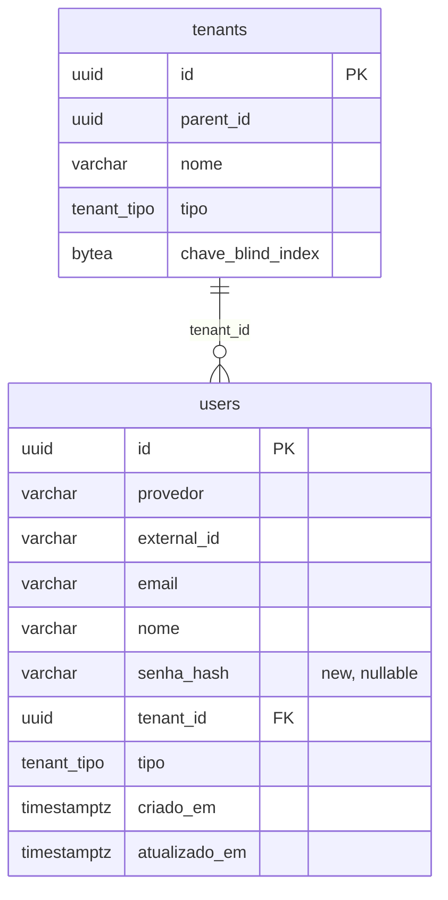

# Data Model: Self Sign-up

No new entity — just an extension of the `users` table already created in
migration `0012_create_users_table.sql`. The `tenants` table (migration `0001`) does not
change schema, it only gains new rows with `tipo = 'dono'` and `parent_id = NULL`
(same shape as the default OAuth tenant from migration `0013`, just one per sign-up).

---

## 1. Entities

### `users` (changed)

| Field | Type | Nullable | Default | Description |
|-------|------|---------|--------|-----------|
| id | uuid | no | `gen_random_uuid()` | PK (unchanged) |
| provedor | varchar(32) | no | — | `google`\|`github`\|**`senha`** (new value in practice, not in an enum — the column is a free `varchar`) |
| external_id | varchar(255) | no | — | the OAuth provider's id, or **the email itself** when `provedor = 'senha'` (satisfies the already-existing `UNIQUE (provedor, external_id)` with no migration on that index) |
| email | varchar(320) | no | `''` | unchanged |
| nome | varchar(255) | no | `''` | unchanged |
| **senha_hash** | varchar(255) | **yes** | `NULL` | **new.** bcrypt hash (prefix `$2`); `NULL` for OAuth accounts |
| tenant_id | uuid | no | — | FK `tenants(id)` (unchanged) |
| tipo | tenant_tipo | no | `'cliente'` | unchanged — password sign-up explicitly writes `'dono'` |
| criado_em / atualizado_em | timestamptz | no | `now()` | unchanged |

### `tenants` (no schema change, only data)

Password sign-up inserts a row with `parent_id = NULL`, `tipo = 'dono'`,
`chave_blind_index` generated the same way as `CriarTenant` (32 bytes via
`crypto/rand`) — no new column.

---

## 2. Relationships

| Entity A | Cardinality | Entity B | Foreign Key |
|------------|--------------|------------|--------------------|
| tenants | 1:N | users | `users.tenant_id → tenants.id` (unchanged) |

---

## 3. ER Diagram



---

## 4. Required Migrations

| Migration File | Operation | Table |
|----------------------|----------|--------|
| `0014_add_senha_users.sql` | `ALTER TABLE ... ADD COLUMN senha_hash` + partial `CREATE UNIQUE INDEX` | `users` |

Full migration content (idempotent, following the style of the previous ones):

```sql
-- 0014 — email/password self sign-up (spec 006). Password accounts reuse
-- the users table with provedor='senha' and external_id=email; senha_hash is NULL
-- for OAuth accounts. The unique index is partial (only provedor='senha') so as
-- not to prevent a Google account and a password account from coexisting with the
-- same email (identity unification is out of scope, spec.md §8).

ALTER TABLE users ADD COLUMN IF NOT EXISTS senha_hash varchar(255);

CREATE UNIQUE INDEX IF NOT EXISTS idx_users_email_senha_unico
    ON users (email)
    WHERE provedor = 'senha';
```
