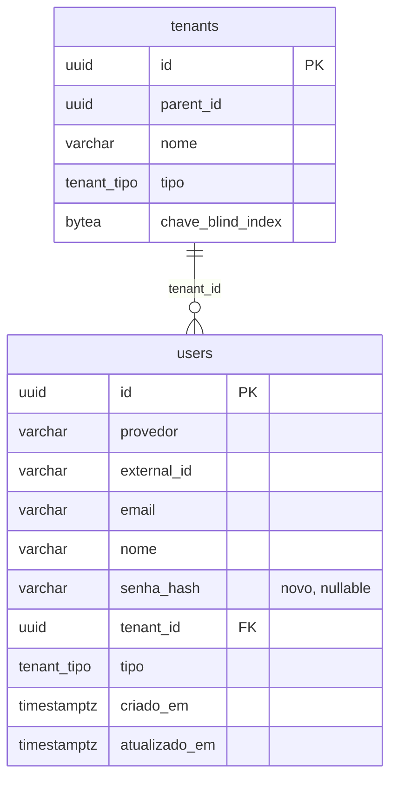

# Modelo de Dados: Auto Cadastro (Self Sign-up)

Nenhuma entidade nova — apenas uma extensão da tabela `users` já criada na
migração `0012_create_users_table.sql`. A tabela `tenants` (migração `0001`) não
muda de schema, só ganha novas linhas com `tipo = 'dono'` e `parent_id = NULL`
(mesmo formato do tenant padrão OAuth da migração `0013`, só que um por cadastro).

---

## 1. Entidades

### `users` (alterada)

| Campo | Tipo | Nulável | Padrão | Descrição |
|-------|------|---------|--------|-----------|
| id | uuid | não | `gen_random_uuid()` | PK (inalterado) |
| provedor | varchar(32) | não | — | `google`\|`github`\|**`senha`** (novo valor de fato, não de enum — coluna é `varchar` livre) |
| external_id | varchar(255) | não | — | id do provedor OAuth, ou **o próprio e-mail** quando `provedor = 'senha'` (garante `UNIQUE (provedor, external_id)` já existente sem migração nesse índice) |
| email | varchar(320) | não | `''` | inalterado |
| nome | varchar(255) | não | `''` | inalterado |
| **senha_hash** | varchar(255) | **sim** | `NULL` | **novo.** Hash bcrypt (prefixo `$2`); `NULL` para contas OAuth |
| tenant_id | uuid | não | — | FK `tenants(id)` (inalterado) |
| tipo | tenant_tipo | não | `'cliente'` | inalterado — cadastro por senha grava explicitamente `'dono'` |
| criado_em / atualizado_em | timestamptz | não | `now()` | inalterado |

### `tenants` (sem alteração de schema, só de dado)

Cadastro por senha insere uma linha com `parent_id = NULL`, `tipo = 'dono'`,
`chave_blind_index` gerada com o mesmo padrão de `CriarTenant` (32 bytes
`crypto/rand`) — nenhuma coluna nova.

---

## 2. Relacionamentos

| Entidade A | Cardinalidade | Entidade B | Chave Estrangeira |
|------------|--------------|------------|--------------------|
| tenants | 1:N | users | `users.tenant_id → tenants.id` (inalterado) |

---

## 3. Diagrama ER



---

## 4. Migrações Necessárias

| Arquivo de Migração | Operação | Tabela |
|----------------------|----------|--------|
| `0014_add_senha_users.sql` | `ALTER TABLE ... ADD COLUMN senha_hash` + `CREATE UNIQUE INDEX` parcial | `users` |

Conteúdo completo da migração (idempotente, seguindo o estilo das anteriores):

```sql
-- 0014 — auto cadastro por e-mail/senha (spec 006). Contas de senha reaproveitam
-- a tabela users com provedor='senha' e external_id=email; senha_hash é NULL
-- para contas OAuth. O índice único é parcial (só provedor='senha') para não
-- impedir uma conta Google e uma conta de senha coexistirem com o mesmo e-mail
-- (unificação de identidade é fora de escopo, spec.md §8).

ALTER TABLE users ADD COLUMN IF NOT EXISTS senha_hash varchar(255);

CREATE UNIQUE INDEX IF NOT EXISTS idx_users_email_senha_unico
    ON users (email)
    WHERE provedor = 'senha';
```
