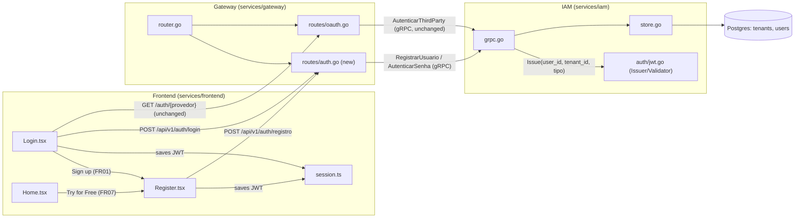

# Implementation Plan: Self Sign-up

Strategy: additive across the whole stack — no existing contract (proto, routes,
schema) is changed, only extended. The IAM gains two new RPCs that converge
on the same `auth.Issuer` already used by OAuth; the Gateway gains a
public-routes file that mirrors the REST→gRPC pattern of `routes/tenants.go`; the Frontend gains
one new screen (`Register.tsx`) and two targeted tweaks (`Login.tsx`, `Home.tsx`).

---

## 1. Architecture



---

## 2. Design Patterns

| Pattern | Where it applies | Justification | Alternative discarded |
|--------|-----------------|----------------|-------------------------|
| **Strategy** (implicit, reinforced) | `IAMServer`: `AutenticarThirdParty` (existing) and `AutenticarSenha`/`RegistrarUsuario` (new) are interchangeable authentication strategies that converge on the same final step, `auth.Issuer.Issue(userID, tenantID, tipo)`. | The output contract (a MACH JWT with the 3 claims) is already unique today; adding a second strategy without touching `Issuer` preserves that guarantee and allows for a third path (e.g., corporate SSO) in the future without reopening the token issuer. | Unifying everything into a single `Autenticar` RPC with `oneof { third_party, senha }` — discarded: it would mix very different error semantics (409 duplicate email at sign-up vs. 401 invalid credentials at login) and would break the already-tested `AutenticarThirdParty` contract (NFR04). |
| **Facade** (reuse of the already-established pattern) | `services/gateway/internal/routes/auth.go` (new) translates REST↔gRPC exactly as `routes/tenants.go` already does for `IAMServiceClient`. | The Gateway is already the only layer that speaks HTTP with the browser; replicating the same handler shape (a narrow client `interface`, `web.JSON`, gRPC→HTTP error mapping) keeps the Gateway predictable for anyone who already reads `tenants.go`. | Calling the IAM directly via gRPC-Web from the browser — discarded: it would require a new gRPC-Web proxy in the infra and would break the 100% REST pattern the rest of the Frontend uses (`ApiClient`). |
| **Repository** (reuse, not a new choice) | `store.Store` gains `CriarTenantEUsuarioComSenha` and `ObterUsuarioPorEmailSenha`, following the same shape as the existing methods (`CriarTenant`, `UpsertUsuarioThirdParty`). | It is already the sole data-access point for `tenants`/`users` in the IAM; there is no reason for a second data-access path in this initiative. | — (no alternative evaluated; it is a convention already fixed in the service). |

---

## 3. Files to Create/Edit

### 3.1. Database
* **`infra/postgres/migrations/0014_add_senha_users.sql`** (new): adds a nullable `senha_hash` to `users` + a partial unique index on `email` for `provedor = 'senha'`.

### 3.2. Contracts (proto)
* **`proto/construtor/iam/v1/iam.proto`**: adds `RegistrarUsuarioRequest/Response`, `AutenticarSenhaRequest/Response`, and the `RegistrarUsuario`/`AutenticarSenha` RPCs to `IAMService`. Run `make proto` to regenerate `gen/go`, `gen/elixir`, `gen/ts`.

### 3.3. IAM (`services/iam`)
* **`internal/store/store.go`**: new `ErrEmailJaCadastrado`; new methods `CriarTenantEUsuarioComSenha` (pgx transaction: inserts a `dono`-type tenant + a `dono`-type user with `senha_hash`, rolling back on `unique_violation`) and `ObterUsuarioPorEmailSenha`.
* **`internal/store/store_test.go`**: tests for the two new methods (success, duplicate email with tenant rollback).
* **`internal/server/grpc.go`**: implements `RegistrarUsuario` (validates fields, `bcrypt.GenerateFromPassword`, calls the store, issues the JWT) and `AutenticarSenha` (`bcrypt.CompareHashAndPassword`, same error message for nonexistent email/wrong password — BR04). Extends the file's `Store` interface with the 2 new methods.
* **`internal/server/grpc_test.go`**: tests for the two new handlers.

### 3.4. Gateway (`services/gateway`)
* **`internal/routes/auth.go`** (new): `RegistrarUsuario` (`POST /api/v1/auth/registro`) and `Login` (`POST /api/v1/auth/login`), translating REST→gRPC like `tenants.go`; maps `AlreadyExists`→409, `Unauthenticated`→401, `InvalidArgument`→422.
* **`internal/routes/auth_test.go`** (new): tests for these two handlers.
* **`internal/app/router.go`**: registers the two routes **outside** `r.Group(Auth)` (public), alongside `oauth.Registrar(r)`.

### 3.5. Frontend (`services/frontend`)
* **`src/auth/Register.tsx`** (new): name/email/password/nome_tenant form; `fetch POST /api/v1/auth/registro`; on success saves the token (reuses `session.ts`) and navigates to `/dashboard`; on 409 shows a duplicate-email error while keeping the filled-in fields.
* **`src/auth/Register.test.tsx`** (new).
* **`src/auth/Login.tsx`**: adds an email/password form (`fetch POST /api/v1/auth/login`) above or below the existing OAuth buttons, plus a "Sign up" link to `/register`.
* **`src/auth/Login.test.tsx`**: covers the new form and the link.
* **`src/main.tsx`**: registers `<Route path="/register" element={<Register />} />` on the public router (alongside `/login`).
* **`src/pages/Home/Home.tsx`**: both "Try for Free" links move from `to="/login"` to `to="/register"`.
* **`src/pages/Home/Home.test.tsx`**: updates the CTA `href`/route assertion.

---

## 4. Technical Decisions

### 4.1. Reuse the `users` table with `provedor = 'senha'` instead of a new table
The table already has `provedor`/`external_id`/`email`/`nome`/`tenant_id`/`tipo` and the same
`tenant_tipo` enum. A password account is just one more row with `provedor = 'senha'`
and `external_id = email` (satisfying the already-existing `UNIQUE (provedor, external_id)`
with no additional migration on that index). All that's missing is the password itself — hence
the new nullable column (`NULL` for OAuth accounts) and a **partial** unique index, so as
not to collide with the existing per-provider uniqueness:

```sql
ALTER TABLE users ADD COLUMN senha_hash varchar(255);
CREATE UNIQUE INDEX idx_users_email_senha_unico ON users (email)
  WHERE provedor = 'senha';
```

### 4.2. New endpoints under `/api/v1/auth/*`, not `/auth/*`
`/auth/{provedor}` (OAuth) is browser navigation (a redirect), so it doesn't need
a proxy in the Vite dev server. Password sign-up/login are called via `fetch` from
inside the SPA — they need the same proxy that `/api/*` already has in
`services/frontend/vite.config.ts` (dev) and in `infra/nginx/*.conf` (production, which
in fact already proxies both prefixes). Placing the new endpoints under `/api/v1/auth/*`
avoids CORS issues and new proxy configuration, even though they sit **outside** the
`r.Group(Auth)` in `router.go` (they are the only two public routes under `/api`).

### 4.3. Tenant + user atomicity via an explicit transaction
`CriarTenant` and the user insert are currently separate calls in the store. To
satisfy NFR03 (no orphaned tenant if the email is a duplicate), the new
`CriarTenantEUsuarioComSenha` method opens a pgx transaction (`BEGIN`), inserts the tenant,
tries to insert the user, and only `COMMIT`s if both inserts succeed; a
`unique_violation` on the `users` `INSERT` triggers a `ROLLBACK` (undoing the tenant
too) before returning `ErrEmailJaCadastrado`.

```go
func (s *Store) CriarTenantEUsuarioComSenha(ctx context.Context, nomeUsuario, email, senhaHash, nomeTenant string) (userID, tenantID string, err error) {
    tx, err := s.pool.Begin(ctx)
    if err != nil {
        return "", "", fmt.Errorf("store: iniciar transação: %w", err)
    }
    defer tx.Rollback(ctx) // no-op se já houve commit

    chave := make([]byte, 32)
    if _, err := rand.Read(chave); err != nil {
        return "", "", fmt.Errorf("store: gerar chave do tenant: %w", err)
    }
    if err := tx.QueryRow(ctx,
        `INSERT INTO tenants (nome, tipo, chave_blind_index) VALUES ($1, 'dono', $2) RETURNING id`,
        nomeTenant, chave,
    ).Scan(&tenantID); err != nil {
        return "", "", fmt.Errorf("store: criar tenant: %w", err)
    }

    err = tx.QueryRow(ctx,
        `INSERT INTO users (provedor, external_id, email, nome, senha_hash, tenant_id, tipo)
         VALUES ('senha', $1, $1, $2, $3, $4, 'dono') RETURNING id`,
        email, nomeUsuario, senhaHash, tenantID,
    ).Scan(&userID)
    var pgErr *pgconn.PgError
    if errors.As(err, &pgErr) && pgErr.Code == "23505" {
        return "", "", ErrEmailJaCadastrado
    }
    if err != nil {
        return "", "", fmt.Errorf("store: criar usuário: %w", err)
    }

    if err := tx.Commit(ctx); err != nil {
        return "", "", fmt.Errorf("store: commit: %w", err)
    }
    return userID, tenantID, nil
}
```

`s.pool` requires swapping the `Store`'s `db DB` field for access to a `*pgxpool.Pool`
(or adding a second field just for transactions) — see Risks, the item with the greatest
technical uncertainty in this initiative.

---

## 5. Dependencies and Prerequisites

- [x] `golang.org/x/crypto` is already an indirect module dependency (`go.mod` line 47) — it just needs to become a direct import of `golang.org/x/crypto/bcrypt`; no new package to install.
- [x] No pending migration from earlier specs blocks `0014`.
- [ ] Confirm whether `store.DB` (current interface, just `Exec`/`Query`/`QueryRow`) needs to evolve to expose `Begin` — technical decision 4.3.

---

## 6. Risks and Points of Attention

| Risk | Impact | Mitigation |
|-------|---------|-----------|
| `store.DB` is currently a narrow interface (`Exec`/`Query`/`QueryRow`) with no `Begin` — may require adjusting the signature or adding a second `TxDB` type just for this method, touching existing tests that use `DB` mocks. | High | Treat as the first implementation task (4.3); if the adjustment turns out larger than expected, fall back to a version without a real transaction (create the user first, then the tenant, with manual cleanup on error), documenting the debt. |
| The lack of dedicated rate limiting on `/api/v1/auth/login` allows password brute-forcing. | Medium | Out of scope (NFR02); the Gateway's existing `middleware.RateLimiter` is per authenticated tenant — it does not apply to public routes. Flag as the next initiative. |
| Two accounts (OAuth and password) with the same email produce disconnected identities, potentially confusing for the user. | Low | Consciously accepted (out of scope — identity unification, spec.md §8). |
| Fixed-cost bcrypt may become outdated over time. | Low | The cost is isolated in a single constant (`const bcryptCost = 12`) — easy to raise later with no data migration (bcrypt already embeds the cost in the hash itself). |
