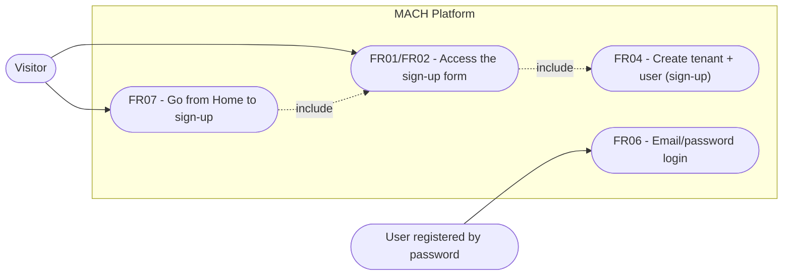
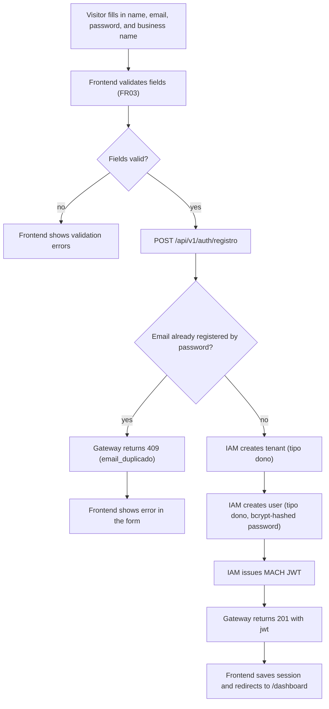
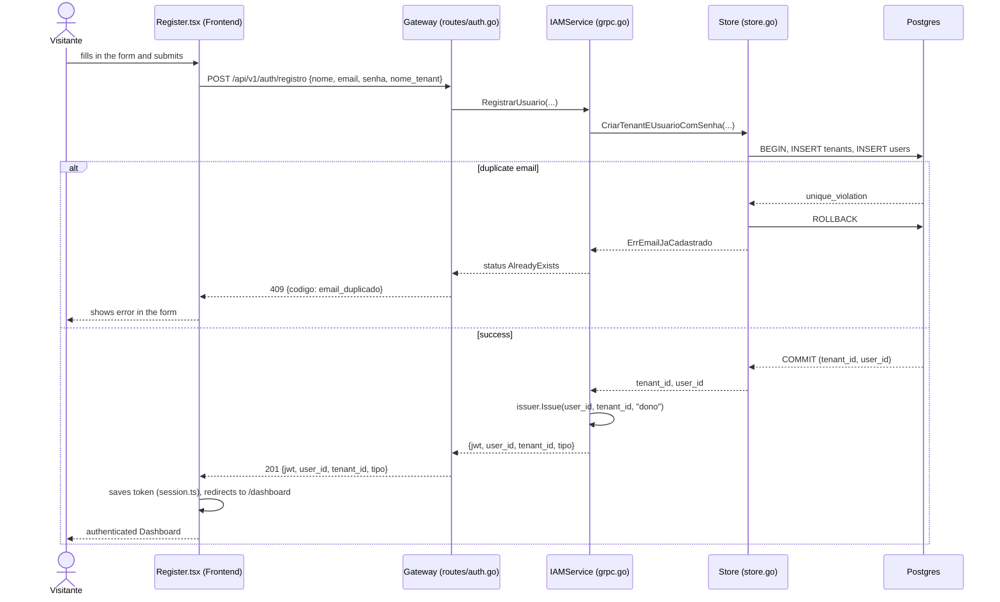
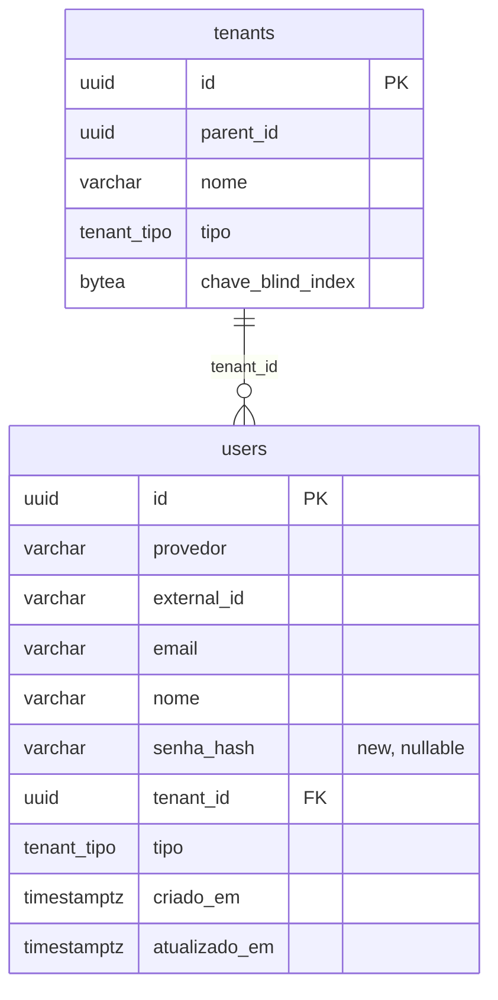

# Specification: Self Sign-up

Today the MACH Platform only authenticates via social login (Google/GitHub — spec 001, FR03):
every new OAuth login is auto-provisioned by the IAM, but it always lands in the same
fixed shared tenant (`TenantPadraoID`, migration 0013) as a `cliente`, with no option for
the user to become the owner of their own tenant. There is no email/password path at all, and
the Home page (spec 004, FR01/FR02) already advertises a "Try for Free" CTA that today only redirects
to the social login, with no dedicated sign-up flow.

This specification covers the first email/password self-sign-up flow: a
visitor creates their own account **and** their own tenant, becoming its
Administrator (owner) — a self-serve SaaS model — without affecting the existing
social login, which continues to work in parallel.

---

## 1. Objective

By the end of this implementation, an anonymous visitor must be able to create an account
with a name/email/password and their business name, automatically receive their own
tenant (`dono` type), and land authenticated on the Dashboard — with no need for an invitation or
a pre-existing administrator. Users already registered by password must also be able to
sign in via email/password on the Login screen, alongside the existing OAuth
buttons.

---

## 2. Business Rules

| ID   | Rule |
|------|-------|
| BR01 | Each sign-up creates exactly one new root tenant (`parent_id = NULL`), for which the registering user is the sole initial user, with `tipo = 'dono'`. |
| BR02 | Email is unique among accounts authenticated by password (partial unique index on `users` restricted to `provedor = 'senha'`). Signing up with an email already used by another password account is rejected. OAuth accounts with the same email neither conflict with nor are merged into it — out of scope (§8). |
| BR03 | Password must be at least 8 characters and is never persisted in clear text — only as a bcrypt hash. |
| BR04 | A password-login failure (nonexistent email OR incorrect password) always returns the same generic message/status, to prevent enumeration of registered emails. |
| BR05 | Password authentication coexists with the existing OAuth (spec 001, FR03) without changing it: both issue the same MACH JWT format (RS256, `tenant_id`/`sub`/`tipo` claims) through the same `auth.Issuer`. |
| BR06 | The tenant name is required at sign-up; it can later be edited by the owner via the existing Settings/Registration-Profile screens (spec 004, FR13/FR17). |

---

## 3. Functional Requirements

| ID   | Description | Actor | Priority |
|------|-----------|------|------------|
| FR01 | Display a "Sign up" link on the Login screen, leading to the new sign-up screen. | Visitor | High |
| FR02 | Display a sign-up form (name, email, password, business/tenant name) on the public `/register` route. | Visitor | High |
| FR03 | Validate required fields and minimum format on the client (valid email, password ≥ 8 characters) before submitting. | Visitor | Medium |
| FR04 | On submit, create a new tenant in the IAM (`tipo = dono`) and a new user (`tipo = dono`, hashed password) linked to that tenant, authenticating automatically (issuing a JWT) — the visitor lands directly on the Dashboard without needing to log in again. | Visitor → Administrator | High |
| FR05 | Reject sign-up with an email already registered by a password account, returning a clear error in the form without discarding the other filled-in fields. | Visitor | High |
| FR06 | Offer email/password login on the Login screen, alongside the existing OAuth, authenticating against the IAM and issuing the same MACH JWT. | User registered by password | High |
| FR07 | The Home "Try for Free" CTA now points to `/register` instead of `/login`. | Visitor | Medium |

---

## 4. Non-Functional Requirements

| ID    | Category       | Description |
|-------|-----------------|-----------|
| NFR01 | Security       | The password never travels or is logged in clear text; bcrypt hash with cost ≥ 10. |
| NFR02 | Security       | The password-login endpoint must not distinguish, in its response, a nonexistent email from an incorrect password (BR04); dedicated brute-force rate limiting is out of scope for this initiative (see Risks in `plan.md`). |
| NFR03 | Reliability  | Creating the tenant + the user at sign-up is atomic: if user creation fails (e.g., duplicate email), no orphaned tenant remains persisted. |
| NFR04 | Compatibility | The OAuth flow (Google/GitHub) keeps working with no change to its contract or behavior. |
| NFR05 | Observability | Sign-up/login failures (duplicate email, invalid credentials) are logged in the Gateway/IAM without exposing the password in clear text. |

---

## 5. Usage Scenarios

### Scenario 1: Successful sign-up (FR02, FR04, BR01, BR03, BR06)
* **Given** a visitor accesses `/register` and fills in name, email, password (≥ 8 characters), and business name
* **When** they submit the form
* **Then** the IAM creates a new tenant (`tipo = dono`) and a new user (`tipo = dono`) with the hashed password, and issues a MACH JWT
* **And** the Frontend saves the session and automatically redirects to `/dashboard`, already authenticated

### Scenario 2: Sign-up with an already-used email (FR05, BR02)
* **Given** a password account with email X already exists
* **When** a visitor tries to sign up again with email X
* **Then** the sign-up is rejected with a clear error ("email already registered")
* **And** no new tenant or user is created (NFR03)

### Scenario 3: Successful password login (FR06, BR05)
* **Given** a user already has a password account
* **When** they enter the correct email and password on the Login screen
* **Then** the IAM validates the hash and issues the MACH JWT
* **And** the Frontend redirects to `/dashboard`, indistinguishable from an OAuth login

### Scenario 4: Password login with invalid credentials (FR06, BR04)
* **Given** a user enters a nonexistent email OR an incorrect password
* **When** they submit the password-login form
* **Then** the system returns the same error message and status in both cases, without indicating which field is wrong

### Scenario 5: Home directs to sign-up (FR07)
* **Given** an anonymous visitor accesses Home
* **When** they click "Try for Free"
* **Then** they are taken to `/register` (no longer to `/login`)

---

## 6. Acceptance Criteria

1. `POST /api/v1/auth/registro` with a valid name/email/password/nome_tenant returns 201 with `jwt`, `user_id`, `tenant_id`, `tipo = "dono"`; a new tenant and a new user now exist in the database.
2. Repeating the sign-up with the same email returns 409 with an identifiable error code (`email_duplicado`), with no additional tenant or user created — testable via an integration test that counts rows before/after.
3. `POST /api/v1/auth/login` with the correct email/password of an account created via sign-up returns 200 with a valid `jwt` (decodable by the existing `Validator`), containing the `tenant_id` of the tenant created at sign-up.
4. `POST /api/v1/auth/login` with an incorrect password and with a nonexistent email return exactly the same HTTP status and error body (byte-for-byte comparable, except for trace fields).
5. The password never appears in clear text in the `users` table — the `senha_hash` column always starts with the bcrypt prefix `$2`.
6. The existing OAuth integration tests keep passing with no modification (NFR04).
7. In the Frontend, `Login.tsx` displays a "Sign up" link to `/register`, and `Home.tsx` points "Try for Free" to `/register` — covered by updated `Login.test.tsx`/`Home.test.tsx`.
8. After a successful sign-up in the browser, the user is automatically redirected to `/dashboard` without needing to log in again.

---

## 7. UML Diagrams

### 7.1. Use Case Diagram

### 7.2. Activity Diagram — Sign-up (FR02, FR04, FR05)

### 7.3. Sequence Diagram — Sign-up (Scenarios 1 and 2)

### 7.4. Class Diagram — Changed Schema

`UNIQUE (provedor, external_id)` already existed; the new partial unique index on
`email` (`WHERE provedor = 'senha'`, BR02) is not representable in the `erDiagram` —
see the full SQL in `data-model.md` §4.

---

## 8. Out of Scope

- Password recovery/reset ("forgot my password") — future initiative.
- Identity unification between an OAuth account and a password account sharing the same email (federated login/account linking).
- Email verification via a confirmation link at sign-up (spec 004, FR18, already covers email-change confirmation for existing users; sign-up here does not require prior confirmation).
- Time-limited billing/trial plans — "Try for Free" remains just a free sign-up, with no billing.
- Dedicated brute-force rate limiting on `/api/v1/auth/login` (see NFR02 and Risks in `plan.md`).
