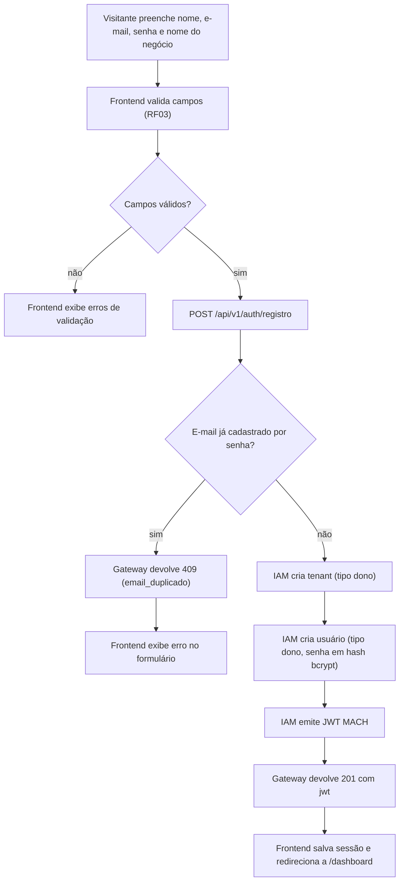
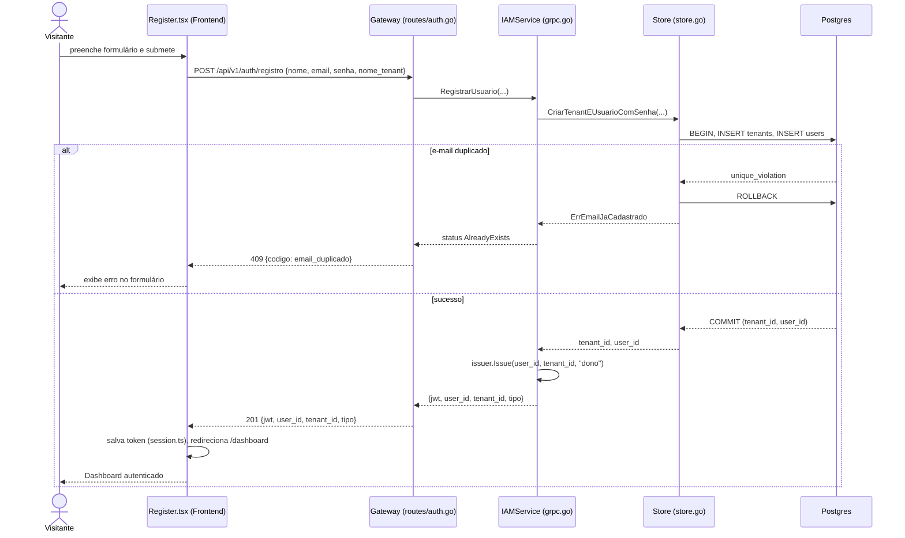
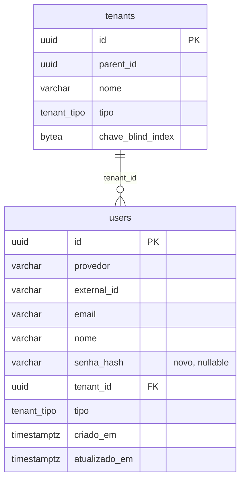

# Especificação: Auto Cadastro (Self Sign-up)

Hoje a Plataforma MACH só autentica via login social (Google/GitHub — spec 001, RF03):
todo login OAuth novo é auto-provisionado pelo IAM, mas cai sempre no mesmo tenant
fixo compartilhado (`TenantPadraoID`, migração 0013) como `cliente`, sem opção de o
usuário virar dono do próprio tenant. Não existe nenhum caminho de e-mail/senha, e a
Home (spec 004, RF01/RF02) já anuncia um CTA "Testar grátis" que hoje só redireciona
para o login social, sem fluxo de cadastro próprio.

Esta especificação cobre o primeiro fluxo de auto cadastro por e-mail/senha: um
visitante cria sua própria conta **e** seu próprio tenant, tornando-se
Administrador (dono) dele — modelo SaaS self-serve — sem afetar o login social
existente, que continua funcionando em paralelo.

---

## 1. Objetivo

Ao final desta implementação, um visitante anônimo deve conseguir criar uma conta
com nome/e-mail/senha e o nome do seu negócio, receber automaticamente um tenant
próprio (tipo `dono`) e cair autenticado no Dashboard — sem precisar de convite ou
de um administrador pré-existente. Usuários já cadastrados por senha devem também
poder entrar via e-mail/senha na tela de Login, ao lado dos botões OAuth já
existentes.

---

## 2. Regras de Negócio

| ID   | Regra |
|------|-------|
| RN01 | Cada cadastro cria exatamente um novo tenant raiz (`parent_id = NULL`), do qual o próprio usuário registrante é o único usuário inicial, com `tipo = 'dono'`. |
| RN02 | E-mail é único entre contas autenticadas por senha (índice único parcial em `users` restrito a `provedor = 'senha'`). Cadastro com e-mail já usado por outra conta de senha é rejeitado. Contas OAuth com o mesmo e-mail não conflitam nem são unificadas — fora de escopo (§8). |
| RN03 | Senha deve ter no mínimo 8 caracteres e nunca é persistida em texto claro — apenas como hash bcrypt. |
| RN04 | Falha de login por senha (e-mail inexistente OU senha incorreta) sempre devolve a mesma mensagem/status genérico, para impedir enumeração de e-mails cadastrados. |
| RN05 | Autenticação por senha coexiste com o OAuth existente (spec 001, RF03) sem alterá-lo: ambos emitem o mesmo formato de JWT MACH (RS256, claims `tenant_id`/`sub`/`tipo`) através do mesmo `auth.Issuer`. |
| RN06 | Nome do tenant é obrigatório no cadastro; pode ser editado depois pelo próprio dono via as telas de Configuração/Cadastro-Perfil já existentes (spec 004, RF13/RF17). |

---

## 3. Requisitos Funcionais

| ID   | Descrição | Ator | Prioridade |
|------|-----------|------|------------|
| RF01 | Exibir link "Cadastre-se" na tela de Login, levando à nova tela de cadastro. | Visitante | Alta |
| RF02 | Exibir formulário de cadastro (nome, e-mail, senha, nome do negócio/tenant) em rota pública `/register`. | Visitante | Alta |
| RF03 | Validar no cliente os campos obrigatórios e formato mínimo (e-mail válido, senha ≥ 8 caracteres) antes de submeter. | Visitante | Média |
| RF04 | Ao submeter, criar no IAM um novo tenant (`tipo = dono`) e um novo usuário (`tipo = dono`, senha em hash) vinculado a esse tenant, autenticando automaticamente (emitir JWT) — o visitante cai direto no Dashboard sem precisar logar de novo. | Visitante → Administrador | Alta |
| RF05 | Rejeitar cadastro com e-mail já registrado por conta de senha, devolvendo erro claro no formulário sem descartar os demais campos preenchidos. | Visitante | Alta |
| RF06 | Oferecer login por e-mail e senha na tela de Login, além do OAuth já existente, autenticando contra o IAM e emitindo o mesmo JWT MACH. | Usuário registrado por senha | Alta |
| RF07 | O CTA "Testar grátis" da Home passa a apontar para `/register` em vez de `/login`. | Visitante | Média |

---

## 4. Requisitos Não Funcionais

| ID    | Categoria       | Descrição |
|-------|-----------------|-----------|
| RNF01 | Segurança       | Senha nunca trafega nem é logada em texto claro; hash bcrypt com custo ≥ 10. |
| RNF02 | Segurança       | O endpoint de login por senha não deve diferenciar, na resposta, e-mail inexistente de senha incorreta (RN04); rate limiting dedicado contra força bruta fica fora de escopo desta demanda (ver Riscos em `plan.md`). |
| RNF03 | Confiabilidade  | A criação do tenant + do usuário no cadastro é atômica: se a criação do usuário falhar (ex.: e-mail duplicado), nenhum tenant órfão permanece persistido. |
| RNF04 | Compatibilidade | O fluxo OAuth (Google/GitHub) continua funcionando sem nenhuma alteração de contrato ou comportamento. |
| RNF05 | Observabilidade | Falhas de cadastro/login (e-mail duplicado, credenciais inválidas) são logadas no Gateway/IAM sem expor a senha em texto claro. |

---

## 5. Cenários de Uso

### Cenário 1: Cadastro bem-sucedido (RF02, RF04, RN01, RN03, RN06)
* **Dado que** um visitante acessa `/register` e preenche nome, e-mail, senha (≥ 8 caracteres) e nome do negócio
* **Quando** submete o formulário
* **Então** o IAM cria um novo tenant (`tipo = dono`) e um novo usuário (`tipo = dono`) com a senha em hash, emite um JWT MACH
* **E** o Frontend salva a sessão e redireciona automaticamente para `/dashboard` já autenticado

### Cenário 2: Cadastro com e-mail já usado (RF05, RN02)
* **Dado que** já existe uma conta de senha com o e-mail X
* **Quando** um visitante tenta se cadastrar novamente com o e-mail X
* **Então** o cadastro é rejeitado com um erro claro ("e-mail já cadastrado")
* **E** nenhum tenant ou usuário novo é criado (RNF03)

### Cenário 3: Login por senha bem-sucedido (RF06, RN05)
* **Dado que** um usuário já possui conta de senha
* **Quando** informa e-mail e senha corretos na tela de Login
* **Então** o IAM valida o hash e emite o JWT MACH
* **E** o Frontend redireciona para `/dashboard`, indistinguível de um login OAuth

### Cenário 4: Login por senha com credenciais inválidas (RF06, RN04)
* **Dado que** um usuário informa um e-mail inexistente OU uma senha incorreta
* **Quando** submete o formulário de login por senha
* **Então** o sistema devolve a mesma mensagem e status de erro em ambos os casos, sem indicar qual campo está errado

### Cenário 5: Home direciona ao cadastro (RF07)
* **Dado que** um visitante anônimo acessa a Home
* **Quando** clica em "Testar grátis"
* **Então** é levado a `/register` (não mais a `/login`)

---

## 6. Critérios de Aceitação

1. `POST /api/v1/auth/registro` com nome/e-mail/senha/nome_tenant válidos retorna 201 com `jwt`, `user_id`, `tenant_id`, `tipo = "dono"`; um novo tenant e um novo usuário passam a existir no banco.
2. Repetir o cadastro com o mesmo e-mail retorna 409 com um código de erro identificável (`email_duplicado`), sem criar tenant ou usuário adicional — testável em teste de integração que conta as linhas antes/depois.
3. `POST /api/v1/auth/login` com e-mail/senha corretos de uma conta criada via cadastro retorna 200 com um `jwt` válido (decodificável pelo `Validator` existente), contendo o `tenant_id` do tenant criado no cadastro.
4. `POST /api/v1/auth/login` com senha incorreta e com e-mail inexistente devolvem exatamente o mesmo status HTTP e corpo de erro (comparável byte a byte, exceto campos de trace).
5. A senha nunca aparece em texto claro na tabela `users` — a coluna `senha_hash` sempre começa com o prefixo bcrypt `$2`.
6. Os testes de integração OAuth já existentes continuam passando sem modificação (RNF04).
7. No Frontend, `Login.tsx` exibe um link "Cadastre-se" para `/register`, e `Home.tsx` aponta "Testar grátis" para `/register` — cobertos por `Login.test.tsx`/`Home.test.tsx` atualizados.
8. Após cadastro bem-sucedido no navegador, o usuário é redirecionado automaticamente para `/dashboard` sem precisar logar novamente.

---

## 7. Diagramas UML

### 7.1. Diagrama de Casos de Uso

### 7.2. Diagrama de Atividade — Cadastro (RF02, RF04, RF05)

### 7.3. Diagrama de Sequência — Cadastro (Cenários 1 e 2)

### 7.4. Diagrama de Classes — Schema Alterado

`UNIQUE (provedor, external_id)` já existia; o novo índice único parcial em
`email` (`WHERE provedor = 'senha'`, RN02) não é representável no `erDiagram` —
ver SQL completo em `data-model.md` §4.

---

## 8. Fora de Escopo

- Recuperação/redefinição de senha ("esqueci minha senha") — demanda futura.
- Unificação de identidade entre conta OAuth e conta de senha com o mesmo e-mail (login federado/account linking).
- Verificação de e-mail por link de confirmação no cadastro (a spec 004, RF18, já cobre confirmação de troca de e-mail para usuários existentes; o cadastro aqui não exige confirmação prévia).
- Planos de cobrança/trial com prazo — "Testar grátis" continua sendo apenas um cadastro gratuito, sem billing.
- Rate limiting dedicado contra força bruta no `/api/v1/auth/login` (ver RNF02 e Riscos em `plan.md`).
