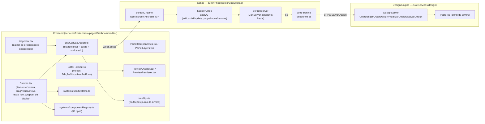

# Plano de Implementação: Editor Visual (Canvas)

Documentação retroativa (as-built) — cobre a implementação já existente do RF09,
construída em cima da casca deixada pela spec 004 e da colaboração em tempo real
já provida pelo Collab (spec 001, RF06).

---

## 1. Arquitetura

O caminho de escrita é sempre otimista no cliente: `useCanvasDesign` aplica a
mutação localmente (via `treeOps.ts`, os mesmos reducers puros usados só para
preview) e envia a mutação (`{tipo, blind_index, ...}`) pelo canal Phoenix;
`Session.Tree.apply/2` é a mesma lógica espelhada no lado Elixir, fonte da
verdade para os outros colaboradores. Persistência no Postgres é
write-behind com debounce de 5s (`ScreenServer`) — checar o estado
persistido via REST logo após uma mutação (< 5s) é um erro de metodologia de
teste, não um bug de app.

---

## 2. Decisões técnicas

### 2.1. Rich text por trecho: `execCommand` + sanitização por DOM

`TextoEditavel` (`Canvas.tsx`) usa `contentEditable` + `document.execCommand`
para negrito/itálico/sublinhado — a alternativa (um editor rico completo tipo
Slate/ProseMirror) foi descartada por escopo: o requisito é 3 comandos
simples, não um editor de documentos. `execCommand` é legado mas ainda
suportado por todos os browsers relevantes; o ganho de não trazer uma
dependência nova para 3 toggles compensa o débito técnico de uma API
deprecated.

Sanitização (`sanitizeHtml.ts`) é feita com um `<template>` real (parser de
DOM do próprio browser) em vez de regex — regex em HTML é notoriamente
inseguro contra variações de encoding/aninhamento. A árvore resultante é
percorrida com uma allowlist de tags e, dentro de `SPAN`, uma allowlist de
propriedades de `style`. Tags como `SCRIPT`/`STYLE` são **descartadas por
completo** (não "desembrulhadas") — a primeira versão tinha um bug aqui
(preservava o texto interno do `<script>`), pego por teste antes de chegar a
produção.

### 2.2. Posicionamento livre: X/Y relativos ao pai direto

`ESTILOS_BASE = { posicao: 'relative', x: 0, y: 0 }` já é aplicado a todo
nó por padrão — isso é o que torna `position: absolute` dos filhos relativo
ao nó pai direto (e não ao artboard inteiro), sem precisar de nenhuma lógica
extra. A alça de mover (`iniciarMove`, mesmo racional de `iniciarResize`) só
aparece quando `estilos.posicao === 'absolute'` e o nó está selecionado;
arrastar atualiza `x`/`y` em preview local (`movePreview`) e comita via
`onMoverAbsoluto` → mutação `update_props` no soltar do ponteiro.

### 2.3. Bug de layout inline: dois lugares, uma única causa

O reporte "não consigo colocar componentes lado a lado" tinha duas causas
empilhadas, ambas na "blockificação" do CSS flex (itens de um pai flex
ignoram o próprio `display` e seguem a `flex-direction` do pai):

1. **Artboard raiz** (`Canvas.tsx`, `aria-label="Canvas"`) era hardcoded
   `flex flex-col gap-2` — todo filho de topo era empilhado
   independentemente do `Estilos.display` escolhido. Fix: raiz virou fluxo
   de bloco normal (`[&>*+*]:mt-2` no lugar do `gap` do flex).
2. **Wrapper de cada nó** (`
`,
   o elemento que de fato participa do fluxo do pai) nunca herdava o
   `Estilos.display` do nó — só o `
` *interno* (com o conteúdo/estilo
   visual) recebia `display: inline-block`. Como o wrapper externo seguia
   sempre `block` (default do navegador para `
`), o navegador quebrava
   linha entre wrappers mesmo com dois `inline-block` internos adjacentes.
   Fix: `exibicaoExterna` deriva `inline-block` no `style` do wrapper quando
   `estilos.display` é `inline`/`inline-block` (mais `verticalAlign: 'top'`
   para não desalinhar wrappers de alturas diferentes).

O item 2 só foi descoberto ao verificar ao vivo no navegador *depois* do
fix do item 1 — os testes automatizados (jsdom) não pegam esse tipo de
regressão porque não aplicam o CSS real gerado pelas classes Tailwind, só o
inline `style`; por isso o teste de regressão criado
(`AbaTelas.test.tsx`, "componente com Display 'inline-block' fica lado a
lado...") verifica o `style.display` do **wrapper**, não do artboard.

### 2.4. Modo Edição/Visualização/Foco: um único estado, não 3 booleanos

`ModoEditor = 'edicao' | 'visualizacao' | 'foco'` substitui o par de estados
independentes que existia antes (`focoAtivo`/`previewAberto`), garantindo
exclusividade por construção (impossível representar dois modos ativos ao
mesmo tempo). Persistido via `useSessionStorageState` com chave
`mach:sistema:<id>:modo`, sobrevivendo à troca entre as sub-abas
Telas/Regras/Versão (que desmontam `AbaTelas` via `<Outlet/>`). O controle
visual é um segmented pill (`role="group"` + botões `aria-pressed`), não
toggles individuais — mais legível para "exatamente um estado ativo" do que
3 switches que *parecem* independentes.

### 2.5. Catálogo de componentes: 8 tipos novos por paridade com PrimeReact

Avatar, Textarea, Radio, ToggleSwitch, Breadcrumb, Alerta, Spinner e
Skeleton foram adicionados após comparar o catálogo existente com
`primereact.dev/docs/styled/components` e identificar lacunas reais (não
cosméticas). Todos seguem o mesmo padrão dos tipos existentes: entrada em
`componentRegistry.ts` (ícone, categoria, `aceitaFilhos`, `temTexto`,
`propriedadesPadrao`), função de preview em `Canvas.tsx` (com
`e.stopPropagation()` nos cliques internos para não disparar seleção do nó
pai), seção própria no `Inspector.tsx` quando o tipo tem campos que não
cabem nos genéricos de Layout/Conteúdo (Breadcrumb, Toggle, Alerta, Avatar),
e `case` em `PreviewRenderer.tsx` para o site publicado. Radio/Textarea/
Spinner/Skeleton reaproveitam seções genéricas já existentes ("Conteúdo",
"Cor de fundo") em vez de campos dedicados.

### 2.6. Porta do Frontend: `strictPort` em vez de confiar no padrão do Vite

`server.port` sem `server.strictPort: true` faz o Vite cair silenciosamente
para `5173` caso a porta configurada esteja ocupada — foi exatamente esse
silêncio que causou a divergência reportada (`make dev` mostrando 5173
enquanto toda a documentação/scripts assumiam 5183). `strictPort: true`
troca o silêncio por uma falha explícita, o comportamento certo para dev
local onde a porta é parte do contrato entre serviços (proxy do Vite para
IAM/Design/Gateway/Collab depende dela).

---

## 3. Testes

Sem contrato de API novo (todas as mutações reaproveitam o protocolo já
existente do Collab/Design Engine) — o esforço de teste é majoritariamente
frontend: `sanitizeHtml.test.ts` (11 casos, allowlist/descarte), testes de
rich text e do wrapper de display em `AbaTelas.test.tsx`, testes de
posicionamento livre em `Inspector.test.tsx` (3 casos) e
`AbaTelas.test.tsx` (alça só aparece com `posicao: absolute`), e um teste
por seção nova do Inspector (Breadcrumb/Toggle/Alerta/Avatar). Verificação
funcional ao vivo (Chrome) foi usada como complemento em cada item, não como
substituto dos testes automatizados — ver `tasks.md` para o mapeamento
completo.
