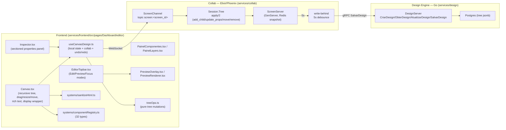

# Implementation Plan: Visual Editor (Canvas)

Retroactive (as-built) documentation — covers the already-existing implementation of FR09,
built on top of the shell left by spec 004 and the real-time collaboration
already provided by Collab (spec 001, FR06).

---

## 1. Architecture

The write path is always optimistic on the client: `useCanvasDesign` applies the
mutation locally (via `treeOps.ts`, the same pure reducers used only for
preview) and sends the mutation (`{tipo, blind_index, ...}`) over the Phoenix
channel; `Session.Tree.apply/2` is the same logic mirrored on the Elixir side,
the source of truth for the other collaborators. Persistence to Postgres is
write-behind with a 5s debounce (`ScreenServer`) — checking the persisted
state via REST right after a mutation (< 5s) is a test-methodology error, not
an app bug.

---

## 2. Technical decisions

### 2.1. Segment-level rich text: `execCommand` + DOM sanitization

`TextoEditavel` (`Canvas.tsx`) uses `contentEditable` + `document.execCommand`
for bold/italic/underline — the alternative (a full rich-text editor like
Slate/ProseMirror) was ruled out on scope grounds: the requirement is 3
simple commands, not a document editor. `execCommand` is legacy but still
supported by all relevant browsers; the gain from not pulling in a new
dependency for 3 toggles outweighs the technical debt of a deprecated API.

Sanitization (`sanitizeHtml.ts`) is done with a real `<template>` (the
browser's own DOM parser) instead of regex — regex over HTML is notoriously
unsafe against encoding/nesting variations. The resulting tree is walked with
an allowlist of tags and, inside `SPAN`, an allowlist of `style` properties.
Tags like `SCRIPT`/`STYLE` are **dropped entirely** (not "unwrapped") — the
first version had a bug here (it preserved the inner text of `<script>`),
caught by a test before reaching production.

### 2.2. Free positioning: X/Y relative to the direct parent

`ESTILOS_BASE = { posicao: 'relative', x: 0, y: 0 }` is already applied to
every node by default — this is what makes the children's `position: absolute`
relative to the direct parent node (and not the whole artboard), with no
extra logic needed. The move handle (`iniciarMove`, same rationale as
`iniciarResize`) only appears when `estilos.posicao === 'absolute'` and the
node is selected; dragging updates `x`/`y` in local preview (`movePreview`)
and commits via `onMoverAbsoluto` → an `update_props` mutation on pointer
release.

### 2.3. Inline layout bug: two places, one root cause

The report "I can't place components side by side" had two stacked causes,
both in the "blockification" of CSS flex (items of a flex parent ignore
their own `display` and follow the parent's `flex-direction`):

1. **Root artboard** (`Canvas.tsx`, `aria-label="Canvas"`) was hardcoded to
   `flex flex-col gap-2` — every top-level child was stacked regardless of
   the chosen `Estilos.display`. Fix: the root became a normal block flow
   (`[&>*+*]:mt-2` instead of the flex `gap`).
2. **Each node's wrapper** (`
`,
   the element that actually participates in the parent's flow) never
   inherited the node's `Estilos.display` — only the *inner* `
` (with
   the visual content/style) received `display: inline-block`. Since the
   outer wrapper always followed `block` (the browser default for `
`),
   the browser wrapped to a new line between wrappers even with two adjacent
   internal `inline-block` elements. Fix: `exibicaoExterna` derives
   `inline-block` in the wrapper's `style` when `estilos.display` is
   `inline`/`inline-block` (plus `verticalAlign: 'top'` so wrappers of
   different heights don't misalign).

Item 2 was only discovered by checking live in the browser *after* the fix
for item 1 — the automated tests (jsdom) don't catch this kind of regression
because they don't apply the real CSS generated by the Tailwind classes,
only the inline `style`; that's why the regression test that was created
(`AbaTelas.test.tsx`, "component with Display 'inline-block' sits side by
side...") checks the **wrapper's** `style.display`, not the artboard's.

### 2.4. Edit/Preview/Focus mode: a single state, not 3 booleans

`ModoEditor = 'edicao' | 'visualizacao' | 'foco'` replaces the pair of
independent states that existed before (`focoAtivo`/`previewAberto`),
guaranteeing exclusivity by construction (impossible to represent two active
modes at the same time). Persisted via `useSessionStorageState` with key
`mach:sistema:<id>:modo`, surviving the switch between the Screens/Rules/
Version sub-tabs (which unmount `AbaTelas` via `<Outlet/>`). The visual
control is a segmented pill (`role="group"` + `aria-pressed` buttons), not
individual toggles — more legible for "exactly one active state" than 3
switches that *look* independent.

### 2.5. Component catalog: 8 new types for parity with PrimeReact

Avatar, Textarea, Radio, ToggleSwitch, Breadcrumb, Alert, Spinner, and
Skeleton were added after comparing the existing catalog against
`primereact.dev/docs/styled/components` and identifying real (not
cosmetic) gaps. All of them follow the same pattern as the existing types:
an entry in `componentRegistry.ts` (icon, category, `aceitaFilhos`,
`temTexto`, `propriedadesPadrao`), a preview function in `Canvas.tsx` (with
`e.stopPropagation()` on internal clicks so they don't trigger selection of
the parent node), its own section in `Inspector.tsx` when the type has
fields that don't fit the generic Layout/Content sections (Breadcrumb,
Toggle, Alert, Avatar), and a `case` in `PreviewRenderer.tsx` for the
published site. Radio/Textarea/Spinner/Skeleton reuse existing generic
sections ("Content", "Background color") instead of dedicated fields.

### 2.6. Frontend port: `strictPort` instead of trusting Vite's default

`server.port` without `server.strictPort: true` makes Vite silently fall
back to `5173` if the configured port is busy — it was exactly that silence
that caused the reported divergence (`make dev` showing 5173 while all the
documentation/scripts assumed 5183). `strictPort: true` swaps the silence
for an explicit failure, the right behavior for local dev where the port is
part of the contract between services (Vite's proxy to IAM/Design/Gateway/
Collab depends on it).

---

## 3. Tests

No new API contract (all mutations reuse Collab/Design Engine's existing
protocol) — the test effort is mostly frontend: `sanitizeHtml.test.ts` (11
cases, allowlist/discard), rich-text and display-wrapper tests in
`AbaTelas.test.tsx`, free-positioning tests in `Inspector.test.tsx` (3 cases)
and `AbaTelas.test.tsx` (handle only appears with `posicao: absolute`), and
one test per new Inspector section (Breadcrumb/Toggle/Alert/Avatar). Live
functional verification (Chrome) was used as a complement on each item, not
as a substitute for the automated tests — see `tasks.md` for the full
mapping.
