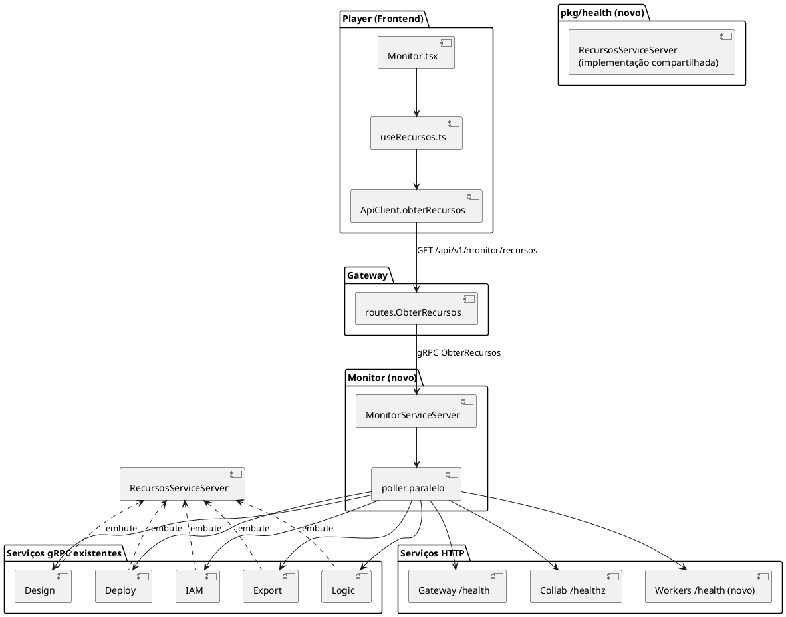

# Plano de Implementação: Monitor de Recursos

Estratégia: reaproveitar ao máximo os padrões já estabelecidos no monorepo (serviço Go
`internal/app/cmd`, proto → `buf generate`, fachada REST no Gateway, hook + página no
Player) e introduzir apenas dois componentes novos de fato — o serviço `services/monitor`
e o pacote compartilhado `pkg/health` — em vez de reinventar convenções.

---

## 1. Arquitetura

O Monitor é um serviço Go a mais, no mesmo nível dos demais (`services/monitor/`), que
não guarda estado (sem Postgres) — só faz polling e agrega. Ele fala com os serviços Go
existentes via uma nova RPC gRPC compartilhada (`RecursosService`, implementada por cada
um deles através do pacote `pkg/health`) e com Collab/Workers via HTTP, porque nem todo
serviço da plataforma fala gRPC nativamente hoje.



**Por que Monitor fala gRPC com uns e HTTP com outros, em vez de padronizar tudo em um
transporte só**: IAM/Design/Logic/Deploy/Export já são servidores gRPC puros (sem HTTP);
Collab é Phoenix (HTTP) e já tem `/healthz`; Workers é um consumidor RabbitMQ sem servidor
algum hoje. Forçar todos a gRPC exigiria adicionar um `grpc.Server` inteiro ao Collab
(reescrever parte do Elixir) e ao Workers, para um único método — desproporcional ao
ganho. Forçar todos a HTTP exigiria adicionar um `net/http` a 5 serviços gRPC puros só
para isso. O caminho mais barato e consistente com o que cada serviço já é: estender o
que cada um já tem (gRPC nos 5 Go-gRPC, HTTP no Collab, HTTP mínimo novo só no Workers,
que é o único sem nenhum servidor).

---

## 2. Padrões de Design

| Padrão | Onde se aplica | Justificativa | Alternativa descartada |
|--------|-----------------|----------------|-------------------------|
| **Strategy** (implícito via interface Go) | `services/monitor/internal/poller` define uma interface `Coletor` com dois métodos concretos — `ColetorGRPC` (IAM/Design/Logic/Deploy/Export) e `ColetorHTTP` (Gateway/Collab/Workers) — cada um encapsulando como falar com seu tipo de serviço. | O poller principal não precisa saber *como* cada serviço é consultado, só chamar `Coletor.Coletar(ctx) (ServicoStatus, error)` — adicionar um 9º serviço no futuro (outro transporte, por exemplo) não muda o loop de agregação. | Um `switch` por tipo de serviço dentro do próprio poller: funciona para 8 casos, mas mistura a lógica de transporte com a de agregação/timeout, dificultando testar cada coletor isoladamente. |
| **Fan-out/Fan-in** (goroutines + `sync.WaitGroup`/canal) | `services/monitor/internal/poller/agregador.go` | É literalmente o requisito RN04/RNF01 (paralelismo, timeout por serviço, um lento não trava os demais) — o padrão idiomático em Go para isso é disparar uma goroutine por coletor com `context.WithTimeout` e juntar os resultados em um canal, sem lib externa. | `errgroup` (golang.org/x/sync/errgroup): descartado porque `errgroup.Group.Wait()` retorna o primeiro erro e cancela o grupo — contrário ao requisito de que a falha de um serviço não deve interromper a coleta dos demais (RN01). O fan-out manual com canal é mais explícito para esse caso. |
| **Shared Kernel** (pacote compartilhado) | `pkg/health` implementa `RecursosServiceServer` uma única vez; IAM/Design/Logic/Deploy/Export só chamam `health.Registrar(grpcServer, health.Config{ServiceName: "iam", StartedAt: ...})` no `main.go`, no mesmo ponto onde já registram seu próprio serviço de negócio. | Evita duplicar a leitura de `runtime.MemStats`/`runtime.NumGoroutine()`/cálculo de uptime em 5 `main.go` diferentes — já existe o precedente de `pkg/telemetry.Init` sendo chamado da mesma forma por todos. | Copiar o mesmo trecho de `runtime.MemStats` em cada serviço: rejeitado por violar DRY sem necessidade — os 5 serviços não têm nenhuma diferença legítima nessa lógica. |
| **Adapter** | `services/monitor/internal/poller/http_collab.go` e `http_workers.go` traduzem o JSON HTTP de cada endpoint para o mesmo `ServicoStatus` (tipo gerado do proto) que os coletores gRPC produzem. | O restante do Monitor (agregação, resposta gRPC) trabalha só com o tipo único `ServicoStatus`; o formato específico de cada endpoint HTTP fica isolado no adapter correspondente. | N/A — é a forma direta de unificar dois protocolos de transporte diferentes em um mesmo modelo de saída. |

---

## 3. Arquivos a Criar/Editar

### 3.1. Proto (`proto/construtor/monitor/v1/`)

* **`proto/construtor/monitor/v1/monitor.proto`** (novo): define `MonitorService` com RPC
  `ObterRecursos(ObterRecursosRequest) returns (ObterRecursosResponse)`, mensagem
  `ServicoStatus { nome, tipo, status, uptime_segundos, memoria_alocada_bytes,
  memoria_sistema_bytes, goroutines, mensagem_erro }`; roda `make proto` para gerar
  `gen/go/construtor/monitor/v1`, `gen/ts/construtor/monitor/v1`.
* **`proto/construtor/health/v1/health.proto`** (novo, usado por `pkg/health`): define
  `RecursosService` com RPC `ObterStatus(ObterStatusRequest) returns (ObterStatusResponse)`
  — reaproveita a mesma mensagem `ServicoStatus` do pacote monitor (import cross-proto,
  mesmo padrão de `common` já usado por outros pacotes do repo).

### 3.2. `pkg/health` (novo pacote compartilhado)

* **`pkg/health/server.go`**: implementa `healthv1.RecursosServiceServer.ObterStatus`,
  lendo `runtime.MemStats`, `runtime.NumGoroutine()` e `time.Since(iniciadoEm)`.
* **`pkg/health/server_test.go`**: testa que `ObterStatus` retorna status "servindo" e
  valores não-negativos de memória/uptime.
* **`pkg/health/registrar.go`**: função `Registrar(grpcServer *grpc.Server, nome string,
  iniciadoEm time.Time)` — chamada por cada `main.go`.

### 3.3. Serviços Go existentes (IAM, Design, Logic, Deploy, Export)

* **`services/iam/cmd/main.go`**, **`services/design/cmd/main.go`**,
  **`services/logic/cmd/main.go`**, **`services/deploy/cmd/main.go`**,
  **`services/export/cmd/main.go`**: adicionar, logo após a criação do `grpcServer`,
  `health.Registrar(grpcServer, "<nome-do-serviço>", inicioProcesso)` — 2 linhas por
  arquivo, sem alterar nada existente.

### 3.4. `services/workers/` (endpoint HTTP novo)

* **`services/workers/internal/health/server.go`** (novo): `net/http` mínimo, uma rota
  `GET /health` retornando JSON `{status, uptime_segundos, memoria_alocada_bytes,
  memoria_sistema_bytes, goroutines}` — mesmo shape de dados dos demais, formato HTTP
  porque Workers não tem `grpc.Server`.
* **`services/workers/internal/health/server_test.go`**: testa o handler isoladamente
  (`httptest.NewRecorder`).
* **`services/workers/cmd/main.go`**: sobe o servidor HTTP em uma goroutine, endereço via
  `env("WORKERS_HTTP_ADDR", ":50056")`, com shutdown gracioso junto ao `signal.Notify`
  já existente no arquivo.

### 3.5. `services/collab/` (Elixir)

* **`services/collab/lib/collab_web/endpoint.ex`**: estender a função privada `healthz/2`
  (linha ~52) para incluir no corpo JSON `status`, `uptime_segundos` (calculado a partir
  de um timestamp guardado em `Application.put_env` no boot, ou via
  `:erlang.statistics(:wall_clock)`) e `memoria_bytes` (via `:erlang.memory(:total)`) —
  mantendo o status HTTP 200 atual, só enriquecendo o corpo.
* **`services/collab/test/collab_web/endpoint_test.exs`** (novo ou estendido): confirma
  que `/healthz` retorna os novos campos.

### 3.6. `services/monitor/` (novo serviço)

* **`services/monitor/cmd/main.go`**: sobe o gRPC server do Monitor
  (`MONITOR_GRPC_ADDR`, default `:50056`... **nota**: colide com o `:50056` do Workers
  HTTP acima — ver §6 Riscos; endereços finais definidos em `research.md`), injeta os
  endereços dos 8 serviços monitorados via env vars (mesma convenção `<NOME>_GRPC_ADDR` /
  `<NOME>_HTTP_ADDR` do Gateway).
* **`services/monitor/app/app.go`**: monta o `MonitorServiceServer` a partir da lista de
  coletores (padrão do `app.go` de Design/Deploy — pacote público para uso do binário e
  dos testes de integração).
* **`services/monitor/internal/server/grpc.go`**: implementa
  `monitorv1.MonitorServiceServer.ObterRecursos`, delega ao agregador.
* **`services/monitor/internal/server/grpc_test.go`**: testa a RPC com coletores fake
  (um sempre ok, um sempre erro, um que estoura o timeout) — confirma RN01 (não propaga
  erro do serviço individual como erro da RPC).
* **`services/monitor/internal/poller/coletor.go`**: interface `Coletor` +
  `ColetorGRPC` (usa `healthv1.RecursosServiceClient`) + `ColetorHTTP` (usa
  `net/http.Client` com timeout).
* **`services/monitor/internal/poller/coletor_test.go`**: testa cada coletor contra um
  servidor gRPC/HTTP fake local.
* **`services/monitor/internal/poller/agregador.go`**: fan-out/fan-in (§2) — recebe a
  lista de `Coletor`, dispara todos em paralelo com `context.WithTimeout` (2s, RNF01),
  devolve `[]ServicoStatus` na ordem fixa de configuração.
* **`services/monitor/internal/poller/agregador_test.go`**: testa paralelismo (todos os
  coletores levam ~mesmo tempo total, não soma) e que um coletor lento/travado não atrasa
  os demais além do timeout.

### 3.7. Gateway

* **`services/gateway/internal/routes/monitor.go`** (novo): `ObterRecursos(monitor
  monitorv1.MonitorServiceClient) http.HandlerFunc`, mesmo padrão de
  `routes.ResumoFinanceiro` (chama a RPC, serializa `ServicoStatus[]` como JSON).
* **`services/gateway/internal/routes/monitor_test.go`**: testa serialização e propagação
  de erro do Monitor (RNF02 — vira um único erro HTTP, não crash).
* **`services/gateway/internal/app/router.go`**: adiciona parâmetro `monitor
  monitorv1.MonitorServiceClient` a `NewRouter` e a rota `r.Get("/api/v1/monitor/recursos",
  routes.ObterRecursos(monitor))` dentro do grupo autenticado (RNF05).
* **`services/gateway/cmd/main.go`**: cria o client gRPC do Monitor
  (`MONITOR_GRPC_ADDR`), passa para `app.NewRouter` (mesmo padrão dos outros 5 clients já
  criados ali).

### 3.8. Frontend

* **`services/frontend/src/api/types.ts`**: adiciona tipo `ServicoStatus` (espelha o JSON
  do Gateway).
* **`services/frontend/src/api/client.ts`**: adiciona `async obterRecursos():
  Promise<ServicoStatus[]>` (mesmo padrão de `resumoFinanceiro()`).
* **`services/frontend/src/dashboard/useRecursos.ts`** (novo) +
  **`useRecursos.test.ts`**: hook com o mesmo formato de `useResumoFinanceiro.ts`
  (`carregando`/`pronto`/`erro`), acrescido de auto-refresh via `setInterval` (RF07) e
  `recarregar()` manual.
* **`services/frontend/src/dashboard/CardServicoStatus.tsx`** (novo) +
  **`CardServicoStatus.test.tsx`**: um card por serviço (nome, indicador verde/vermelho,
  uptime formatado, memória formatada, ou mensagem de erro).
* **`services/frontend/src/pages/Dashboard/Monitor.tsx`** (novo) +
  **`Monitor.test.tsx`**: página que usa `useRecursos`, renderiza os `CardServicoStatus`,
  botão "Atualizar", distingue erro-da-tela-toda (RNF02) de indisponibilidade individual
  (RN01).
* **`services/frontend/src/App.tsx`**: importa `Monitor`, adiciona
  `<Route path="monitor" element={<Monitor />} />` dentro do grupo `/dashboard`.
* **`services/frontend/src/layout/DashboardLayout.tsx`**: novo item de sidebar "Monitor"
  (ícone `Activity` de `lucide-react`, mesmo padrão de `SidebarMenuItem` dos existentes) e
  novo `case` em `tituloDaPagina`.
* **`services/frontend/src/layout/DashboardLayout.test.tsx`**: cobre o novo item de menu.

### 3.9. Infra / build

* **`build/dev-up.sh`**: adiciona `run_bg monitor go run ./services/monitor/cmd` à lista
  de serviços subidos (após `export`, antes de `workers`/`gateway` — ordem não importa
  funcionalmente, mas o Monitor deve subir depois dos serviços que ele consulta para os
  logs iniciais não mostrarem erro de conexão transitório).
* **`.github/workflows/ci.yml`**: nenhuma mudança estrutural — o job `go` já roda
  `go build ./... && go vet ./... && go test ./...` sobre todo o monorepo, cobrindo o novo
  módulo automaticamente; o job `elixir` já roda `mix test` em `services/collab`; o job
  `player` já roda `npm test`/`typecheck` em `services/frontend`.

---

## 4. Decisões Técnicas

### 4.1. Por que um proto `health.proto` separado do `monitor.proto`

`RecursosService` (implementado pelos 5 serviços Go via `pkg/health`) e `MonitorService`
(implementado só pelo Monitor) são interfaces diferentes: a primeira responde "como estou
eu", a segunda responde "como estão todos". Um único proto com um único serviço faria o
Monitor "implementar a si mesmo" de forma confusa (ele teria que registrar tanto
`RecursosService.ObterStatus` — sobre si mesmo — quanto `MonitorService.ObterRecursos` —
sobre todos). Separar deixa explícito que `ServicoStatus` é o contrato de dado
compartilhado, e cada proto expõe só a RPC que faz sentido para quem o implementa.

```protobuf
// proto/construtor/health/v1/health.proto
service RecursosService {
  rpc ObterStatus(ObterStatusRequest) returns (ServicoStatus);
}

// proto/construtor/monitor/v1/monitor.proto
service MonitorService {
  rpc ObterRecursos(ObterRecursosRequest) returns (ObterRecursosResponse);
}
message ObterRecursosResponse {
  repeated ServicoStatus servicos = 1;
}
```

### 4.2. Timeout e paralelismo do poller (RNF01/RN04)

```go
// services/monitor/internal/poller/agregador.go (esboço)
func (a *Agregador) Coletar(ctx context.Context) []ServicoStatus {
	resultados := make([]ServicoStatus, len(a.coletores))
	var wg sync.WaitGroup
	for i, c := range a.coletores {
		wg.Add(1)
		go func(i int, c Coletor) {
			defer wg.Done()
			ctxTimeout, cancel := context.WithTimeout(ctx, a.timeout) // 2s, RNF01
			defer cancel()
			status, err := c.Coletar(ctxTimeout)
			if err != nil {
				resultados[i] = ServicoStatus{Nome: c.Nome(), Status: "indisponivel", MensagemErro: err.Error()} // RN01
				return
			}
			resultados[i] = status
		}(i, c)
	}
	wg.Wait()
	return resultados
}
```
Escrever direto no slice por índice (em vez de canal) evita reordenar o resultado — a
ordem final é sempre a ordem de configuração dos 8 serviços, sem lock extra, porque cada
goroutine escreve em uma posição exclusiva do slice.

### 4.3. Memória "de sistema" vs "alocada" (Go) e VM (Elixir)

Go: `runtime.MemStats.Alloc` (heap atualmente em uso) e `.Sys` (memória total obtida do
SO) — os dois nomes do proto (`memoria_alocada_bytes`/`memoria_sistema_bytes`) mapeiam
direto para esses dois campos, sem cálculo adicional. Elixir/BEAM: `:erlang.memory(:total)`
é o equivalente mais próximo de "memória alocada pela VM"; não há um segundo número
diretamente comparável a `.Sys`, então o Collab preenche só `memoria_alocada_bytes` e
deixa `memoria_sistema_bytes` como 0/ausente — o Frontend trata esse campo como opcional
(RN02: cada serviço reporta só o que consegue).

---

## 5. Dependências e Pré-requisitos

- [ ] `pkg/health` e os dois protos novos existem e `make proto` roda sem erro antes de
      tocar em qualquer `main.go` existente (os 5 serviços dependem de `pkg/health`
      compilar primeiro).
- [ ] Nenhuma migração de banco — o Monitor não persiste nada.
- [ ] Confirmar em `research.md` a porta final de `MONITOR_GRPC_ADDR` vs
      `WORKERS_HTTP_ADDR` antes de escrever os `main.go` (risco de colisão, ver §6).

---

## 6. Riscos e Pontos de Atenção

| Risco | Impacto | Mitigação |
|-------|---------|-----------|
| Colisão de porta: rascunho inicial usou `:50056` tanto para o gRPC do Monitor quanto para o HTTP do Workers. | Alto (serviço não sobe) | Resolvido em `research.md` §2 — Monitor gRPC fica em `:50056`, Workers HTTP em `:8081` (linha com o Gateway HTTP em `:8080`, não com a faixa gRPC 50051-50055). Task 1 de `tasks.md` fixa isso antes de qualquer código. |
| Adicionar `RecursosService` a 5 `main.go` existentes, mesmo sendo 2 linhas cada, é uma mudança em arquivo compartilhado por outras specs em paralelo. | Médio (conflito de merge) | Mudança isolada e no fim do bloco de criação do `grpcServer` (mesmo padrão de "sempre no fim" documentado em memória do projeto para reduzir conflito); revisar `git status` antes de editar cada arquivo. |
| BEAM não tem um equivalente direto a "memória de sistema" do Go — risco de inventar um número sem sentido. | Baixo | Decisão explícita em §4.3: Collab só reporta `memoria_alocada_bytes`; Frontend trata o campo de sistema como opcional. |
| Timeout de 2s por serviço pode ser curto demais em ambientes de CI mais lentos, gerando falsos "indisponível" nos testes de integração. | Médio | Timeout é injetável (`Agregador{timeout: ...}`), não uma constante fixa — testes de integração passam um timeout maior via env var, testes unitários usam coletores fake (sem I/O real, RNF independente de rede). |
| Workers ganhar um servidor HTTP muda seu perfil de processo (hoje só consome fila) — pode exigir liberar a porta em ambientes com firewall restrito. | Baixo | Mesmo padrão de `env("WORKERS_HTTP_ADDR", ...)` já usado nos outros serviços — documentado em `quickstart.md` e `.env.example` se existir. |
