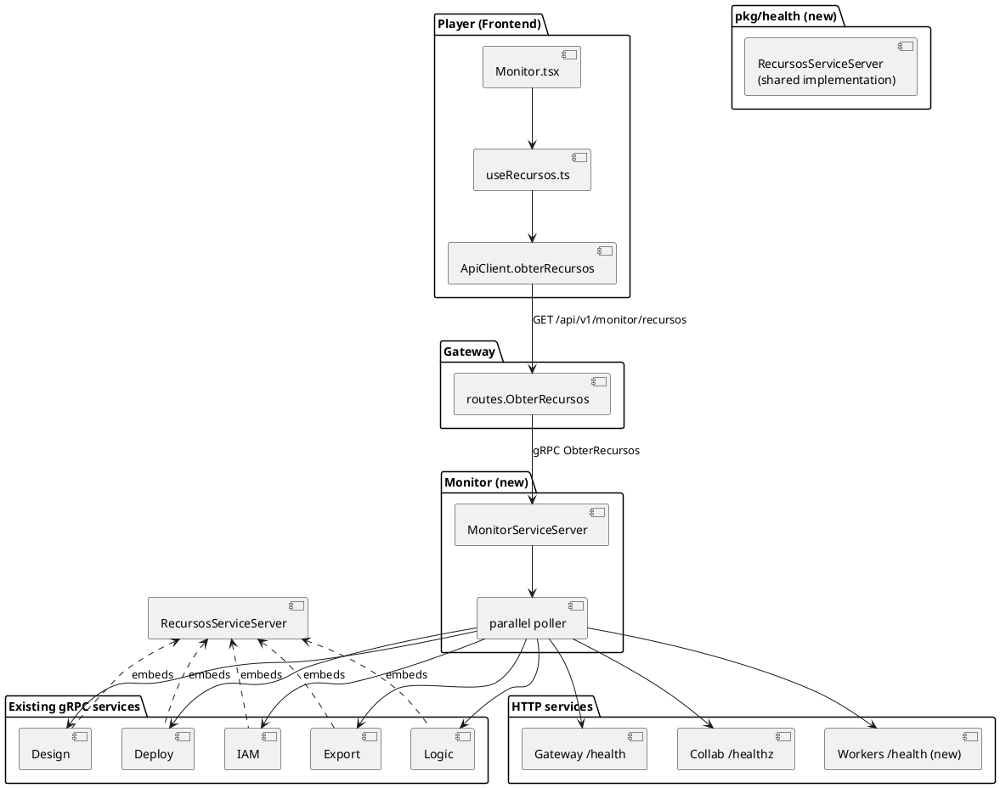

# Implementation Plan: Resource Monitor

Strategy: reuse as much as possible of the patterns already established in the monorepo
(Go service `internal/app/cmd`, proto → `buf generate`, REST facade in the Gateway, hook +
page in the Player) and introduce only two genuinely new components — the
`services/monitor` service and the shared `pkg/health` package — instead of reinventing
conventions.

---

## 1. Architecture

The Monitor is one more Go service, at the same level as the others (`services/monitor/`),
which holds no state (no Postgres) — it only polls and aggregates. It talks to the
existing Go services via a new shared gRPC RPC (`RecursosService`, implemented by each of
them through the `pkg/health` package) and to Collab/Workers via HTTP, because not every
service in the platform speaks gRPC natively today.



**Why the Monitor speaks gRPC with some and HTTP with others, instead of standardizing
everything on a single transport**: IAM/Design/Logic/Deploy/Export are already pure gRPC
servers (no HTTP); Collab is Phoenix (HTTP) and already has `/healthz`; Workers is a
RabbitMQ consumer with no server at all today. Forcing everything onto gRPC would require
adding a whole `grpc.Server` to Collab (rewriting part of the Elixir) and to Workers, for a
single method — disproportionate to the gain. Forcing everything onto HTTP would require
adding a `net/http` to 5 pure-gRPC services just for this. The cheapest path, and the one
consistent with what each service already is: extend what each one already has (gRPC on
the 5 Go-gRPC services, HTTP on Collab, a new minimal HTTP only on Workers, which is the
only one with no server at all).

---

## 2. Design Patterns

| Pattern | Where it applies | Rationale | Alternative discarded |
|--------|-----------------|----------------|-------------------------|
| **Strategy** (implicit via a Go interface) | `services/monitor/internal/poller` defines a `Coletor` interface with two concrete implementations — `ColetorGRPC` (IAM/Design/Logic/Deploy/Export) and `ColetorHTTP` (Gateway/Collab/Workers) — each encapsulating how to talk to its kind of service. | The main poller doesn't need to know *how* each service is queried, only to call `Coletor.Coletar(ctx) (ServicoStatus, error)` — adding a 9th service in the future (another transport, for instance) doesn't change the aggregation loop. | A `switch` per service type inside the poller itself: works for 8 cases, but mixes transport logic with aggregation/timeout logic, making it harder to test each collector in isolation. |
| **Fan-out/Fan-in** (goroutines + `sync.WaitGroup`/channel) | `services/monitor/internal/poller/agregador.go` | It is literally requirement BR04/NFR01 (parallelism, per-service timeout, one slow service doesn't block the others) — the idiomatic Go pattern for this is to fire one goroutine per collector with `context.WithTimeout` and join the results in a channel, no external library. | `errgroup` (golang.org/x/sync/errgroup): discarded because `errgroup.Group.Wait()` returns the first error and cancels the group — contrary to the requirement that one service's failure must not interrupt the collection of the others (BR01). Manual fan-out with a channel is more explicit for this case. |
| **Shared Kernel** (shared package) | `pkg/health` implements `RecursosServiceServer` once; IAM/Design/Logic/Deploy/Export just call `health.Registrar(grpcServer, health.Config{ServiceName: "iam", StartedAt: ...})` in `main.go`, at the same point where they already register their own business service. | Avoids duplicating the reading of `runtime.MemStats`/`runtime.NumGoroutine()`/uptime calculation across 5 different `main.go` files — there's already a precedent with `pkg/telemetry.Init` being called the same way by all of them. | Copying the same `runtime.MemStats` snippet into each service: rejected for needlessly violating DRY — the 5 services have no legitimate difference in this logic. |
| **Adapter** | `services/monitor/internal/poller/http_collab.go` and `http_workers.go` translate each endpoint's HTTP JSON into the same `ServicoStatus` (proto-generated type) that the gRPC collectors produce. | The rest of the Monitor (aggregation, gRPC response) works only with the single `ServicoStatus` type; each HTTP endpoint's specific format stays isolated in its corresponding adapter. | N/A — this is the direct way to unify two different transport protocols into the same output model. |

---

## 3. Files to Create/Edit

### 3.1. Proto (`proto/construtor/monitor/v1/`)

* **`proto/construtor/monitor/v1/monitor.proto`** (new): defines `MonitorService` with the RPC
  `ObterRecursos(ObterRecursosRequest) returns (ObterRecursosResponse)`, the message
  `ServicoStatus { nome, tipo, status, uptime_segundos, memoria_alocada_bytes,
  memoria_sistema_bytes, goroutines, mensagem_erro }`; run `make proto` to generate
  `gen/go/construtor/monitor/v1`, `gen/ts/construtor/monitor/v1`.
* **`proto/construtor/health/v1/health.proto`** (new, used by `pkg/health`): defines
  `RecursosService` with the RPC `ObterStatus(ObterStatusRequest) returns (ObterStatusResponse)`
  — reuses the same `ServicoStatus` message from the monitor package (cross-proto import,
  the same pattern already used by other packages in the repo for `common`).

### 3.2. `pkg/health` (new shared package)

* **`pkg/health/server.go`**: implements `healthv1.RecursosServiceServer.ObterStatus`,
  reading `runtime.MemStats`, `runtime.NumGoroutine()`, and `time.Since(iniciadoEm)`.
* **`pkg/health/server_test.go`**: tests that `ObterStatus` returns "serving" status and
  non-negative memory/uptime values.
* **`pkg/health/registrar.go`**: `Registrar(grpcServer *grpc.Server, nome string,
  iniciadoEm time.Time)` function — called by each `main.go`.

### 3.3. Existing Go services (IAM, Design, Logic, Deploy, Export)

* **`services/iam/cmd/main.go`**, **`services/design/cmd/main.go`**,
  **`services/logic/cmd/main.go`**, **`services/deploy/cmd/main.go`**,
  **`services/export/cmd/main.go`**: add, right after the `grpcServer` is created,
  `health.Registrar(grpcServer, "<service-name>", inicioProcesso)` — 2 lines per
  file, no changes to existing code.

### 3.4. `services/workers/` (new HTTP endpoint)

* **`services/workers/internal/health/server.go`** (new): minimal `net/http`, one
  `GET /health` route returning JSON `{status, uptime_segundos, memoria_alocada_bytes,
  memoria_sistema_bytes, goroutines}` — same data shape as the others, HTTP format
  because Workers has no `grpc.Server`.
* **`services/workers/internal/health/server_test.go`**: tests the handler in isolation
  (`httptest.NewRecorder`).
* **`services/workers/cmd/main.go`**: starts the HTTP server in a goroutine, address via
  `env("WORKERS_HTTP_ADDR", ":50056")`, with graceful shutdown alongside the
  `signal.Notify` already present in the file.

### 3.5. `services/collab/` (Elixir)

* **`services/collab/lib/collab_web/endpoint.ex`**: extend the private `healthz/2`
  function (line ~52) to include in the JSON body `status`, `uptime_segundos` (calculated
  from a timestamp stored via `Application.put_env` at boot, or via
  `:erlang.statistics(:wall_clock)`), and `memoria_bytes` (via `:erlang.memory(:total)`) —
  keeping the current HTTP 200 status, only enriching the body.
* **`services/collab/test/collab_web/endpoint_test.exs`** (new or extended): confirms
  that `/healthz` returns the new fields.

### 3.6. `services/monitor/` (new service)

* **`services/monitor/cmd/main.go`**: starts the Monitor's gRPC server
  (`MONITOR_GRPC_ADDR`, default `:50056`... **note**: collides with Workers HTTP's
  `:50056` above — see §6 Risks; final addresses defined in `research.md`), injects the
  addresses of the 8 monitored services via env vars (the same `<NAME>_GRPC_ADDR` /
  `<NAME>_HTTP_ADDR` convention as the Gateway).
* **`services/monitor/app/app.go`**: assembles the `MonitorServiceServer` from the list of
  collectors (the same pattern as Design/Deploy's `app.go` — a public package for use by
  the binary and by integration tests).
* **`services/monitor/internal/server/grpc.go`**: implements
  `monitorv1.MonitorServiceServer.ObterRecursos`, delegates to the aggregator.
* **`services/monitor/internal/server/grpc_test.go`**: tests the RPC with fake collectors
  (one always ok, one always erroring, one that blows the timeout) — confirms BR01 (does
  not propagate an individual service's error as an RPC error).
* **`services/monitor/internal/poller/coletor.go`**: `Coletor` interface +
  `ColetorGRPC` (uses `healthv1.RecursosServiceClient`) + `ColetorHTTP` (uses
  `net/http.Client` with a timeout).
* **`services/monitor/internal/poller/coletor_test.go`**: tests each collector against a
  local fake gRPC/HTTP server.
* **`services/monitor/internal/poller/agregador.go`**: fan-out/fan-in (§2) — receives the
  list of `Coletor`s, fires all of them in parallel with `context.WithTimeout` (2s, NFR01),
  returns `[]ServicoStatus` in the fixed configuration order.
* **`services/monitor/internal/poller/agregador_test.go`**: tests parallelism (all the
  collectors take roughly the same total time, not the sum) and that one slow/stuck
  collector doesn't delay the others beyond the timeout.

### 3.7. Gateway

* **`services/gateway/internal/routes/monitor.go`** (new): `ObterRecursos(monitor
  monitorv1.MonitorServiceClient) http.HandlerFunc`, the same pattern as
  `routes.ResumoFinanceiro` (calls the RPC, serializes `ServicoStatus[]` as JSON).
* **`services/gateway/internal/routes/monitor_test.go`**: tests serialization and
  propagation of a Monitor error (NFR02 — becomes a single HTTP error, not a crash).
* **`services/gateway/internal/app/router.go`**: adds a `monitor
  monitorv1.MonitorServiceClient` parameter to `NewRouter` and the route
  `r.Get("/api/v1/monitor/recursos", routes.ObterRecursos(monitor))` inside the
  authenticated group (NFR05).
* **`services/gateway/cmd/main.go`**: creates the Monitor's gRPC client
  (`MONITOR_GRPC_ADDR`), passes it to `app.NewRouter` (the same pattern as the other 5
  clients already created there).

### 3.8. Frontend

* **`services/frontend/src/api/types.ts`**: adds the `ServicoStatus` type (mirrors the
  Gateway's JSON).
* **`services/frontend/src/api/client.ts`**: adds `async obterRecursos():
  Promise<ServicoStatus[]>` (same pattern as `resumoFinanceiro()`).
* **`services/frontend/src/dashboard/useRecursos.ts`** (new) +
  **`useRecursos.test.ts`**: a hook with the same shape as `useResumoFinanceiro.ts`
  (`carregando`/`pronto`/`erro`), plus auto-refresh via `setInterval` (FR07) and a manual
  `recarregar()`.
* **`services/frontend/src/dashboard/CardServicoStatus.tsx`** (new) +
  **`CardServicoStatus.test.tsx`**: one card per service (name, green/red indicator,
  formatted uptime, formatted memory, or an error message).
* **`services/frontend/src/pages/Dashboard/Monitor.tsx`** (new) +
  **`Monitor.test.tsx`**: a page that uses `useRecursos`, renders the `CardServicoStatus`
  components, an "Update" button, distinguishes a whole-screen error (NFR02) from an
  individual unavailability (BR01).
* **`services/frontend/src/App.tsx`**: imports `Monitor`, adds
  `<Route path="monitor" element={<Monitor />} />` inside the `/dashboard` group.
* **`services/frontend/src/layout/DashboardLayout.tsx`**: a new "Monitor" sidebar item
  (the `Activity` icon from `lucide-react`, the same pattern as the existing
  `SidebarMenuItem`s) and a new `case` in `tituloDaPagina`.
* **`services/frontend/src/layout/DashboardLayout.test.tsx`**: covers the new menu item.

### 3.9. Infra / build

* **`build/dev-up.sh`**: adds `run_bg monitor go run ./services/monitor/cmd` to the list
  of services started (after `export`, before `workers`/`gateway` — the order doesn't
  matter functionally, but the Monitor should start after the services it queries so the
  initial logs don't show a transient connection error).
* **`.github/workflows/ci.yml`**: no structural changes — the `go` job already runs
  `go build ./... && go vet ./... && go test ./...` across the whole monorepo, covering the
  new module automatically; the `elixir` job already runs `mix test` in
  `services/collab`; the `player` job already runs `npm test`/`typecheck` in
  `services/frontend`.

---

## 4. Technical Decisions

### 4.1. Why a `health.proto` separate from `monitor.proto`

`RecursosService` (implemented by the 5 Go services via `pkg/health`) and `MonitorService`
(implemented only by the Monitor) are different interfaces: the first answers "how am I
doing," the second answers "how is everyone doing." A single proto with a single service
would make the Monitor "implement itself" in a confusing way (it would have to register
both `RecursosService.ObterStatus` — about itself — and `MonitorService.ObterRecursos` —
about everyone). Separating them makes it explicit that `ServicoStatus` is the shared data
contract, and each proto exposes only the RPC that makes sense for whoever implements it.

```protobuf
// proto/construtor/health/v1/health.proto
service RecursosService {
  rpc ObterStatus(ObterStatusRequest) returns (ServicoStatus);
}

// proto/construtor/monitor/v1/monitor.proto
service MonitorService {
  rpc ObterRecursos(ObterRecursosRequest) returns (ObterRecursosResponse);
}
message ObterRecursosResponse {
  repeated ServicoStatus servicos = 1;
}
```

### 4.2. Poller timeout and parallelism (NFR01/BR04)

```go
// services/monitor/internal/poller/agregador.go (sketch)
func (a *Agregador) Coletar(ctx context.Context) []ServicoStatus {
	resultados := make([]ServicoStatus, len(a.coletores))
	var wg sync.WaitGroup
	for i, c := range a.coletores {
		wg.Add(1)
		go func(i int, c Coletor) {
			defer wg.Done()
			ctxTimeout, cancel := context.WithTimeout(ctx, a.timeout) // 2s, NFR01
			defer cancel()
			status, err := c.Coletar(ctxTimeout)
			if err != nil {
				resultados[i] = ServicoStatus{Nome: c.Nome(), Status: "indisponivel", MensagemErro: err.Error()} // BR01
				return
			}
			resultados[i] = status
		}(i, c)
	}
	wg.Wait()
	return resultados
}
```
Writing directly into the slice by index (instead of a channel) avoids having to reorder
the result — the final order is always the services' configuration order, with no extra
lock, because each goroutine writes to an exclusive position in the slice.

### 4.3. "System" vs. "allocated" memory (Go) and VM memory (Elixir)

Go: `runtime.MemStats.Alloc` (heap currently in use) and `.Sys` (total memory obtained from
the OS) — the proto's two names (`memoria_alocada_bytes`/`memoria_sistema_bytes`) map
directly to these two fields, with no extra calculation. Elixir/BEAM: `:erlang.memory(:total)`
is the closest equivalent to "memory allocated by the VM"; there's no second number
directly comparable to `.Sys`, so Collab only fills in `memoria_alocada_bytes` and
leaves `memoria_sistema_bytes` as 0/absent — the Frontend treats this field as optional
(BR02: each service reports only what it can).

---

## 5. Dependencies and Prerequisites

- [ ] `pkg/health` and the two new protos exist and `make proto` runs without error before
      touching any existing `main.go` (the 5 services depend on `pkg/health` compiling
      first).
- [ ] No database migration — the Monitor doesn't persist anything.
- [ ] Confirm in `research.md` the final port for `MONITOR_GRPC_ADDR` vs.
      `WORKERS_HTTP_ADDR` before writing the `main.go` files (collision risk, see §6).

---

## 6. Risks and Points of Attention

| Risk | Impact | Mitigation |
|-------|---------|-----------|
| Port collision: the initial draft used `:50056` for both the Monitor's gRPC and the Workers' HTTP. | High (service won't start) | Resolved in `research.md` §2 — Monitor gRPC stays at `:50056`, Workers HTTP moves to `:8081` (in line with the Gateway HTTP at `:8080`, not with the 50051-50055 gRPC range). Task 1 of `tasks.md` fixes this before any code. |
| Adding `RecursosService` to 5 existing `main.go` files, even at 2 lines each, is a change to a file shared with other specs in parallel. | Medium (merge conflict) | Isolated change at the end of the `grpcServer` creation block (the same "always at the end" pattern documented in the project's memory to reduce conflicts); check `git status` before editing each file. |
| The BEAM has no direct equivalent to Go's "system memory" — risk of inventing a meaningless number. | Low | Explicit decision in §4.3: Collab only reports `memoria_alocada_bytes`; the Frontend treats the system field as optional. |
| A 2s per-service timeout may be too short in slower CI environments, producing false "unavailable" results in integration tests. | Medium | The timeout is injectable (`Agregador{timeout: ...}`), not a fixed constant — integration tests pass a larger timeout via env var, unit tests use fake collectors (no real I/O, independent of network NFRs). |
| Workers gaining an HTTP server changes its process profile (today it only consumes a queue) — may require opening the port in environments with a restrictive firewall. | Low | The same `env("WORKERS_HTTP_ADDR", ...)` pattern already used by the other services — documented in `quickstart.md` and `.env.example` if it exists. |
