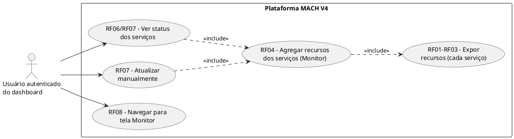
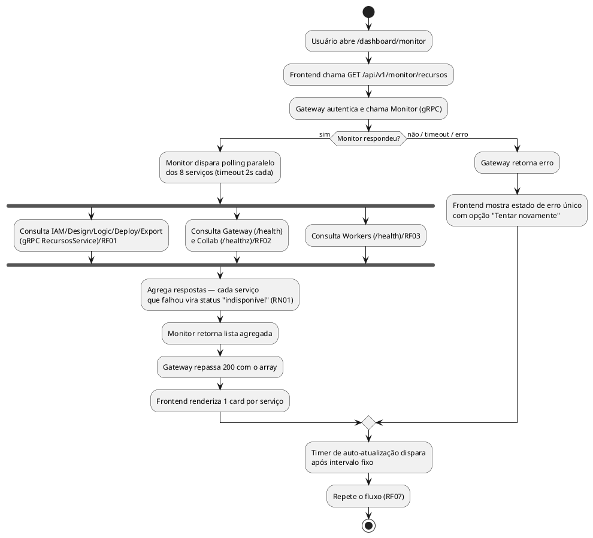
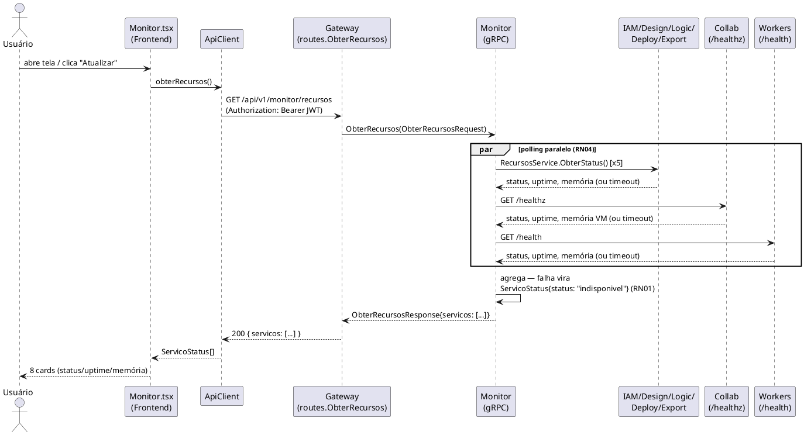

# Especificação: Monitor de Recursos

> **Nota de arquitetura (pós-implementação, mesma sessão)**: durante a
> implementação, a decisão de transporte mudou — em vez do serviço
> `services/monitor` + `pkg/health` (RecursosService por gRPC/HTTP, polling
> customizado) descritos abaixo, a plataforma foi migrada para Kubernetes com
> service mesh Linkerd (`infra/k8s/`). CPU/memória vêm do metrics-server
> (`metrics.k8s.io`) e RPS/taxa de sucesso/latência vêm do Prometheus do
> `linkerd-viz` — o sidecar instrumenta os 8 serviços automaticamente, sem
> RecursosService próprio. O Gateway consulta essas duas fontes diretamente
> via `services/gateway/internal/meshmetrics`. RN01-RN05/RNF01-RNF05 e os
> critérios de aceitação abaixo continuam valendo em espírito (um serviço
> sem pod vira "indisponivel", nunca derruba a tela); RF01-RF04 (como os
> dados são obtidos) estão desatualizados — a fonte real está em
> `meshmetrics/k8s.go` e `meshmetrics/prometheus.go`. `pkg/health` e a
> instrumentação `health.Registrar` em IAM/Design/Logic/Deploy/Export, o
> `/health` do Workers e o `/healthz` estendido do Collab continuam no
> repositório (funcionam, têm teste) mas não são mais consumidos pelo
> Monitor — ficaram como sinais de liveness independentes, não removidos por
> não atrapalharem. `contracts/api.md` também está desatualizado quanto ao
> corpo de `GET /api/v1/monitor/recursos` — o formato real está no handler
> `services/gateway/internal/routes/monitor.go`.

Hoje a plataforma MACH V4 tem tracing distribuído (OTel → Jaeger) mas nenhuma visão
consolidada de **saúde/infraestrutura** dos próprios serviços: não existe um lugar único
onde a equipe operando a plataforma veja se IAM, Design, Logic, Deploy, Export, Workers,
Collab e Gateway estão de pé, há quanto tempo, e quanto de memória/processos estão
consumindo. Hoje, `GET /health` do Gateway só responde por ele mesmo (liveness binário,
sem dados), e nenhum outro serviço expõe qualquer sinal de saúde além do `/healthz` do
Collab.

Esta demanda adiciona uma tela **Monitor de Recursos** no dashboard do Player, alimentada
por um novo microsserviço `services/monitor/` que faz polling periódico de todos os
serviços já existentes e agrega o resultado. Não inclui consumo/quota por tenant (fica
para uma demanda futura) nem integração com Prometheus (decisão explícita desta entrega:
o Monitor lê os próprios serviços diretamente, sem um back-end de métricas intermediário).

---

## 1. Objetivo

Ao final desta implementação, qualquer usuário autenticado do dashboard consegue abrir a
tela "Monitor" e ver, para cada um dos 8 serviços da plataforma (IAM, Design, Logic,
Deploy, Export, Workers, Collab, Gateway), seu status (ativo/indisponível), uptime e uso
de memória — atualizados sob demanda ou automaticamente a cada poucos segundos — sem que
a falha de um serviço monitorado derrube a tela ou os dados dos demais.

---

## 2. Regras de Negócio

| ID | Regra |
|----|-------|
| RN01 | Um serviço monitorado é considerado **indisponível** quando o Monitor não recebe resposta dentro do timeout configurado (RNF01) ou a chamada retorna erro — nesse caso o serviço aparece com status "indisponível" e uma mensagem curta de causa, nunca derrubando a resposta agregada. |
| RN02 | O Monitor reporta apenas o que cada serviço consegue informar sobre si mesmo (uptime e memória do próprio processo); não infere ou estima recursos de um serviço que não expõe essa informação. |
| RN03 | A tela é acessível a qualquer usuário autenticado do dashboard — não há hoje um papel "administrador de plataforma" distinto de "usuário de tenant" no sistema de permissões (`permissionMap.ts`), então esta tela segue o mesmo modelo de acesso das demais telas do dashboard (Configuração, Clientes, etc.), sem introduzir RBAC novo. |
| RN04 | O polling do Monitor aos serviços monitorados é paralelo — a indisponibilidade ou lentidão de um serviço não atrasa a coleta dos demais (RNF01). |
| RN05 | A lista de serviços monitorados é fixa no código do Monitor (os 8 serviços da plataforma) — não é configurável pelo usuário final nesta entrega. |

---

## 3. Requisitos Funcionais

| ID | Descrição | Ator | Prioridade |
|----|-----------|------|------------|
| RF01 | IAM, Design, Logic, Deploy e Export passam a expor uma RPC gRPC de recursos (status "servindo", uptime, memória alocada, memória de sistema, goroutines) via um serviço `RecursosService` compartilhado, registrado no `grpc.Server` de cada um. | Sistema | Alta |
| RF02 | Collab (Elixir) passa a incluir dados de recursos (uptime, memória da VM) no corpo do `/healthz` já existente, sem alterar seu contrato de status HTTP atual. | Sistema | Alta |
| RF03 | Workers passa a expor um endpoint HTTP mínimo `/health` (não existe hoje nenhum servidor no processo) retornando status, uptime e memória do processo Go, seguindo a mesma forma de configuração por variável de ambiente (`WORKERS_HTTP_ADDR`) dos demais serviços. | Sistema | Alta |
| RF04 | O novo serviço `services/monitor/` faz polling paralelo dos 8 serviços (IAM, Design, Logic, Deploy, Export, Gateway, Workers via HTTP/gRPC conforme RF01-RF03; Collab via seu `/healthz`; Gateway via seu `/health` já existente) e expõe o resultado agregado via uma RPC gRPC própria. | Sistema | Alta |
| RF05 | O Gateway expõe `GET /api/v1/monitor/recursos` como fachada REST autenticada sobre a RPC do Monitor, seguindo o mesmo padrão de `routes.*` dos demais recursos. | Usuário autenticado | Alta |
| RF06 | O Frontend consome `GET /api/v1/monitor/recursos` e renderiza um card por serviço, mostrando nome, status (visual verde/vermelho), uptime formatado e memória usada; um serviço indisponível mostra a mensagem de erro em vez das métricas. | Usuário autenticado | Alta |
| RF07 | A tela permite atualização manual (botão "Atualizar") e também atualiza automaticamente em intervalo fixo enquanto estiver aberta, sem exigir reload da página. | Usuário autenticado | Média |
| RF08 | A sidebar do dashboard ganha um item de navegação "Monitor" (rota `/dashboard/monitor`), no mesmo padrão visual e de roteamento dos itens existentes (Dashboard, Clientes, Configuração). | Usuário autenticado | Alta |

---

## 4. Requisitos Não Funcionais

| ID | Categoria | Descrição |
|----|-----------|-----------|
| RNF01 | Desempenho | O Monitor consulta os 8 serviços em paralelo com timeout curto por serviço (2s); a resposta agregada não deve levar mais que ~2-3s mesmo com um ou mais serviços fora do ar. |
| RNF02 | Resiliência | A indisponibilidade de qualquer serviço monitorado (incluindo o próprio Monitor, do ponto de vista do Gateway) não gera erro 5xx bloqueante na tela — o Frontend distingue "não consegui falar com o Monitor" (estado de erro da tela toda) de "um serviço individual está indisponível" (estado por card, RN01). |
| RNF03 | Observabilidade | O serviço Monitor participa do tracing distribuído já existente (OTel), como os demais serviços Go (`pkg/telemetry.Init`). |
| RNF04 | Portabilidade | Endereços dos serviços monitorados são configuráveis por variável de ambiente, seguindo a convenção já usada no Gateway (`<SERVICO>_GRPC_ADDR` / `<SERVICO>_HTTP_ADDR`), com os mesmos defaults de porta usados em `build/dev-up.sh`. |
| RNF05 | Segurança | `GET /api/v1/monitor/recursos` exige autenticação (mesmo grupo de middlewares `Auth` + `RateLimiter` das demais rotas autenticadas do Gateway) — não expõe topologia interna a requisições anônimas. |

---

## 5. Cenários de Uso

### Cenário 1: Todos os serviços saudáveis
* **Dado que** todos os 8 serviços da plataforma estão no ar
* **Quando** o usuário abre `/dashboard/monitor`
* **Então** a tela mostra 8 cards, todos com indicador verde, uptime e memória preenchidos

### Cenário 2: Um serviço fora do ar
* **Dado que** o serviço Logic está parado
* **Quando** o usuário abre ou atualiza a tela Monitor
* **Então** os outros 7 cards mostram dados normalmente e o card do Logic mostra status "indisponível" com uma mensagem curta, sem erro na tela inteira

### Cenário 3: O próprio Monitor está fora do ar
* **Dado que** o serviço Monitor não está rodando
* **Quando** o usuário abre a tela Monitor
* **Então** o Gateway retorna erro ao chamar o Monitor e a tela mostra um estado de erro único (não 8 cards de erro), com opção de tentar novamente

### Cenário 4: Atualização automática
* **Dado que** a tela Monitor está aberta e um serviço estava indisponível
* **Quando** o intervalo de auto-atualização decorre e o serviço volta ao ar
* **Então** o card correspondente passa de "indisponível" para "ativo" sem ação do usuário

---

## 6. Critérios de Aceitação

1. `GET /api/v1/monitor/recursos` autenticado retorna 200 com um array de 8 entradas (uma por serviço), cada uma com `nome`, `status`, e (quando disponível) `uptime_segundos`, `memoria_alocada_bytes`, `memoria_sistema_bytes`.
2. Parar um dos serviços monitorados (ex.: `logic`) e chamar o endpoint continua retornando 200 com as demais 7 entradas normais e a entrada do serviço parado com `status = "indisponivel"` — nunca 5xx por causa de um único serviço fora do ar.
3. Parar o serviço `monitor` e chamar o endpoint do Gateway retorna erro (5xx/erro conhecido) tratado como estado único de erro pelo Frontend — não como 8 cards de erro.
4. A tela `/dashboard/monitor` é acessível pela sidebar e reflete os dados do endpoint acima; um botão "Atualizar" refaz a chamada; a tela também atualiza sozinha em um intervalo fixo (documentado em `plan.md`).
5. Todos os testes novos (Go: pacote `pkg/health` e `services/monitor`; Elixir: `/healthz` estendido; TS: hook + página) passam, junto com a suíte completa existente (`go build ./... && go vet ./... && go test ./...`, `mix test` em `services/collab`, `npm test` em `services/frontend`).

---

## 7. Diagramas UML

### 7.1. Diagrama de Casos de Uso

### 7.2. Diagrama de Atividade

### 7.3. Diagrama de Sequência

---

## 8. Fora de Escopo

- Consumo/quota por tenant (armazenamento, chamadas de API, nº de sistemas) — decisão explícita: esta entrega cobre apenas saúde/infra da plataforma.
- Integração com Prometheus ou qualquer back-end de métricas intermediário — o Monitor lê os serviços diretamente.
- Histórico/série temporal de métricas (a tela mostra o estado atual a cada poll, sem persistir amostras).
- Alertas automáticos (e-mail/Slack) quando um serviço cai — fica para uma demanda futura de observabilidade.
- CPU real do processo (percentual de uso) — Go e a BEAM não expõem isso de forma trivial e portável sem bibliotecas extras; esta entrega cobre memória e uptime. Ver `research.md` §3.
- Papel/RBAC de "administrador de plataforma" distinto de usuário de tenant (RN03) — reaproveita o modelo de acesso atual.
