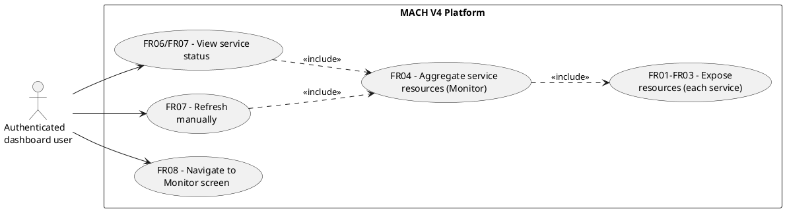
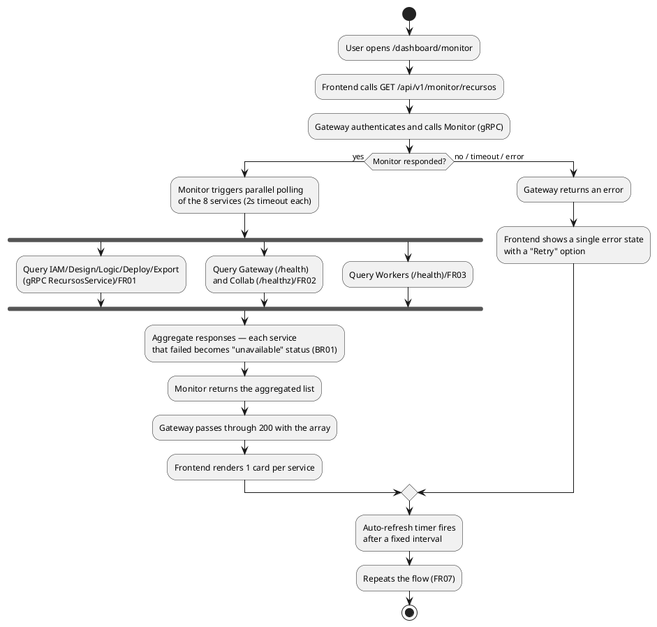
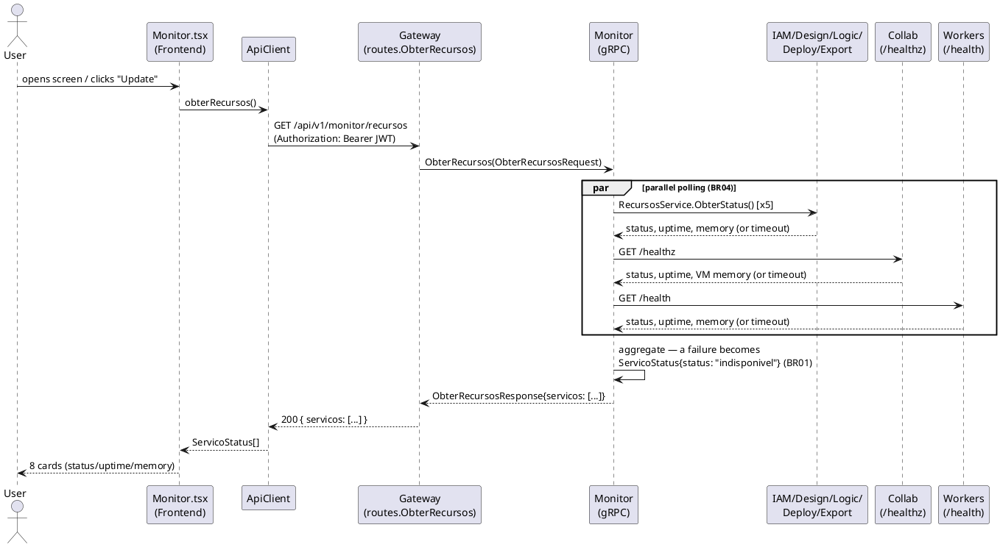

# Specification: Resource Monitor

> **Architecture note (post-implementation, same session)**: during
> implementation, the transport decision changed — instead of the
> `services/monitor` service + `pkg/health` (RecursosService over gRPC/HTTP,
> custom polling) described below, the platform was migrated to Kubernetes with
> a Linkerd service mesh (`infra/k8s/`). CPU/memory come from the metrics-server
> (`metrics.k8s.io`) and RPS/success rate/latency come from `linkerd-viz`'s
> Prometheus — the sidecar instruments the 8 services automatically, with no
> dedicated RecursosService. The Gateway queries these two sources directly
> via `services/gateway/internal/meshmetrics`. BR01-BR05/NFR01-NFR05 and the
> acceptance criteria below still hold in spirit (a service with no pod becomes
> "unavailable," never brings down the screen); FR01-FR04 (how the data is
> obtained) are outdated — the real source is in
> `meshmetrics/k8s.go` and `meshmetrics/prometheus.go`. `pkg/health` and the
> `health.Registrar` instrumentation in IAM/Design/Logic/Deploy/Export, the
> Workers' `/health`, and Collab's extended `/healthz` remain in the
> repository (they work, they have tests) but are no longer consumed by
> Monitor — they were kept as independent liveness signals, not removed since
> they're not in the way. `contracts/api.md` is also outdated regarding the
> body of `GET /api/v1/monitor/recursos` — the real format is in the handler
> `services/gateway/internal/routes/monitor.go`.

Today the MACH V4 platform has distributed tracing (OTel → Jaeger) but no consolidated
view of the **health/infrastructure** of the services themselves: there's no single place
where the team operating the platform can see whether IAM, Design, Logic, Deploy, Export,
Workers, Collab, and Gateway are up, for how long, and how much memory/processes they're
consuming. Today, the Gateway's `GET /health` only answers for itself (binary liveness,
no data), and no other service exposes any health signal besides Collab's `/healthz`.

This request adds a **Resource Monitor** screen to the Player's dashboard, powered
by a new `services/monitor/` microservice that periodically polls all the already
existing services and aggregates the result. It does not include per-tenant
consumption/quota (left for a future request) nor Prometheus integration (an
explicit decision for this delivery: the Monitor reads the services directly,
with no intermediate metrics backend).

---

## 1. Goal

By the end of this implementation, any authenticated dashboard user can open the
"Monitor" screen and see, for each of the platform's 8 services (IAM, Design, Logic,
Deploy, Export, Workers, Collab, Gateway), its status (active/unavailable), uptime, and
memory usage — updated on demand or automatically every few seconds — without a failure
in one monitored service bringing down the screen or the other services' data.

---

## 2. Business Rules

| ID | Rule |
|----|-------|
| BR01 | A monitored service is considered **unavailable** when the Monitor gets no response within the configured timeout (NFR01) or the call returns an error — in that case the service shows up with an "unavailable" status and a short cause message, never bringing down the aggregated response. |
| BR02 | The Monitor only reports what each service can tell about itself (its own process's uptime and memory); it does not infer or estimate resources for a service that doesn't expose that information. |
| BR03 | The screen is accessible to any authenticated dashboard user — there is currently no "platform administrator" role distinct from "tenant user" in the permission system (`permissionMap.ts`), so this screen follows the same access model as the other dashboard screens (Settings, Customers, etc.), without introducing new RBAC. |
| BR04 | The Monitor's polling of the monitored services is parallel — the unavailability or slowness of one service does not delay the collection for the others (NFR01). |
| BR05 | The list of monitored services is fixed in the Monitor's code (the platform's 8 services) — it is not configurable by the end user in this delivery. |

---

## 3. Functional Requirements

| ID | Description | Actor | Priority |
|----|-----------|------|------------|
| FR01 | IAM, Design, Logic, Deploy, and Export now expose a resource gRPC RPC (status "serving", uptime, allocated memory, system memory, goroutines) via a shared `RecursosService`, registered on each one's `grpc.Server`. | System | High |
| FR02 | Collab (Elixir) now includes resource data (uptime, VM memory) in the body of its already existing `/healthz`, without changing its current HTTP status contract. | System | High |
| FR03 | Workers now exposes a minimal HTTP endpoint `/health` (no server exists in the process today) returning the status, uptime, and memory of the Go process, following the same environment-variable configuration approach (`WORKERS_HTTP_ADDR`) as the other services. | System | High |
| FR04 | The new `services/monitor/` service does parallel polling of the 8 services (IAM, Design, Logic, Deploy, Export, Gateway, Workers via HTTP/gRPC per FR01-FR03; Collab via its `/healthz`; Gateway via its already existing `/health`) and exposes the aggregated result via its own gRPC RPC. | System | High |
| FR05 | The Gateway exposes `GET /api/v1/monitor/recursos` as an authenticated REST facade over the Monitor's RPC, following the same `routes.*` pattern as the other resources. | Authenticated user | High |
| FR06 | The Frontend consumes `GET /api/v1/monitor/recursos` and renders one card per service, showing name, status (green/red visual), formatted uptime, and memory used; an unavailable service shows the error message instead of the metrics. | Authenticated user | High |
| FR07 | The screen supports manual refresh (an "Update" button) and also refreshes automatically at a fixed interval while it's open, without requiring a page reload. | Authenticated user | Medium |
| FR08 | The dashboard sidebar gains a "Monitor" navigation item (route `/dashboard/monitor`), following the same visual and routing pattern as the existing items (Dashboard, Customers, Settings). | Authenticated user | High |

---

## 4. Non-Functional Requirements

| ID | Category | Description |
|----|-----------|-----------|
| NFR01 | Performance | The Monitor queries the 8 services in parallel with a short per-service timeout (2s); the aggregated response should not take more than ~2-3s even with one or more services down. |
| NFR02 | Resilience | The unavailability of any monitored service (including the Monitor itself, from the Gateway's point of view) does not produce a blocking 5xx error on the screen — the Frontend distinguishes "couldn't reach the Monitor" (whole-screen error state) from "an individual service is unavailable" (per-card state, BR01). |
| NFR03 | Observability | The Monitor service participates in the already existing distributed tracing (OTel), like the other Go services (`pkg/telemetry.Init`). |
| NFR04 | Portability | Addresses of the monitored services are configurable via environment variable, following the convention already used in the Gateway (`<SERVICE>_GRPC_ADDR` / `<SERVICE>_HTTP_ADDR`), with the same default ports used in `build/dev-up.sh`. |
| NFR05 | Security | `GET /api/v1/monitor/recursos` requires authentication (the same `Auth` + `RateLimiter` middleware group as the Gateway's other authenticated routes) — it does not expose internal topology to anonymous requests. |

---

## 5. Usage Scenarios

### Scenario 1: All services healthy
* **Given** all 8 platform services are up
* **When** the user opens `/dashboard/monitor`
* **Then** the screen shows 8 cards, all with a green indicator, uptime, and memory filled in

### Scenario 2: One service down
* **Given** the Logic service is stopped
* **When** the user opens or refreshes the Monitor screen
* **Then** the other 7 cards show data normally and the Logic card shows an "unavailable" status with a short message, with no error on the whole screen

### Scenario 3: The Monitor itself is down
* **Given** the Monitor service is not running
* **When** the user opens the Monitor screen
* **Then** the Gateway returns an error when calling the Monitor and the screen shows a single error state (not 8 error cards), with a retry option

### Scenario 4: Automatic refresh
* **Given** the Monitor screen is open and a service was unavailable
* **When** the auto-refresh interval elapses and the service comes back up
* **Then** the corresponding card switches from "unavailable" to "active" with no action from the user

---

## 6. Acceptance Criteria

1. An authenticated `GET /api/v1/monitor/recursos` returns 200 with an array of 8 entries (one per service), each with `nome`, `status`, and (when available) `uptime_segundos`, `memoria_alocada_bytes`, `memoria_sistema_bytes`.
2. Stopping one of the monitored services (e.g., `logic`) and calling the endpoint still returns 200 with the other 7 entries normal and the stopped service's entry with `status = "indisponivel"` — never 5xx because of a single service being down.
3. Stopping the `monitor` service and calling the Gateway's endpoint returns an error (5xx/known error) handled as a single error state by the Frontend — not as 8 error cards.
4. The `/dashboard/monitor` screen is accessible from the sidebar and reflects the data from the endpoint above; an "Update" button redoes the call; the screen also refreshes itself at a fixed interval (documented in `plan.md`).
5. All new tests (Go: the `pkg/health` and `services/monitor` packages; Elixir: the extended `/healthz`; TS: hook + page) pass, together with the existing full suite (`go build ./... && go vet ./... && go test ./...`, `mix test` in `services/collab`, `npm test` in `services/frontend`).

---

## 7. UML Diagrams

### 7.1. Use Case Diagram

### 7.2. Activity Diagram

### 7.3. Sequence Diagram

---

## 8. Out of Scope

- Per-tenant consumption/quota (storage, API calls, number of systems) — explicit decision: this delivery covers only platform health/infrastructure.
- Integration with Prometheus or any intermediate metrics backend — the Monitor reads the services directly.
- Metrics history/time series (the screen shows the current state on each poll, without persisting samples).
- Automatic alerts (email/Slack) when a service goes down — left for a future observability request.
- Real process CPU (usage percentage) — Go and the BEAM don't expose this trivially and portably without extra libraries; this delivery covers memory and uptime. See `research.md` §3.
- A "platform administrator" role/RBAC distinct from a tenant user (BR03) — reuses the current access model.
